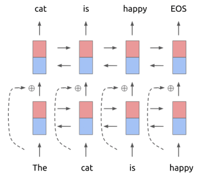
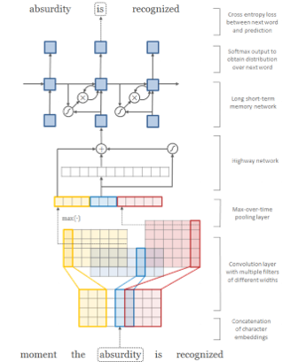
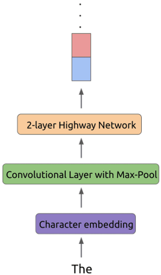
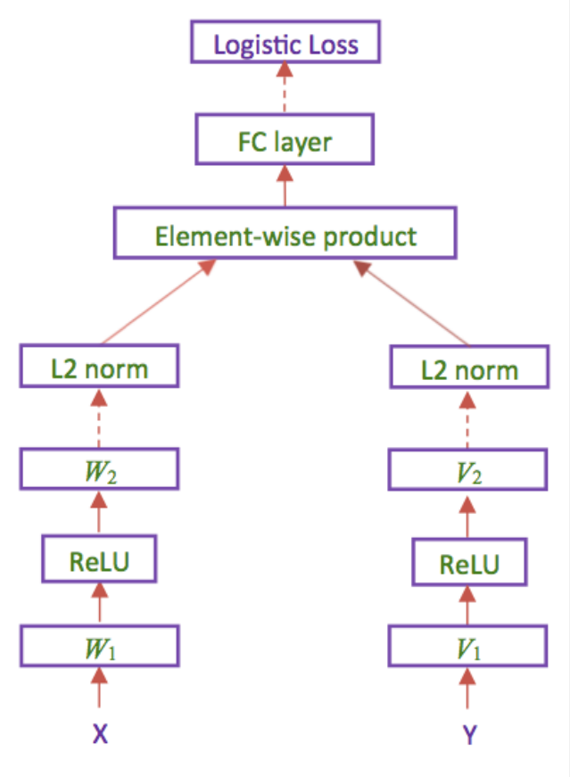

# ELMO和双分支模型 简单几个点的叙述

thanks to [littleRound](https://github.com/camelop) to provide materials and guidance.

## ELMO

### Temage使用ELMO的原因

Temage使用ELMO的原因主要在于ELMO考虑了一词多义的问题（Deep
contextualized word representations），并且解决了使用word2vec中的无法创建集外词（OOV）问题

### 网络结构

这个网络有两个特点

1. 使用Bi-LSTM，考虑整句的语境，而不是简单的单向推导。
2. 使用residual connection（残差连接），使得求导过程多出一个常数项，在反向传播时不会造成梯度消失。

## 解决OOV的方式 sub-word+CNN

在character的层级上先利用CNN，使用多个不同规格的kernel，对陌生单词进行2d卷积提取信息。

### 演讲稿部分

语言方面，ELMO模型在word representation上大获全胜，ELMO

考虑了一词多义的问题（Deep
contextualized word representations），并且解决了使用word2vec中的无法创建集外词（OOV）问题，能够保证我们在图文匹配、文本分类等下游深度学习模型有足够好表现。

## 双分支模型

### Temage使用ELMO的原因

双分支模型作为近几年来新出的模型，其最终的效果比其他模型更为出色，并且能够很好的和我们的上游深度学习模型——ELMo进行结合。

### 模型结构

同时输入图片和文本，分别在CNN和RNN的处理下得到我们X，Y，在进过一层Activation和L2 norm之后我们将两者的结果进行比对，最终再经过一层全连接层，得到最后我们希望得到的匹配程度。

### 演讲稿部分

双分支模型作为近几年来新出的模型，其最终的效果比其他模型更为出色，并且能够很好的和我们的上游深度学习模型——ELMo进行结合。

对模型同时输入图片和文本，分别在CNN和RNN的处理下得到我们X，Y，在进过一层Activation和L2 norm之后我们将两者的结果进行比对，最终再经过一层全连接层，得到最后我们希望得到的匹配程度。