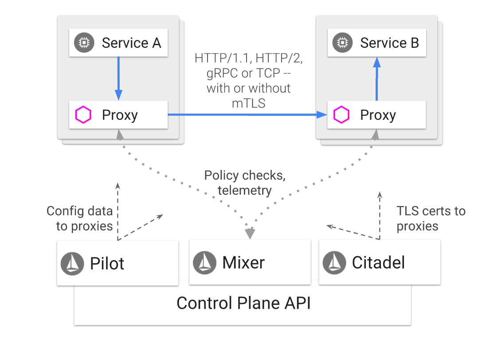
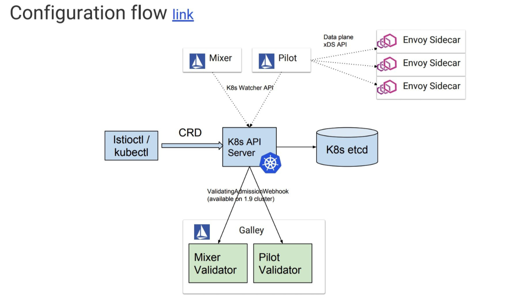
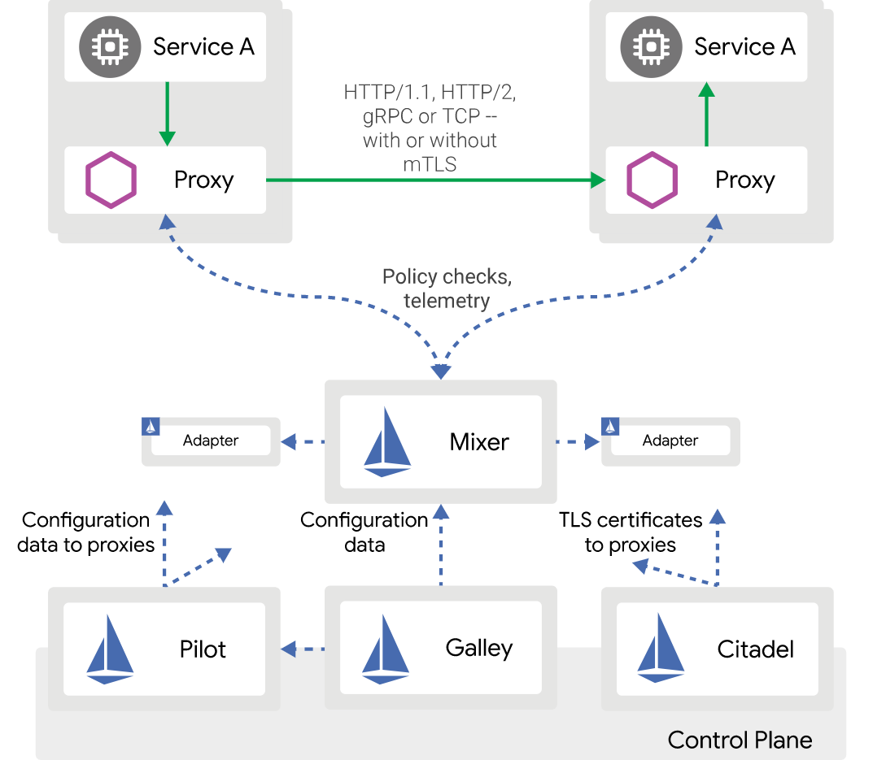
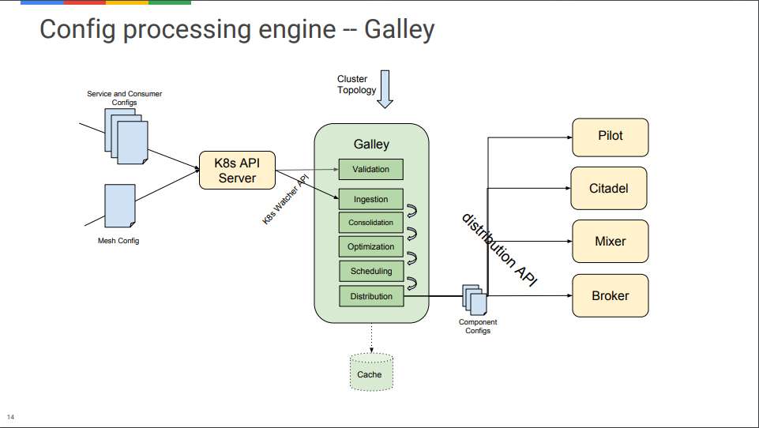
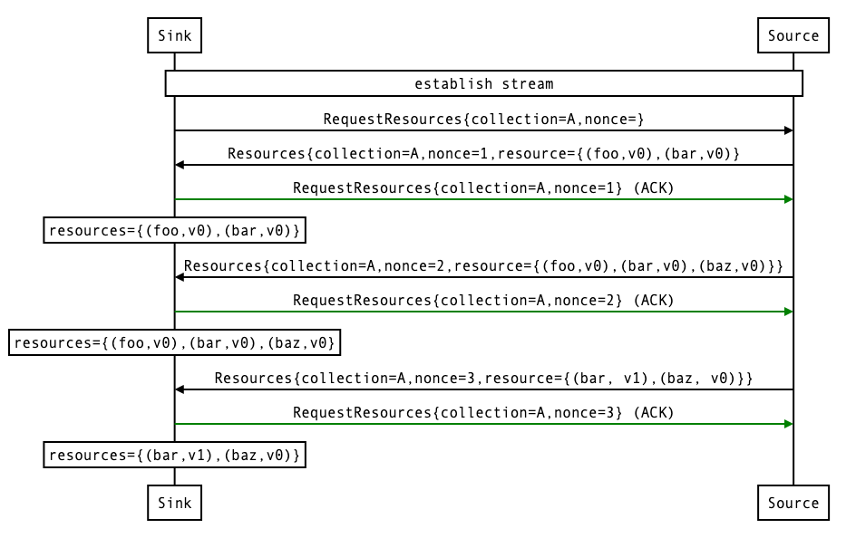
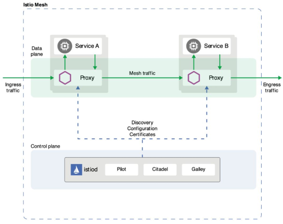
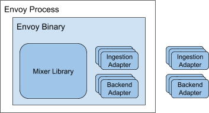

# Istio Architecture

（他不是不想更，他就是没有空，那业务逻辑也是要人写的

本文大概会分好几个部分来细细梳理一下Istio的架构演变，主要的一个写作原因也是因为Istio 1.5从拆分的多进程多服务的架构转变为单体结构，这是一个很微妙的过程，我们一般情况下会讲拆分为微服务，从而带来更好的版本更新，Istio最开始的美好愿望也是如此，但是他们最终还是回到了单体（并非不是模块化），这自有其独特的考量，我们也会对此积极探讨。

我们将以timeline结合Istio文档，以data plane 和 control plane两个角度，来讲述Istio架构演变。

### Istio 1.0

简单描述一下组件的主要工作，以及具体体现在我们的功能中是如何进行工作的。

**Proxy**：Proxy是主管Data Plane的，简单的理解就是一个nginx，负责的是网格和网格之间的交互，是实际意义上真正的worker，比如我们的消息转发，负载均衡等等。具体的流量控制都是在此完成。

**Mixer**：Mixer的主要功能是收集envoy的相关数据，关注各方proxy是否的开始执行相关policy。

Mixer主要提供三个核心功能：

- 前置条件检查(Precondition Checking): 某一服务响应外部请求前,通过Envoy向Mixer发送Check请求,检查该请求是否满足一定的前提条件,包括白名单检查、ACL检查等。
- 配额管理: 当多个请求发生资源竞争时，通过配额管理机制可以实现对资源的有效管理。
- 遥测报告上报:该服务处理完请求后,通过Envoy向Mixer上报日志、监控等数据。

饱受诟病的主要是check，每一次请求（后续有了cache也不是说每次请求），都需要想mixer进行check，检查白名单等等，检查也必定是阻塞的，所以性能上有着很大的缺陷。

**Pilot**：Pilot实质上就是一个将envoy细节与语义描述解耦的component，因为我们可能使用的具体环境可能是kubernetes，可能是consul等等，甚至是混合的环境。之后相应的配置文件会被更新到具体的具体的proxy，这里的相关配置主要是针对于路由相关。

**Citadel**：citadel主要是关注安全和权限的管理（可以拿来做多租户？），mTLS（主要是生成证书），以及服务和服务之间的调用的权限管理（比较细粒度的管控），以及有关于后续扩展的JWT端到端鉴权。

**Galley**：（我以前经常看错，以为是Gallery），在Istio1.0版本中主要的作用是就用户apply的配置进行校对，后续我们会看到他在Istio1.1版本中有较大的修改，内容更加的丰富了。

## Istio 1.1

Istio1.1里面我们可以看到Galley被明确的表示了出来，Galley的出现主要是对Istio CRD的统一管理，从而演变出了MCP(Mesh Configuration Protocol)，从[Design Doc](https://docs.google.com/document/d/1GRLQ6bs2pzhURKQ871fgoagh8bkJkRYRFABgAuezK8s/edit#)里面偷出来两个图

MCP主要定义了三个概念——Sink、Source、Resource

Sink：配置的消费端，比如Pilot和Mxier。

Source：配置的提供端，比如我们的Galley。

Resource：主要就指具体的配置。

MCP协议基于gRPC双向流协议进行定义，Sink端和Source端都可以随时往对端发送数据，相互不会阻塞。从上图的协议交互也可以看出，Sink端可以主动发送RequestResources请求来向Source端要求数据，同时Source端也可以主动将Resources数据发送给Sink端。Sink端在收到数据后会返回一个ACK确认。在RequestResources请求和ACK响应中，主要有两个字段：

Collection：此次请求需要的数据类型。

nonce：类似于请求的ID，用来与响应或者请求进行匹配。

同时MCP协议还定义了增量推送的能力，如下图所示。可以在RequestResouces请求中增加incremental=true字段，这样Sink在收到数据后，会根据增量的形式进行数据的更新。协议的文档中还指出，必须在RequestResouces请求中包含incremental=true的情况下，才能返回给Sink增量的数据，否则Sink端对于该数据的处理将是未知的。目前社区的Pilot还没有支持增量的MCP数据推送，从下一节的源码分析中可以看到，Pilot对于每一个Source（Pilot可以配置多个Source，每个Source之间的数据是隔离的）发送的数据，都是整体替换更新的。目前社区的一个进展是正在进行serviceEntries类型数据的增量更新的支持，而且是endpoints粒度的增量更新。

这个地方要提到，我们的确会存在多集群的情况，在跨集群且都适用Istio进行管理的情况下，跨集群的Pilot/Mixer无法获取到主集群的Galley，这个时候该集群的Galley是需要作为client去同步主集群Galley。

相关Galley和MCP的细节可以看[这里](https://cloud.tencent.com/developer/article/1409159)和[那里](https://nacos.io/en-us/blog/pilot%20mcp.html)

## Istio 1.5

以[这篇](https://mp.weixin.qq.com/s?__biz=MzIwNDIzODExOA==&mid=2650167577&idx=1&sn=3b68bbfbd79249b4f6d20991b3df5d8a&chksm=8ec1c550b9b64c46edf3963c86ec64c2f4ff4f4a9241ca238a4f7eb853f54b160f43c0daade5&scene=126&sessionid=1583490456&key=3b0e800a5b4608692c64c2f836110728833b7eeee329535214d70b3d683a9d110240be7f4c0814e661e7545afbbfc65f090c598b26338ce8eea4afb858184a77ec17e46918746bcfc3f6dfb1b6453f8f&ascene=1&uin=NDk4Nzc3MTM%3D&devicetype=Windows+10&version=62080079&lang=zh_CN&exportkey=A8YAgKULryEDY2AFGUSqsHM%3D&pass_ticket=2Ya95N%2BYz8mQokjfmAOQKNdtkOn%2BfP2DmiWjiviwlmM%3D)公众号的论述结合自身的操作实践，讨论和总结一下相关

### 改变的原因

我个人认为里面比较重要的几点如下：

1. Istio的各个组件根本就无法单独部署，从这个角度而言，他们之间组织MCP，必定需要更新stub，release的时候也只会是以Istio x.x来进行release，根本不会出现单独release一个component这样的情况，我认为部件和部件之间的耦合程度，就不支持进行进程上的拆分。

2. 组件对于用户而言，安装好就够了，一般用户也不会就安全进行考虑，而且事实各个组件之间也没有响应的安全区分，只有功能区分，因此拆分也没有什么用途。

3. 启动的时候大部分都不可能一次性启动成功，每一次都需要restart好几次，

   - Citadel 要先启动为其他组件生成证书；
   - Galley 要先监控 apiserver；
   - Pilot 要 Galley 准备好才能启动；
   - autoinjector 需要 Pilot 启动完成；

   至少证明了，这个启动实质是需要一个“编排”的过程。

   Mixer作为一个中心化的组件，需要收集大量的日志以及进行相应的检测，虽然有过相应的cache的优化，但是性能整体还是很差的。

### 1.5版本新架构

1.5版本架构里面将Pilot、Citadel、Galley三者以单体的形式整合在了一起，Mixer模块并不单独出现，而是进入到了Proxy。整体而言，Istio实质是在修改自己的限界上下文，不是单纯的整合为单体。

就针对Mixer in Proxy而言，我们对比一下现在的结构和1.5版本之前的结构

整体而言，原来的Mixer是中心化的处理，是gRPC来进行调用的，这部分的latency较大，资源的消耗也较大，现阶段我们将Mixer直接植入到了proxy，相当于原来是一个总的水管，现在被分流到了各个细的小水管中，好处在于去中心化，且去掉了繁琐的网络调用，但是个人认为，资源消耗不一定会减少，因为每一个Envoy都需要Mixer的支持（当然根据配置，他可能只需要支持一些部分就可以了，因为我们可能设置了不监控等等config），这里各方给出的一个折中方案是让envoy支持wasm的运行环境。这将使Mixer及其适配器能够加载到通用的Envoy二进制文件中。 它还将Mixer及其适配器放入沙盒，防止这些组件中的错误导致Envoy进程失效。

