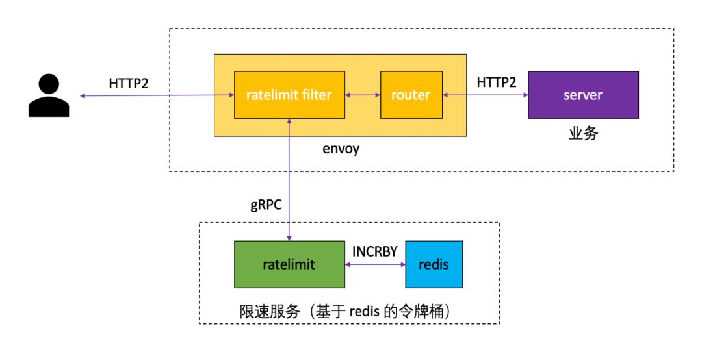

# Istio quota usage and Envoy rate limit

本文就如何使用quota进行简单的介绍，并结合当下Istio进行改版之后，进行的相关操作，应当如何处理。

### quota的使用

在Istio1.2版本之后，Policy策略默认是关闭的，Policy的验证是Envoy主动发起给Mixer，过程必然是阻塞的

，因此造成的latency也非常高，所以默认是关闭了Policy策略，因此要启用Policy策略，我们需要进行相关的设置

```bash
istioctl manifest apply --set values.global.disablePolicyChecks=false --set values.pilot.policy.enabled=true
```

如果是低版本的Istio，需要相关helm的操作，具体可见1.2版本的文档

之后就是写相关handler的规则，以及被bind到哪一个计数器上，观察的返回是什么等等，这些规则和handler都是要注入到Mixer中的

```yaml
apiVersion: config.istio.io/v1alpha2
kind: handler
metadata:
  name: mail-quotahandler
  namespace: istio-system
spec:
  compiledAdapter: memquota
  params:
    quotas:
    - name: mail-requestcountquota.instance.istio-system
      maxAmount: 400
      validDuration: 5s
      # The first matching override is applied.
      # A requestcount instance is checked against override dimensions.
---
apiVersion: config.istio.io/v1alpha2
kind: instance
metadata:
  name: mail-requestcountquota
  namespace: istio-system
spec:
  compiledTemplate: quota
  params:
    dimensions:
      source: request.headers["x-forwarded-for"] | "unknown"
      destination: destination.labels["app"] | destination.service.name | "unknown"
      destinationVersion: destination.labels["version"] | "unknown"
---
apiVersion: config.istio.io/v1alpha2
kind: QuotaSpec
metadata:
  name: mail-request-count
  namespace: istio-system
spec:
  rules:
  - quotas:
    - charge: 1
      quota: mail-requestcountquota
---
apiVersion: config.istio.io/v1alpha2
kind: QuotaSpecBinding
metadata:
  name: mail-request-count
  namespace: istio-system
spec:
  quotaSpecs:
  - name: mail-request-count
    namespace: istio-system
  services:
  - name: mail
    namespace: default
---
apiVersion: config.istio.io/v1alpha2
kind: rule
metadata:
  name: quota
  namespace: istio-system
spec:
  # quota only applies if you are not logged in.
  # match: match(request.headers["cookie"], "user=*") == false
  actions:
  - handler: mail-quotahandler
    instances:
    - mail-requestcountquota

```

我们这里去查看一下调用方Istio Proxy(Envoy)和被调用方Mixer两边各自的处理，这里首先观察release1.2版本

```c++
void RequestHandlerImpl::Check(CheckData* check_data,
                               HeaderUpdate* header_update,
                               const TransportCheckFunc& transport,
                               const CheckDoneFunc& on_done) {
  // Forwarded attributes need to be stored regardless Check is needed
  // or not since the header will be updated or removed.
  AddCheckAttributes(check_data);
  AddForwardAttributes(check_data);
  header_update->RemoveIstioAttributes();
  service_context_->InjectForwardedAttributes(header_update);

  if (!service_context_->enable_mixer_check()) {
    check_context_->setFinalStatus(Status::OK, false);
    on_done(*check_context_);
    return;
  }

  service_context_->AddQuotas(attributes_->attributes(),
                              check_context_->quotaRequirements());

  service_context_->client_context()->SendCheck(transport, on_done,
                                                check_context_);
}
```

我们在release-1.2 `proxy/src/istio/control/http`中可以看到，在Check函数中有加入对于quota的相关内容。最终调用了`SendCheck`

```c++
void ClientContextBase::SendCheck(
    const TransportCheckFunc& transport, const CheckDoneFunc& on_done,
    ::istio::mixerclient::CheckContextSharedPtr& context) {
  MIXER_DEBUG("Check attributes: %s",
              context->attributes()->DebugString().c_str());
  return mixer_client_->Check(context, transport, on_done);
}
```

`SendCheck`的主要内容就是调用mixer_client

```c++
void MixerClientImpl::Check(CheckContextSharedPtr &context,
                            const TransportCheckFunc &transport,
                            const CheckDoneFunc &on_done) {
  //
  // Always check the policy cache
  //

  context->checkPolicyCache(*check_cache_);
  ++total_check_calls_;

  MIXER_DEBUG("Policy cache hit=%s, status=%s",
              context->policyCacheHit() ? "true" : "false",
              context->policyStatus().ToString().c_str());

  if (context->policyCacheHit()) {
    ++total_check_cache_hits_;

    if (!context->policyStatus().ok()) {
      //
      // If the policy cache denies the request, immediately fail the request
      //
      ++total_check_cache_hit_denies_;
      context->setFinalStatus(context->policyStatus());
      on_done(*context);
      return;
    }

    //
    // If policy cache accepts the request and a quota check is not required,
    // immediately accept the request.
    //
    ++total_check_cache_hit_accepts_;
    if (!context->quotaCheckRequired()) {
      context->setFinalStatus(context->policyStatus());
      on_done(*context);
      return;
    }
  } else {
    ++total_check_cache_misses_;
  }

  bool remote_quota_prefetch{false};

  if (context->quotaCheckRequired()) {
    context->checkQuotaCache(*quota_cache_);
    ++total_quota_calls_;

    MIXER_DEBUG("Quota cache hit=%s, status=%s, remote_call=%s",
                context->quotaCacheHit() ? "true" : "false",
                context->quotaStatus().ToString().c_str(),
                context->remoteQuotaRequestRequired() ? "true" : "false");

    if (context->quotaCacheHit()) {
      ++total_quota_cache_hits_;
      if (context->quotaStatus().ok()) {
        ++total_quota_cache_hit_accepts_;
      } else {
        ++total_quota_cache_hit_denies_;
      }

      if (context->policyCacheHit()) {
        //
        // If both policy and quota caches are hit, we can call the completion
        // handler now.  However sometimes the quota cache's prefetch
        // implementation will still need to send a request to the Mixer server
        // in the background.
        //
        context->setFinalStatus(context->quotaStatus());
        on_done(*context);
        remote_quota_prefetch = context->remoteQuotaRequestRequired();
        if (!remote_quota_prefetch) {
          return;
        }
      }
    } else {
      ++total_quota_cache_misses_;
    }
  }

  // TODO(jblatt) mjog thinks this is a big CPU hog.  Look into it.
  context->compressRequest(
      compressor_,
      deduplication_id_base_ + std::to_string(deduplication_id_.fetch_add(1)));

  //
  // Classify and track reason for remote request
  //

  ++total_remote_calls_;

  if (!context->policyCacheHit()) {
    ++total_remote_check_calls_;
  }

  if (context->remoteQuotaRequestRequired()) {
    ++total_remote_quota_calls_;
  }

  if (remote_quota_prefetch) {
    ++total_remote_quota_prefetch_calls_;
  }

  RemoteCheck(context, transport ? transport : options_.env.check_transport,
              remote_quota_prefetch ? nullptr : on_done);
}
```

总之就是加了一层Cache，如果cache hit则不进行相应的请求，而是自行处理，如果cache没有hit则会启用RemoteCheck，RemoteCheck中有更新cache的机制和retry的具体机制。转过头开始看Mixer端的处理

```
// Check is the entry point for the external Check method
func (s *grpcServer) Check(ctx context.Context, req *mixerpb.CheckRequest) (*mixerpb.CheckResponse, error) {
	if s.throttler.Throttle(loadshedding.RequestInfo{PredictedCost: 1.0}) {
		return nil, grpc.Errorf(codes.Unavailable, "Server is currently overloaded. Please try again.")
	}

	lg.Debugf("Check (GlobalWordCount:%d, DeduplicationID:%s, Quota:%v)", req.GlobalWordCount, req.DeduplicationId, req.Quotas)
	lg.Debug("Dispatching Preprocess Check")

	if req.GlobalWordCount > uint32(len(s.globalWordList)) {
		err := fmt.Errorf("inconsistent global dictionary versions used: mixer knows %d words, caller knows %d", len(s.globalWordList), req.GlobalWordCount)
		lg.Errora("Check failed: ", err.Error())
		return nil, grpc.Errorf(codes.Internal, err.Error())
	}

	// bag around the input proto that keeps track of reference attributes
	protoBag := attribute.GetProtoBag(&req.Attributes, s.globalDict, s.globalWordList)

	if s.cache != nil {
		if value, ok := s.cache.Get(protoBag); ok {
			resp := &mixerpb.CheckResponse{
				Precondition: mixerpb.CheckResponse_PreconditionResult{
					Status: rpc.Status{
						Code:    value.StatusCode,
						Message: value.StatusMessage,
					},
					ValidDuration:        time.Until(value.Expiration),
					ValidUseCount:        value.ValidUseCount,
					ReferencedAttributes: &value.ReferencedAttributes,
					RouteDirective:       value.RouteDirective,
				},
			}

			if status.IsOK(resp.Precondition.Status) {
				lg.Debug("Check approved from cache")
			} else {
				lg.Debugf("Check denied from cache: %v", resp.Precondition.Status)
			}

			if !status.IsOK(resp.Precondition.Status) || len(req.Quotas) == 0 {
				// we found a cached result and no quotas to allocate, so we're outta here
				return resp, nil
			}
		}
	}

	// This holds the output state of preprocess operations
	checkBag := attr.GetMutableBag(protoBag)

	resp, err := s.check(ctx, req, protoBag, checkBag)

	protoBag.Done()
	checkBag.Done()

	return resp, err
}
```

整个envoy与mixer交互的过程基本就如上。

在此我们会思考，是因为quota，istio才开始不再启用Mixer了吗，如果没有了Mixer，我们又应当如何实现这个rate limit的功能呢。进一步的，就开始考察Envoy如何做到rate limit

最后发现如果要envoy单独使用global rate limit，需要在各envoy中注册一个rate limit service，lyft官方提供了一个go/gRPC的实现，其背后主要是使用redis实现令牌桶



实质上，要实现整体的rate limit，你的信息量则必须是全局的，所以要实现global rate limit，必须要能够有一个中心化的存储，除非你希望将global rate limit拆分成为多个local rate limit

