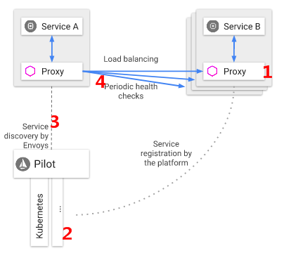
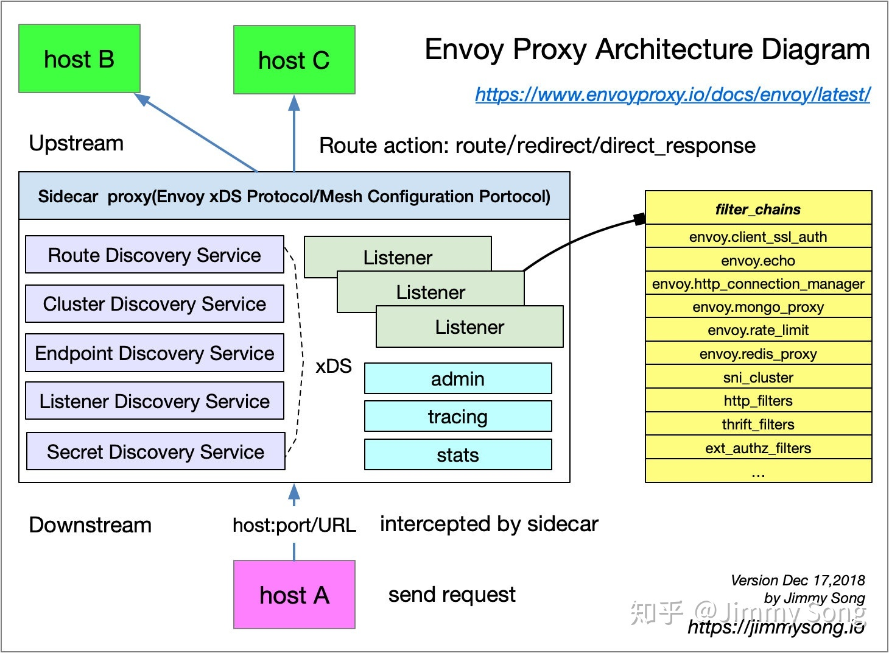

# Envoy Load Balance and Istio Load Balance

## Envoy Load Balance

主要分为两大类，**分布式负载均衡**和**全局负载均衡**

**分布式负载均衡**指让每一个Envoy实例，通过自己对上游主机的情况，自行组织负载均衡，当然，这样的情况是基于Envoy能够做到服务发现，在得知有多少candidate的情况下能够进行的操作。例如可以对多个上游进行主机进行健康检查（看是检查具体的业务服务还是检查对方的Envoy网络连通状态，这都有可能），通过标识的区域进行感知等等。

**全局负载均衡**是一个中心化的服务，单点决定如何在主机之间分配负载（当然这样的请求可能是一段时间一次），是一个控制面板进行分配，控制面板能够做的事情就相对更多，更加全局，他能够收集到更多的信息，从而进行更加合理地及时流量分配

简单就集中负载均衡执行的算法进行描述：

**Weighted Round Robin**: 简单来讲，如果把高权值转换为更多的同名主机，就能够按照Round Robin的基础算法进行操作。

**Weighted Least Request**:  如果所有节点的权值相同，则随机选出N个节点，再从中选出一个请求量最少的即可，如果节点的权值不相同，则按照权值/请求进行计算，按照此作为权值，进行的Weighted Round Robin。

**Ring Hash**: 简单的讲就是一致性hash，将节点按权重在环上进行分布，对于请求按照某域的hash值进行请求的发布

**Maglev**: 感觉不同地方对此都有不同的叫法，redis对此的叫法叫做虚拟槽，即在Ring Hash的基础上，固定点位数量，让节点按照权重进行节点的占比。能够让分布更加的均匀，并且选择的速度更加快。

## Istio Load Balance

Envoy是Istio的御用数据平面，我们看看具体在Istio中是如何结合kubernetes实现负载均衡。

Istio采取的是分布式负载均衡和全局负载均衡的一个结合。

如果正常加入一个endpoint会是怎么的效果

1. ServiceB增添了一个Pod，此时kubernetes API server已经了解到相关Pod的增添
2. Pilot接收到Kubernetes的相关信息（正确点的说法是从Galley那边拿过来）
3. Pilot将相关内容分发到各个Proxy中，比如Envoy XDS来获取相应的配置
4. 将相应的Pod放进池子中，开始正常的Load Balancing

我们简单介绍一下XDS

Envoy可以通过XDS来实现服务发现，但是关于服务是否会进入到我们负载均衡的内容中，则有如下的规则。

| 发现状态 | 健康检查成功 | 健康检查失败   |
| -------- | ------------ | -------------- |
| 发现     | 路由         | 不要路由       |
| 未发现   | 路由         | 不用路由、删除 |

**发现主机，健康检查成功**

Envoy **将路由**到目标主机

**未发现主机，健康检查成功**

Envoy **将路由**到目标主机。这一点非常重要，因为我们在设计时假定发现服务随时可能失败。即使发现主机数据缺失，但健康检查通过，Envoy 仍会路由。虽然在这种情况下添加新主机是不可能的，但现有主机仍将继续正常运行。当发现服务再次正常运行时，数据将最终重新收集。

**发现主机，健康检查失败**

Envoy **不会路由**到目标主机。我们假设健康检查数据比发现数据更准确。

**未发现主机，健康检查失败**

Envoy **不会路由并将删除目标主机**。这是 Envoy 清除主机数据的唯一一种情况。

健康检查存在**主动检查**和**被动检查**两种方式，主动请求就是类似探针一样，发送相应的信号（HTTP 请求）给到上游，返回相应的状态码，通过状态码进行相应的判断。这样做的好处是及时，坏处在于健康检查就会消耗掉大量的资源，因此也会提出缓存结果的情况。

另一种健康检查的方式就是通过异常检测的方式进行，即如果在业务逻辑中，如果出现多次的5xx的情况，则会进行驱逐。

## Kubernetes Load Balancing

kubernetes的 Load Balancing主要是体现在Service上，对应在上图Istio中的Load Balancing中的第一个步骤。kubernetes的这种操作主要是基于kube-proxy来进行，kube-proxy会针对定义好的规则，重写iptables，从而控制流量的转发。