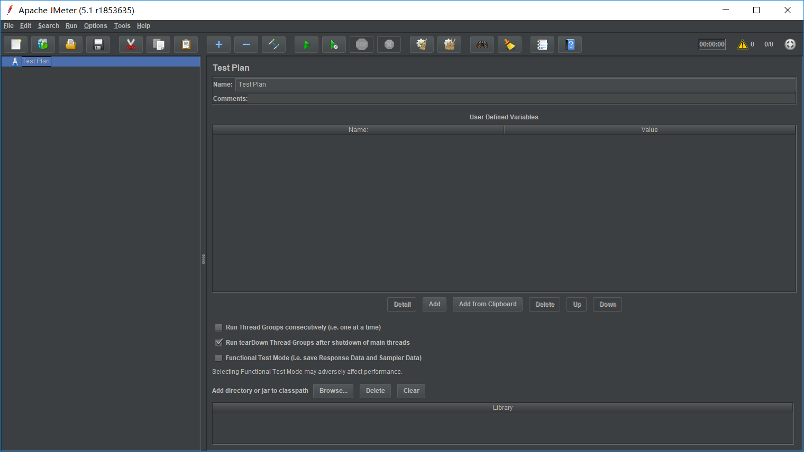
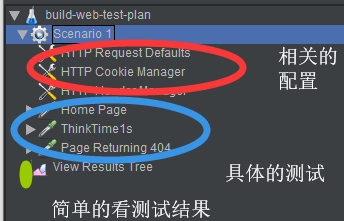
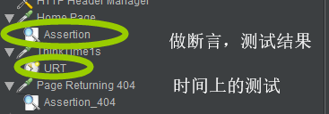

# JMeter

[download](http://jmeter.apache.org/download_jmeter.cgi)

## Introduction

JMeter是一个进行测试的纯JAVA项目，但测试并不只是针对于JAVA，而是支持各种协议、各种类别的测试

Ability to load and performance test many different applications/server/protocol types:

- Web - HTTP, HTTPS (Java, NodeJS, PHP, ASP.NET, …)
- SOAP / REST Webservices
- FTP
- Database via JDBC
- LDAP
- Message-oriented middleware (MOM) via JMS
- Mail - SMTP(S), POP3(S) and IMAP(S)
- Native commands or shell scripts
- TCP
- Java Objects

JMeter是用多线程来进行模拟用户的操作。

JMeter的使用的主要目的是压力测试，但是不仅仅是压力测试，还可以进行validate，对返回的结果进行验证，但重心仍旧是在压力测试。

## usages

JMeter开包即用，主要有两个部分的操作的，GUI和NON-GUI

GUI主要是用于debug，小规模的测试，load原有的测试计划，不支持在GUI中大规模进行测试，会卡死

1. 打开GUI进行项目的创立

   

   你可以选择使用第一排从左到右第二个按钮来选择使用模板，我们在此选择使用Web Test Plan

   

