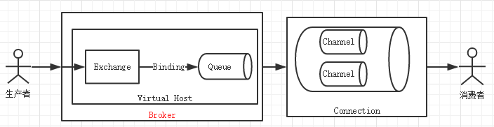

# RabbitMQ

RabbitMQ是一个实现了AMQP（Advanced Message Queuing Protocol）高级消息队列协议的消息队列服务，用Erlang语言。

## Components

组件内容和其他的消息队列没有什么本质上的区别，基本包括Producer、Exchange、Queue、Channel、Consumer。相关的demo测试可以看[这里](http://tryrabbitmq.com/)

我们按照组件从左到右的顺序一一进行相应的介绍

### Producer

Producer就是需要产生相应的message进入到Exchange进行分流。这里我们主要关注的是如何确保数据已经写入到了Broker的内存或是磁盘中，这里我们需要Broker给我到Producer一个ACK，即相应的Comfirm机制。RabbitMQ中主要是使用的两种，第一种是Transaction机制，第二种是异步Producer。

Transaction是天然的支持commit和rollback的，所以完全能够做到我们想要的效果，但是无奈的是Transaction速度过于慢，对于消息中间件而言，这样的写入速度基本不可以接受。

Comfirm机制能够异步的接收到相应错误的response，并使用已经注册好的回调函数进行。

### Exhange

Exchange是制定策略进行Message分发的一个组件，从上文我们可以看到，Message都必须通过Exchange进行分发

Exhange的几种分发机制如下：

**fanout**：对所有的queue都发送，不进行区分

**direct**：使用routeKey进行匹配进行发送

**topic**：使用以点分割的主题进行分发例如`xx.y.#.*`

### Queue

queue简单而言就是一块顺序存储的内存或是磁盘，Queue是可以跟多个主题或是routeKey进行绑定的，也可以对多个exchange进行绑定。

这里我们主要强调一下Queue的存储机制

磁盘节点：持久化的消息在到达队列时就被写入到磁盘，并且如果可以，持久化的消息也会在内存中保存一份备份，这样可以提高一定的性能，只有在内存吃紧的时候才会从内存中清除；

内存节点：非持久化的消息一般只保存在内存中，在内存吃紧的时候会被换入到磁盘中，以节省内存空间；

这里也要强调就是RabbitMQ为了性能的问题，不会再每一条message来到都会调用fsync，那么久存在一个时间间隔，可能已经回复了ACK，但是信息在buffer中，还没有被写入到磁盘上。

### Connection & Channel

Connection就是一个TCP连接，Channel是建立在上述的TCP连接中，可以理解为一个会话，Channel是建立在TCP基础之上。

### Consumer

comsumer可以同时订阅多个Queue，一个Queue进行消息分发，主要是采取round-robin算法，从创建queue的角度而言，Comsumer也可以主动创建queue，与Exhange进行进一步的绑定。我们进一步考虑Comusmer的ACK机制。

比较常用的就是`ack`和`nack`，ack表示的是一个消息已经接收到/已经被处理，在broker处收到该处理后，对应的操作可以是从内存或磁盘中删除的掉相应的内容。nack则是考虑让这个message重新进入到队列中。

这里要注意，RabbitMQ是不存在超时机制的，仅仅通过ConSumer的TCP连接是否仍旧存在而而论。因此如果你忘记了ack，则如果你在收集了一段时间message之后因为某些情况退出，则会导致你认为你已经处理了的message会再一次被分发给其他的Consumer，这样RabbitMQ会占用越来越多的内存，最终导致“内存泄漏”。

我们在这里思考一个情况，假如consumer发送了ack，但这个时候发生了丢包或者网络不好的情况，导致broker一直没有收到ack，但是这个TCP连接也没有结束(只是互相不写东西了，不代表没有连接)。这个时候的一个策略是broker如果收到了consumer的ack之后，也会回一个ack，来表示自己已经收到了对于该条消息的ack。但是如果consumer在发出ack之后，自己突然下线（崩溃），该ack也因为网络的原因没有能够传输到broker，则broker会发现tcp连接已经断开，则会认为该consumer已经下线，但是相应的ack也没有收到，这时候就会出现多次消费的情况。