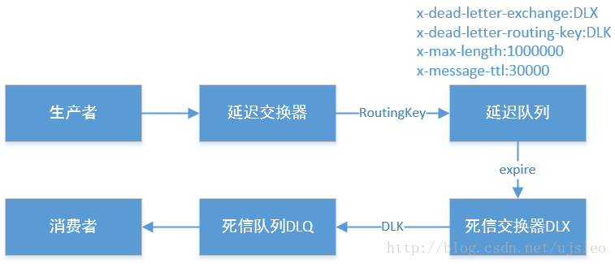

# Dead Letter

队列中出现Dead Letter可能有如下几种情况

1. 某信息被拒绝，但又要求不会到原始队列
2. 队列的TTL上限达到
3. 队列的长度达到上限

我们对于死信的处理是需要统一处理的，有人会问为什么不设置直接retry，我个人认为retry本来就是一个”过于乐观“的操作，就跟我们认为电脑有问题，重启一下就好了，但是实际上在高并发的场景中，retry造成的压力会一直积累，这个时候我们会设置所谓的retry的次数来缓解压力。另外一种处理方式就是放入到死信队列之中，进行相应的初步处理之后，后续进行相应的“补偿处理”。

## RabbitMQ

RabbitMQ的处理是将死信放入到对应的死信队列之中进行处理，需要指定到具体的Dead Letter Exchange

这些参数都是写在最初声明queue的里面。

## Kafka

Kafka处理相关死信是通过区分出新的topic来实现，如果是使用的Kafka Connect，则直接设置`errors.tolerance`和`errors.deadletterqueue.topic.name`，如果使用Kafka Stream 则可以设计提供`default.deserialization.exception.handler`，如果这个错误跟业务逻辑紧密相关，建议就是直接互为consumer和producer，直接将信息推送到相关topic