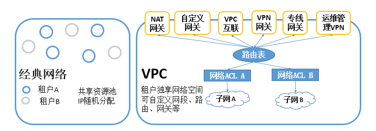
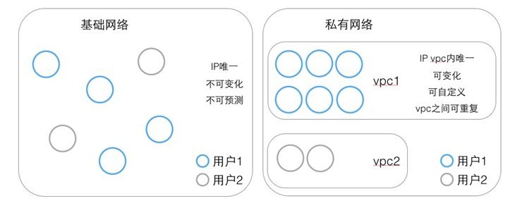
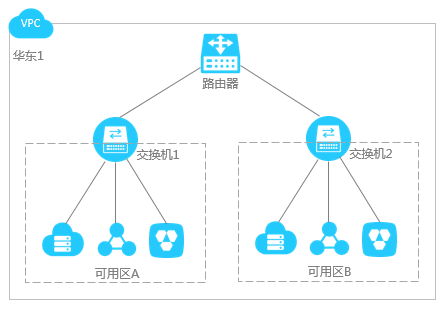

# VPC私有网络

VPC（Virtual Private Cloud）是公有云上自定义的逻辑隔离网络空间，是一块可自定义的网络空间

## VPC的好处

1) 灵活部署：自定义网络划分、路由规则，配置实施立即生效 
2) 安全隔离：100%逻辑隔离的网络空间，我的地盘听我的 
3) 丰富接入：支持公网VPN接入和专线接入 
4) 访问控制：精确到端口的网络控制，满足金融政企的安全要求

通俗易懂的讲，就是在公有云的基础上，再做一个层次的封装和映射，用户可以自行分配网段、路由和网管，对流量的监管更加的有组织

## VPC的层次结构

首先一定要明白，VPC是在路由器和交换机的上一次层次的，虽然某些层次功能有些重叠，但是我们更希望用分层来解决问题。

### 路由器

路由器一般情况内部含有交换机，是交换机的超集，并且路由器支持SDN，路由器主要是一个基于IP的转发功能，注意这个地方不再是广播，而是一个转发的情况，这样效率会更高。另外SDN（Software Defined Network）是建立VPC的主要贡献者，SDN可以制定一些规则，所以它能够当网关，能够rewrite，通过这个有规则的rewrite，最终能够实现VPC，而不是走经典网络。

### 交换机

主要是根据你的MAC地址进行发包，当不知道你的MAC地址出现miss的时候，将会触发一次广播，收集到各方的MAC地址。