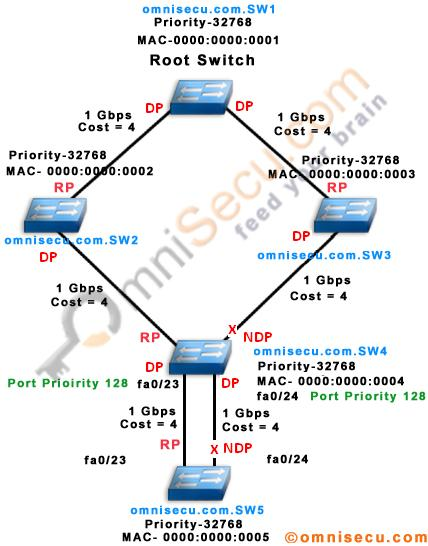

# Spanning Tree Protocol

Spanning Tree Protocol(STP)是通过拆除二层网络中可能存在的环，从而解决broadcast storm的问题。

可以通过[视频](https://www.youtube.com/watch?v=japdEY1UKe4)对整个过程进行了解，本文也将对过程进行详细的讲解。

## 基本概念

有如下概念需要理解：

Root Switch：又名根网桥，能够发放frame

RP(Root Port)：根端口，接收frame。

DP(Designated Port)：指定端口，非根网桥的转发frame的端口。

BID： priority+mac地址，用于选举。

Cost：用于路径选择。

## 选举过程

1. 根据BID的大小从中选出Root Switch，按照BID从小到大进行排序。
2. Root Swtich 进入到forwarding的状态。
3. DFS的进行各个switch的DP和RP的配置，如若面临多条路径，则表明存在成环的现象，选择其中Cost最小的路径即可，另外的一些路径将进入到Blocking的状态，等待被使用。

## STP的优点和缺点

**优点**：

- 能够解决广播风暴的问题，加强对链路的管理。

**缺点**：

- 协议收敛慢，但是可以使用PVST(per-VLAN spanning tree)的方式来解决收敛慢的问题，让树不要过大
- 无法做到负载均衡，浪费带宽。因为是直接把其他的备选路径给block住，所以该路径的带宽汇直接浪费掉了也可以通过PVST来缓解这类情况。

