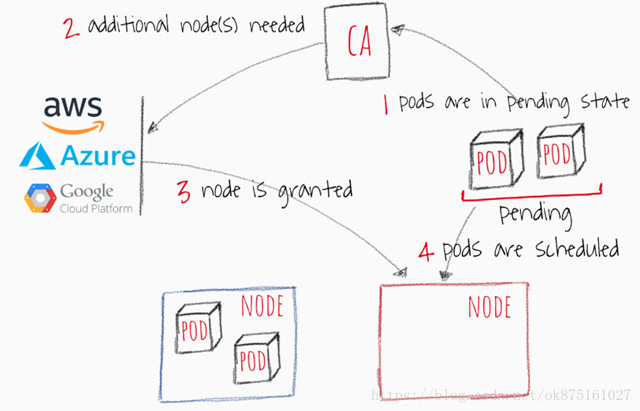

# cluster autoscaler

本文档主要记录cluster autoscaler（后文简称CA）的主要逻辑以及在其源代码中的体现，我们首先从CA的行为作为切入点。



上图源自该篇[博客](https://blog.csdn.net/jettery/article/details/82776318)，他主要反映的是，驱动CA进行工作的不是一些metrics，而是具体的一个Pod有没有一个可以落脚的位置。CA通过定时检查pending状态容器，与cloud provider进行交互，获取到更多的资源来进行相应的工作。

## emit event

有关cluster autoscaler相关的event主要如下：

- on kube-system/cluster-autoscaler-status config map:

  - ScaledUpGroup - CA increased the size of node group, gives both old and new group size.

  ```go
  func executeScaleUp(context *context.AutoscalingContext, clusterStateRegistry *clusterstate.ClusterStateRegistry, info nodegroupset.ScaleUpInfo, gpuType string, now time.Time) errors.AutoscalerError {
  	klog.V(0).Infof("Scale-up: setting group %s size to %d", info.Group.Id(), info.NewSize)
  	context.LogRecorder.Eventf(apiv1.EventTypeNormal, "ScaledUpGroup",
  		"Scale-up: setting group %s size to %d", info.Group.Id(), info.NewSize)
  	increase := info.NewSize - info.CurrentSize
  	if err := info.Group.IncreaseSize(increase); err != nil {
  		context.LogRecorder.Eventf(apiv1.EventTypeWarning, "FailedToScaleUpGroup", "Scale-up failed for group %s: %v", info.Group.Id(), err)
  		clusterStateRegistry.RegisterFailedScaleUp(info.Group, metrics.APIError, now)
  		return errors.NewAutoscalerError(errors.CloudProviderError,
  			"failed to increase node group size: %v", err)
  	}
  	clusterStateRegistry.RegisterOrUpdateScaleUp(
  		info.Group,
  		increase,
  		time.Now())
  	metrics.RegisterScaleUp(increase, gpuType)
  	context.LogRecorder.Eventf(apiv1.EventTypeNormal, "ScaledUpGroup",
  		"Scale-up: group %s size set to %d", info.Group.Id(), info.NewSize)
  	return nil
  }
  ```

  这个函数的调用是在完成dry run的分配的时候，最终确定执行的函数。

  - ScaleDownEmpty - CA removed a node with no pods running on it (except system pods found on all nodes).
  - ScaleDown - CA decided to remove a node with some pods running on it. Event includes names of all pods that will be rescheduled to drain the node.

- on nodes:

  - ScaleDown - CA is scaling down the node. Multiple ScaleDown events may be recorded on the node, describing status of scale-down operation.
  - ScaleDownFailed - CA tried to remove the node, but failed. The event includes error message.

- on pods:

  - TriggeredScaleUp - CA decided to scale up cluster to make place for this pod.
  - NotTriggerScaleUp - CA couldn't find node group that can be scaled up to make this pod schedulable.
  - ScaleDown - CA will try to evict this pod as part of draining the node.

## Scale up

相关代码为在[这里](https://github.com/kubernetes/autoscaler/blob/master/cluster-autoscaler/core/scale_up.go)

scaleUpResourcesLeft 是存储的在provider那里还剩余的资源

nodeGroup就是node的类型，大概只node的具体配置

upcomingNodes里面是所有要添加到集群里面的node的板子，对于这些板子能不能用，我们需要进行一些筛选。

之后开始一个个试这些能用板子，然后开始看能不能使用这个板子去完成place这些pod，如果不行就换个板子，这个进行place的问题就是一个NPC的装箱问题，CA默认是使用了first-fit的算法，对大件物品首先进行放置。至于说FitPrediscate（对于其他的资源等的考核），是使用得k8s内部的算法（详见simulator/predicate.go）。最终还是会有些pod没有办法被分配，也将被返回。这个时候scaleup仍旧是不成功的，但是会返回相关不能被place的pod，给予用户一个反馈。

再之后可以使用bestOption对之前的方案进行进一步的评估，最终选出bestOption，bestOption可能是random，也可能是你指定的以价钱为主导的策略。最终我们执行`executeScaleUp`来最终向我们的cloudprovider进行相应node的寻求。

这个地方我反向寻找了下针对于alicloud的调用链ExecuteScalingRule <- setCapcityInstanceSize <- SetAsgSize <- IncreaseSize(这里是cloudprovider的interface，多个供应商实现) <- executeScaleUp

