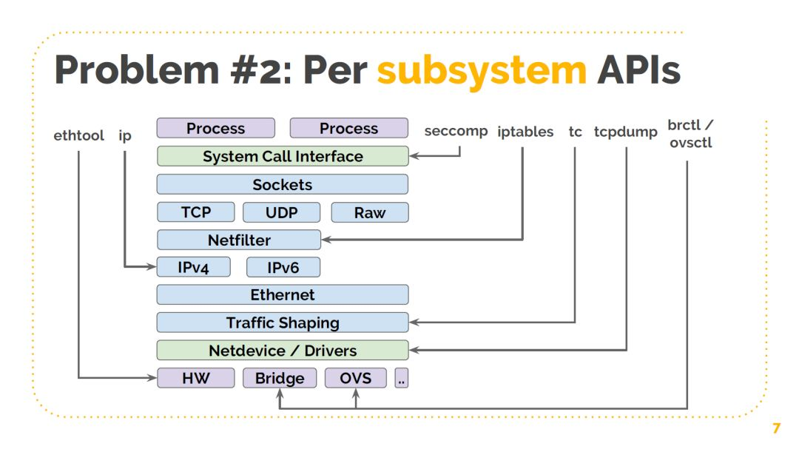
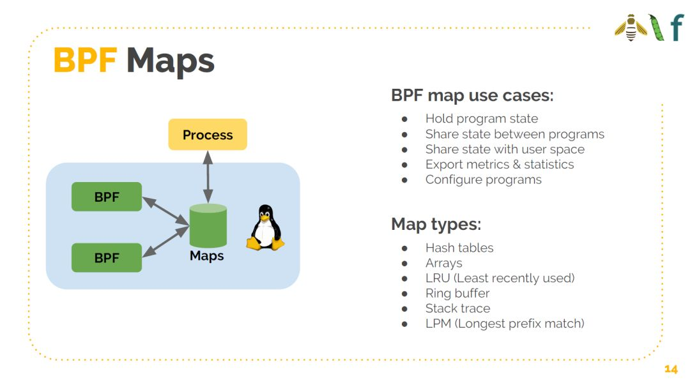
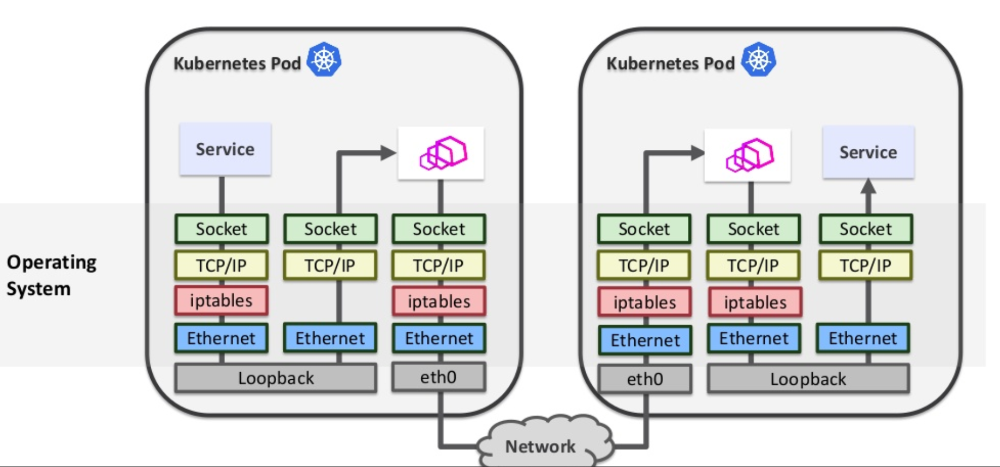
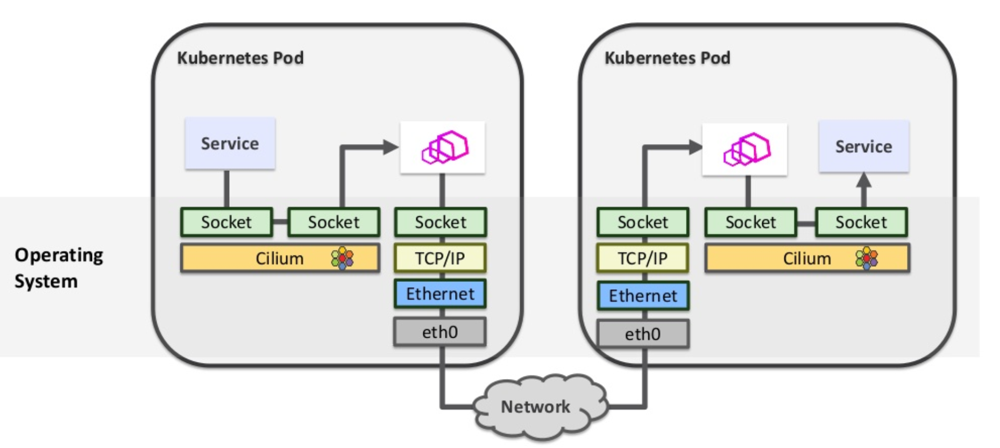

# Cilium

Cilium的出现主要解决两个问题。

1. 使用daemon process对网络的静态配置进行刷新和更新，性能将会影响到集群的进一步扩展，且路由表和iptables的维护对于程序员而言是一个非常头疼的事情。针对此，在通过虚拟机的方式保证内核安全的情况下，使用BPF让对于包的转发等相关逻辑使用代码进行处理。BPF中使用了bytecode，类似java的在虚拟机中执行，也不会影响到宿主机的kernel，却拥有近似kernel的状态。
2. 对于同一Pod中的容器利用socket通信的情况下，需要多次进入到内核网络协议栈，例如穿透TCP/IP，但TCP是用于解决网络拥堵和控流的，例如在sidecar部署模式下，没有什么实际的用途，并且封包拆包会带来较大的性能消耗。针对此，可以使用BPF中的`sockmap`，让sock和sock进行直连，从而极大的提高性能。

为验证 Cilium 的相关功能，使用 sealos 快速搭建一个1 master 2 node 的 cluster(--without-cni) ，并使用 istioctl 安装 istio 及其 bookinfo，并根据Cilium官方的配置安装 Cilium。

## 观察 Cilium 默认模式下的网络模式

就 Cilium 而言，我认为其层次高于 Flannel 和 Calico，因为他的网络模式既可以是类似 Flannel 的 overlay，也可以是类似 Calico 的 Direct Routing （甚至你可以直接让 Cilium 适配已有的 Flannel）。使用 VXLAN 的话 daemon主要负责做 VNI 等值的配置。相应的在 Direct Routing 的模式下，需要支持BGP，则要另行配置 BIRD，就变成了 Calico 的基本形式。

默认情况下使用是 Flannel VXLAN 的基本情况。例如查看route table

```bash
root@hadoop-master:/home/ubuntu# route
Kernel IP routing table
Destination     Gateway         Genmask         Flags Metric Ref    Use Iface
default         _gateway        0.0.0.0         UG    100    0        0 ens3
10.0.0.0        0.0.0.0         255.255.0.0     U     0      0        0 ens3
100.64.0.0      hadoop-master   255.255.255.0   UG    0      0        0 cilium_host
hadoop-master   0.0.0.0         255.255.255.255 UH    0      0        0 cilium_host
100.64.1.0      hadoop-master   255.255.255.0   UG    0      0        0 cilium_host
100.64.2.0      hadoop-master   255.255.255.0   UG    0      0        0 cilium_host
169.254.169.254 10.0.0.2        255.255.255.255 UGH   100    0        0 ens3
172.17.0.0      0.0.0.0         255.255.0.0     U     0      0        0 docker0

```

和 Flannel 如出一辙。

## Cilium & BPF



从上图可以看到，每一个类似的辅助软件都是在不同的层次上进行工作，例如我们正使用的iptables，他处于IP层之上，正好处于瘦腰模型的中间，可谓是“不上不下”，或者说我们希望足够抽象，基于Linux的事件驱动，我们能够在不同层都能够实现监听和劫持。因此我们使用的BPF，希望能够在不同的层次监听不同的事件，例如监听系统调用，或是监听网卡，都可以基于BPF实现。

## Istio & Cilium Network Control Compare

在此进行 Istio 和 Cilium 在 Network Control 方面进行对比。

Istio 中主要是依靠 mTLS 的证书，证书中有关于个人身份的 Identity，我们可以设置 Principal Check 来进行访问层面上的控制。当然这个是在TCP层之上

``` yaml
apiVersion: security.istio.io/v1beta1
kind: AuthorizationPolicy
metadata:
 name: httpbin
 namespace: foo
spec:
 action: ALLOW
 rules:
 - from:
   - source:
       principals: ["cluster.local/ns/default/sa/sleep"]
   - source:
       namespaces: ["test"]
   to:
   - operation:
       methods: ["GET"]
       paths: ["/info*"]
   - operation:
       methods: ["POST"]
       paths: ["/data"]
   when:
   - key: request.auth.claims[iss]
     values: ["https://accounts.google.com"]
```

这是 Istio 中 Authorization Policy的一个例子，主要观察principals，指定只有相应的服务才能访问自己，另外是关于他能访问哪些接扣，这都是HTTP层关注的内容。

Cilium 的在 Network Control 中既可以在 IP 层，也可以在 HTTP 层，他主要依赖的“Identity”是kubernetes中的Label。

```yaml
apiVersion: "cilium.io/v2"
kind: CiliumNetworkPolicy
metadata:
  name: "service-rule"
spec:
  endpointSelector:
    matchLabels:
      id: app2
  egress:
  - toServices:
    - k8sService:
        serviceName: myservice
        namespace: default
```

试设想，当该条 CiliumNetworkPolicy apply 之后将下发到各 Daemon 中，注意这个Policy的最终成果是生成一个BPF程序，这个程序具体执行的地方可能是在Driver或者Kernel(当然Driver一般也属于Kernel，只是更靠近Device)，根据相应的规则或forward，或drop，或返回403。



### Cilium-Istio

Istio使用sidecar模式对于通信而言会使得性能下降较为严重，且其使用了iptables来完成从application到sidecar的通信，将多次进出内核和协议栈，性能消耗巨大。Cilium对Istio进行改造，希望能够将application和sidecar之间的通信变为简单的socket->socket的信息传递，不需要走低层协议栈，即实现sockmap。






reference:

[How to Make Linux Microservice-Aware with Cilium and eBPF](https://www.youtube.com/watch?v=_Iq1xxNZOAo)

[sealos使用]([https://sealyun.com/docs/tutorial.html#%E5%AE%89%E8%A3%85%E6%95%99%E7%A8%8B](https://sealyun.com/docs/tutorial.html#安装教程))

[istio install](https://istio.io/docs/setup/install/istioctl/)

[kubecon-slides](https://www.slideshare.net/ThomasGraf5/accelerating-envoy-and-istio-with-cilium-and-the-linux-kernel)