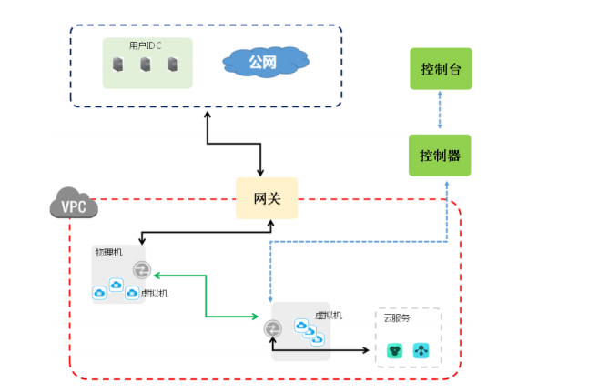
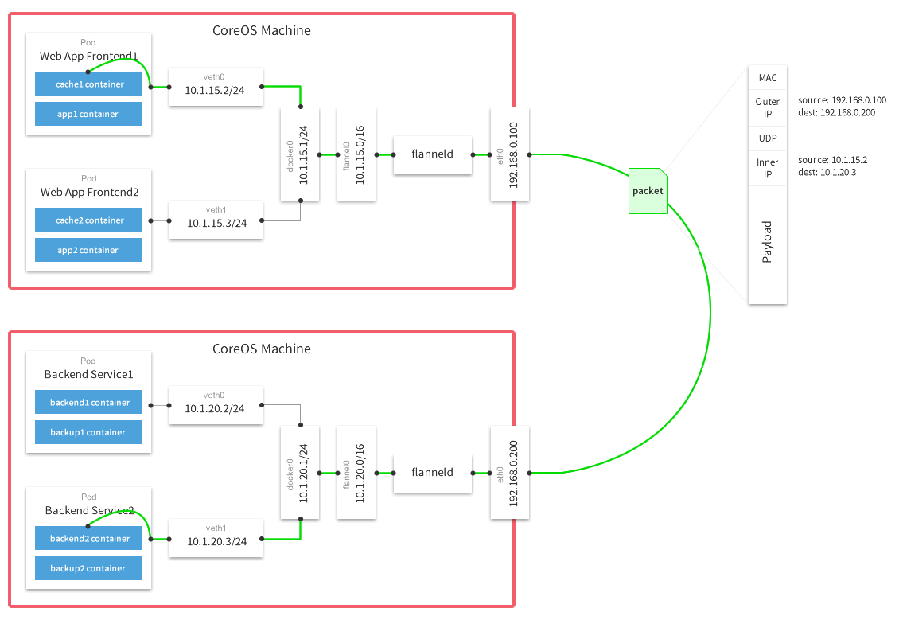

# overlay网络

overlay网络是应用层的网络，你不需要考虑过多的物理上的问题，建立overlay网络的主要原因主要是建立在物理结构上的虚拟网络，以IP的基础网络技术为主。

我们在阿里云服务器上建立的集群是在一个VPC下，该VPC就是一个overlay网络，在集群还未建立之前，我们的ECS之间是用VPC进行通信，拥有用户自定义分配的IP。

之后再我们建立集群之后，我们在集群内部的Pod or Service上之间用于通信的IP是我们集群内部的“虚拟子网”，即我们最终落脚的overlay网络。

### ARP与广播风暴

ARP其实与ICS课堂上对于以太网的科普是非常相关的。

在应用上我们会指定IP来用于通信，而更加低层的，我们是需要知道各物理机的MAC地址的，这个时候我们要在局域网中使用以太网的“广播”功能，当对方是我们需要通信的IP时，对方会向我们发送其IP地址。

我们会想到，假设我们在一个同一局域网下的物理机过多，我们的广播影响就越大，如果在没有cache的情况下，要求n个IP之间进行通信，则arp是需要平方的复杂度，这显然是不能够接受的，而这带来的就是广播风暴。

### ARP 代理

从性能上将我们肯定是尽可能的减少广播这样的操作，因而我们需要进一步的在局域网内进行分组，这个地方就涉及到ARP代理，详情可见[这里](https://www.2cto.com/net/201307/228504.html)，简单描述就是proxy提前应答了相应的mac地址，之后再进行定向转发到其他的子网。

我们这里不具体详谈overlay网络的实现，我们主要考察的是calico和flannel这两款kubernetes CNI plugin的实现方式和各项比较。

## Calico

Calico不是使用的overlay的网络，简单而言Calico是通过ARP代理劫持所有的容器中流量（因此我们会发现在容器中的网卡都是mac地址都是ee:ee:ee:ee:ee:ee

Calico是一个纯三层的数据中心（overlay网络是中心化的），能够提供可控的VM、容器、裸机之间的IP通信。

Calico在kubernetes部署时，存在两种组件：

calico-kube-controller：主要是监听Kubernetes API，读取相关的CRD(NetworkPolicy)，并同步到Calico数据库。

calico-node：每个主机节点上的iptables和路由表规则，来实现网络的控制，因此calico是部署在各个node节点上的。calico-node的主要有两个进程：Felix，Felix主要负责刷新主机路由和ACL规则，并确保主机正确相应来自每个工作负载的ARP Request，并将其管理的网卡启动IP Forward。BGP client负责将路由信息分发给其他的工作节点，具体负责BGP协议的实现。

额外的，在较大规模的部署场景中，我们可以设置BGP Route Reflector，要求BGP client与之进行连接，从而避免网络中的每一个BGP Client相互之间进行通信，进行集中式的路由信息分发。

Calico实现了arp proxy，让所有转发都在第三层网络层的基础上来进行，详情可见[这里](http://ju.outofmemory.cn/entry/367749)。

Calico的特点在于，将会拥有非常多的iptables设置和route table设置，相对于使用隧道(IPIP VXLAN UDP，因为Calico在三层，所以隧道会使用IPIP)，性能上将会有较大的提升，但是的在部署规模大幅度上升的情况下，各项静态配置的刷新将是非常难以接受的。

Calico发包的具体过程如下：

1. Container发出一个包，该包通过calixxxx（同时负责ARP proxy）网络设备来到宿主机
2. 宿主机通过路由表，将包直接发给对方宿主机。
3. 在对方宿主机上中找到对应的路由规则，直接进入到对应的容器中（注意这里不会进入到网桥中）。

## Flannel

总体来讲就是flannel做了一次代理，并且拥有统一的节点间路由表（etcd），flannel在每个节点上是一个二层设备，也必须知道对应的mac地址，但这个时候flannel是不会去发送arp的，而是在etcd中查询到对应的mac地址，对应的数据包再经过vxlan进行封装之后，会查询vxlan fdb（其实就是etcd的一个cache）。

flannel的主流的三种模式为UDP，VXLAN，HOST-GW。

UDP现如今已经不会在在生产环境中使用了，因为性能太低，需要两次进入到协议栈之中。

VXLAN可取代UDP，因为相关的封包工作将交由内核进行处理，从而减少了flanneld的工作，flanneld只需要对相应的内容进行配置即可，例如VNI。

HOST-GW的主要想法是，是将flanneld中的“知识”直接反馈在路由表中，在这种模式下，flanneld的唯一功能为修改主机上的路由表。同样的，路由表也是静态配置，这也会阻碍我们的集群进一步扩大规模，与此同时，HOST-GW必须得支持在同一网络下的传输，如果需要其他的路由器跨网进行发包则理论上不可能。

Flannel的发包过程具体如下(UDP)：

1. container的包通过 10.1.14.2/24对应的veth发送到docker0网桥中
2. 在docker0中查看路由表，发现是需要发送到flannel0的网卡上。
3. flannel0是一个tun设备，会被flanneld监听，在听到RAW IP包后，进行UDP的封装（如果是VXLAN模式，则该步骤不会在用户态操作，而是在内核已经完成），对应的IP和端口都是通过查询cache或etcd得知。
4. 对方宿主机中的flanneld收到包之后进行解包。包通过路由表发送到docker0的网桥，docker0的网桥。

