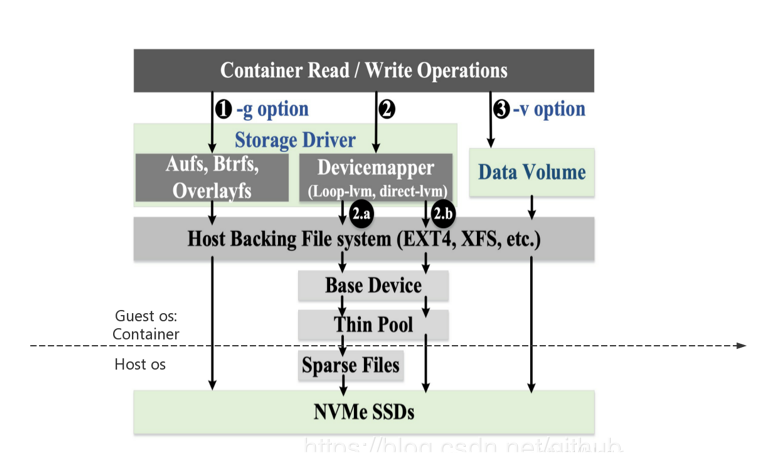
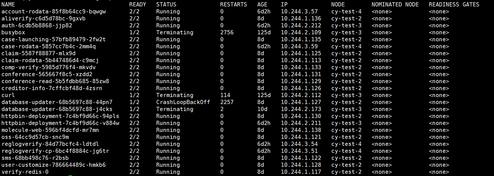
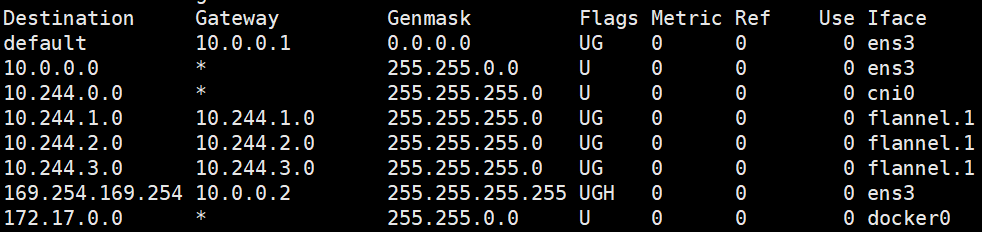
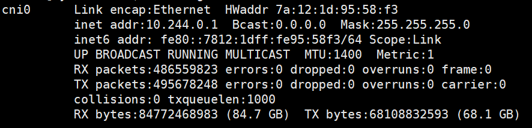
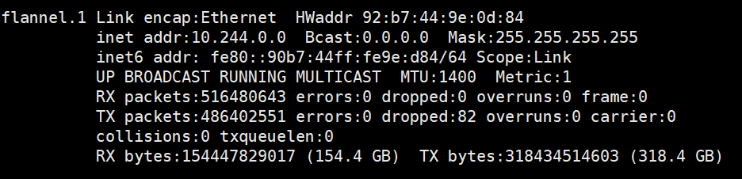
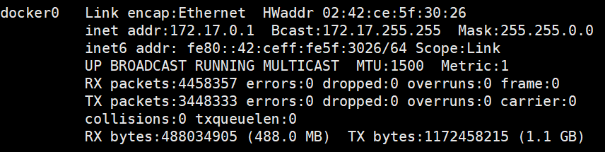

# linux namespace 与 docker 对namespace的运用

## namespace info

namespace的功能是使用linux内核来隔离内核资源，通过namespace可以让一些进程只能看到与自己相关的一部分资源。简而言之，**namespace做到的是在linux操作系统下针对进程的资源隔离**。

linux现如今提供的对于六类系统资源的隔离机制，分别是：

1. Mount：隔离文件系统挂载点
2. UTS：隔离主机名和域名信息
3. IPC：隔离进程间通信
4. PID：隔离进程ID
5. Network：隔离网络资源
6. User：隔离用户和用户组ID

首先我们简单了解一下相关namespace的系统调用

```c
// clone 用于创建一个独立的namespace进程，本质上感觉跟fork似乎没有太大的区别，但是会添加一个 flags参数，flag参数即选定即选定新进程的特有的namespace。
int clone(int (*child_func)(void *), void *child_stack, int flags, void *arg);
// 把本进程加入到指定的namespace中，这个namespace是可以通过文件描述符的方式来索引到某个namespace
int setns(int fd, int nstype);
// 用于将当前进程和所在的namespace分离，加入到一个新的namespace中
int unshare(int flags);
```

相关的flag自查文档。

### mount namespace

mount这个操作，主要是为了在用户使用上，访问其他的文件系统，如同访问一个普通文件一样，mount namespace的作用是隔离挂载点，每个mnt namespace内的文件结构都可以单独修改。

这里我们回顾一下我们的docker，实质上确实是这么进行操作的，默认的都是挂载点进行隔离，我们在docker filesystem中的提到的层叠是文件系统是作为了docker container系统的初始挂载点。我们每一个Mount namespace都有自己的独立的文件系统视图。

当然完全的隔离也会带来问题，我们可能在电脑上安装了一个新的硬件磁盘，我们现在是想所有的namespace都可见（因为大家都想扩容），那就有了挂载传播的概念，有如下几种传播类型：**MS_SHARED**: 一个挂载对象的挂载实践会跨namespace共享到其他挂载对象

**MS_SLAVE**: 传播的方向是单向的，即只能从Master传播到Slave方向。

**MS_PRIVATE**: 不同namespace的挂载事件是互不影响的。

**MS_UNBINDABLE**: 一个不可绑定的私有挂载，与私有挂载类似，但是不能执行挂载操作。



我们这里的最上层，其实是你linux系统里面的的VFS，VFS会对挂载点进行管理，我们可以看到，这里我们在中间层的**Storage Driver** 和 **Data Volume**是平级的，Storage Driver是其实是加载的我们的image中的的相关存储的内容，而Data Volume比如主要针对的就是`-v`的相关操作

简单的，我们可以认为存储卷是一个mapping，是容器上的一个或多个“目录”，此目录可以绕过联合文件系统，与宿主机上的某个目录关联。我们一共有两种挂载卷：

绑定挂载卷：在宿主机和容器上各致命绑定路径才能进行绑定。

docker管理卷：在容器内指定挂载点，而被挂载点宿主机上的挂载路径不需要用户创建，而是docker daemon维护。

甚至学到了点新的操作，你可以复制另一个container的volume使用`--volumes-from`。

我们继续回到mount这个操作，我们一般要是插入U盘或者某硬件，就是在/dev文件夹下建立一个文件映射。这个地方我们是在思考就是这个映射到文件，他是如何做到的呢，他实质是插入了一个硬件之后，类似于I/O中断一样，cpu会跳转到一个具体的位置，然后这个具体的位置，执行相应的代码，修改相应VFS的相应挂载点的数据结构，挂载点添加之后，会检查自己的挂载传播的策略，来执行相应的后序操作。

### UTS namespace

UTS namespace的主要功能是用来隔离系统的hotsname以及NIS domain name。修改这个部分，主要是调用`sethostname`和`setdomainname`这两个系统调用来进行相应的操作，没有什么难度。

对应在docker中操作主要是有关于container的命名，以及命名所带来的DNS的相关问题。

### network namespace

network namespace能够创建多个隔离的网络空间，运行的时候仿佛自己在独立的网络中。

对于每一个network namespace而言，他需要有什么内容呢，主要就是需要虚拟网卡，路由表、ARP表、iptables等相关网络资源

我们的相关内容都将使用到`ip`的cmd

我们能够使用ip在选定的网络环境下进行相关指令的执行，可以用来测试相关虚拟网络的情况

```bash
ip netns add net0 # 创建两个namespace 
ip netns add net1
ip link add type veth
ip link set veth0 netns net0
ip link set veth1 netns net1 # 将两个interface分别于namespace进行绑定
ip netns exec net0 ip link set veth0 up
ip netns exec net0 ip addr add 10.0.1.1/24 dev veth0 # gei net0配置相应的ip网段
ip netns exec net0 ping -c 3 10.0.1.2
# 测试两个网络之间的通信是否畅通
```

以上的操作基本能够模拟早期使用docker --link时时候进行相应的网络联通时的操作，主义veth pair是成对创建的，在创建初就是一对

之后我们尝试使用桥接模式进行网络连接。

```bash
ip link add br0 type bridge
ip link set dev br0 up
ip link set dev veth1 netns net0
ip netns exec net0 ip link set dev veth1 name eth0
ip netns exec net0 ip addr add 10.0.1.1/24 dev eth0
ip netns exec net0 ip link set dev eth0 up
ip link set dev veth0 master br0
ip link set dev veth0 up
```

这里主要操作是要把一端注册到我们的网桥上，完成相应的通信。

这里其实我们非常容易能够与docker本身的结构进行相应的理解。

另一方面，我们kubernetes中一个Pod内是使用同一个network namespace，因为我们在一个Pod内部之间的访问都是localhost的访问，并且端口不能重合。这里存在说我们kubernetes高层的网络倒确实是使用DNS这一套的思路来进行网络的构建的。


现在整体的考虑的一下kubernetes+flannel+CoreDNS这套架构下，我们整个发包的流程：

1. 检查包如果是本Pod内的，由于一个Pod内是使用的一个namespace，则该包并不过docker的网卡，而是在子网内的网桥中进行运转。
2. 如果包是发往同一宿主机上的不同Pod，则需要发包到宿主机的网卡（宿主机是单独一个namespace），但是不会进入到flannel的网桥中。
3. 如果是包是发往不同宿主机上的Pod，则需要发包到flannel的网卡上，然后flannel去查询相关的地址，进行封装后发包。

注意到这里有个关键就在于，我们使用DNS，就必须得使用flannel的网卡，我们很多的操作都需要使用LoadBalancer和使用Service这一层次的操作，基本都需要使用到查询Service，大部分所谓本地Pod找本地Pod的情况，也不会出现，因为那样需要直接使用IP访问，但是这样动态性基本会被毁灭。

我们进一步观察相关的路由





route中我们看见几个虚拟的Iface是flannel管理的，是每一个节点一个子网，和上面的具体的Pod的相关信息也是一一对应的，cni0对应的是本机的网络。

我们这里发现了一个很有趣的现象，跟大家分享，主要是验证cni0、flannel、openstack虚拟网络三者之间的关系。





我们可以看到这个cni0管的是本机内Pod跟Pod之间的传输，则会存在cni0 MTU <= flannel <= openstack MTU。



之后我们发现，我们的docker0即dokcer的默认子网的interface，使用的是MTU = 1500，我们进行测试，发现还是有MTU的问题。我们在这里认为这个设置他是有问题的，我们这里使用`ping -s 1472 www.bilibili.com`（IP包头20 + ICMP包头8）发现大于1472的都发布出去，我们后面又使用了`tracepath`进行测试。


我们发现了pmtu的这个操作，即在进行发送消息之前会主动提供路径上的MTU大小，便于本次传输的MTU的设置，pmtu似乎是一个修正功能。

### User namespace

user namespace主要是对用户权限进行相应的隔离。 当在一个进程中调用unshare或者clone创建新的user namespace时，当前进程原来所在的user namespace为父user namespace，新的user namespace为子user namespace。

在不同的user namespace中，同样一个用户的user ID 和group ID可以不一样，换句话说，一个用户可以在父user namespace中是普通用户，在子user namespace中是超级用户（超级用户只相对于子user namespace所拥有的资源，无法访问其他user namespace中需要超级用户才能访问资源）。

这两个文件里面的配置格式如下（可以有多条）：

```bash
ID-inside-ns ID-outside-ns length
```

举个例子, 0 1000 256这条配置就表示父user namespace中的1000~1256映射到新user namespace中的0~256。

