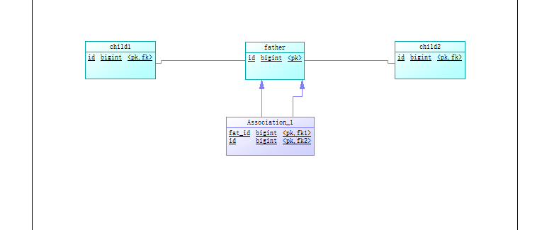

# 数据库多态的实现

在一般程序中多态一个较为常用的一个情况，那么在数据库中我们多态的主要表现是各实体类之间的关系建立。我们在数据库中的实现方式有两种，一种方式是继承，另一种方式是聚合。

## 继承

对于继承关系的父类来说，它不知道有哪些子模块继承与它，但那些子模块都必须知道自己的父类是什么。

由于我们在诸多的编程语言中都会使用到继承来实现多态，所以我们惯性思维可以想到先是使用继承来实现。

我们让子类继承父类，具体体现在子类的主键也是外键，对应的是父类的主键，这样所有子类的主键域是同一个，即如果确定id，也确定了子类的类型。

## 聚合

聚合与继承不一样，对于聚合模块来说，它知道有哪些被聚合的模块，但那些被聚合的模块不知道这个聚合模块的存在。

使用聚合实现，我们需要在association记录下其主键，并且要记录下其相应的类型，我们需要用类型+id来确定唯一实体。

associate表头如下：

| id   | type | fat_id | fat_type |
| ---- | ---- | ------ | -------- |
|      |      |        |          |

## 聚合与继承的比较

尽量使用组合，聚合来代替继承，我们可以对比一下聚合和继承两者之间用于数据库实现上的问题。

聚合需要新增两列列来确定唯一实体，继承由于多个表主键是同一域下，所以只需要外键即可。

继承需要维护主键同一域这样一个问题，在具体的实现中会有一些性能上的影响。

在增加一个新的“子类”的情况下，继承的消耗要比聚合更多。