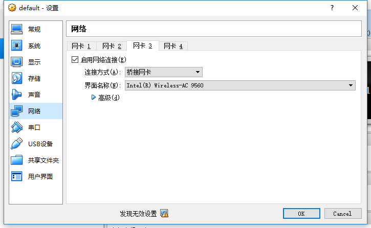

# docker的基本操作

1. 为什么我们要使用docker

   主要是因为一个比赛需要快速配环境，使用docker能够快速配置好linux服务器的相关环境。

## 安装

由于docker在windows或者macOS下是在虚拟机内跑的，我们需要使用oracle VM virtualBox，这里建议大家下载DockerToolBox，用于自动安装，比较方便。

下载完成并一直next之后，按照一般操作是需要你使用Docker QuickStart Terminal，需要使用到你的bash，所以大家在下载DockerToolBox同时下载bash并安装。

因为在windows下，docker container是在你的虚拟机下面跑的，当你打开Oracle VM virtualBox的时候，你需要能够对default虚拟机的网卡和bridge进行设置，如下图。



需要提醒的是，虚拟机需要在每次使用docker的时候打开，这也是为什么不提倡大家在windows下使用的原因之一。

## 使用

docker的操作和git比较相似，dockerhub上有许多的images供大家选择，根据不同的需求可以得到不同的image

```shell
docker pull nginx #获得image
docker run --name demo xxxxxx nginx:latest # 通过image nginx:latest创建名为demo的docker container并运行
docker ps# 可以看到正在使用的docker进程
docker stop {id} # 停止docker进程
docker kill {id} # 无条件停止docker进程
```

另外大家可以使用Kitematic这个docker GUI，也比较方便大家使用

docker多用于部署web应用，我们必然会关注到端口的问题，docker可以进行端口映射，即我们docker容器的端口和我们主机的端口之间存在一个map，指令如下

```shell
docker run --name demo -p 8080:80 nginx:latest
```

上述的语句基本是说你主机的8080端口映射到container的80端口，比如我们就可以通过localhost:8080看到一个container中80端口nginx的默认欢迎页面。

注意，windows和mac用户没法在localhost看到，这是因为他们是运行在虚拟机中的，只有linux环境下这个操作才是可以的，windows和mac用户可以通过Kitematic看到该container的80端口被映射到了那个ip下面。

## mysql环境的搭建

为了搭建mysql环境，我预期使用mysql的image进行create container。在通过上述的类似操作之后，我发现我能execute command中用命令行进入到mysql，但是我使用PHP脚本的时候却被拒绝，这个原因在于mysql8.0的auth的默认模式并不是用户名密码的，因为我并没有什么特别的用途，我就直接退回到了mysql5.7，当然你也可以进入到数据库内部调整auth的方式为naïve mode