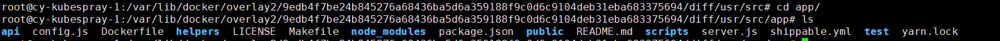

# Docker的文件系统

本文将主要介绍docker分层文件系统的相关知识，并主要介绍overlayfs、devicemap、aufs三种fs对于docker的支持以及再各个平台上的使用。

最开始接触到docker的文件系统是在课程中遇到在arm的板子上由于磁盘空间不够，又发现是docker image所占空间过大造成，因此我们考虑到相关的操作去减小磁盘空间大小。

## docker 浅析

我们首先探析一下`/var/lib/docker`文件夹下的目录结构，每一个文件夹和文件分别对应有关的什么功能。

### contianers

contianers里面的文件夹一一与我们在`docker ps`中看到的CONTAINER ID 对应。


众所周知，docker的文件系统是分层结构的，具体的层次结构可以由Dockerfile非常清晰的进行对应。我们进一步查看具体某文件夹中的相关内容，内部的文件结构如下

```
xxx.log
checkpoints
config.v2.json
hostconfig.json
hostname
hosts
mounts
resolv.conf
resolv.conf.hash
```

发现除去标准输出的相关log，就是相关网络的配置、相关卷mount的情况。这个里面会发现mount里面默认会有一个shm文件夹，/dev/shm这个目录是linux下一个利用内存虚拟出来的一个目录，这个目录中的文件都是保存在内存中，而不是磁盘上。其大小是非固定的，即不是预先分配好的内存来存储的(shm == shared memory)。有一些程序需要用到shm，这个时候需要在run container的时候设置好`shm-size`这个参数。

### image

在image文件夹下我们主要关注的是image-db和layer-db这两个文件夹，两个文件夹中的内容都是按IMAGE ID来进行索引的

```json
{
	"architecture": "amd64",
	"config": {
		"Hostname": "9000374819a8",
		"Domainname": "",
		"User": "",
		"AttachStdin": true,
		"AttachStdout": true,
		"AttachStderr": true,
		"ExposedPorts": {
			"3306/tcp": {},
			"33060/tcp": {}
		},
		"Tty": true,
		"OpenStdin": true,
		"StdinOnce": true,
		"Env": ["MYSQL_ALLOW_EMPTY_PASSWORD=1", "PATH=/usr/local/sbin:/usr/local/bin:/usr/sbin:/usr/bin:/sbin:/bin", "GOSU_VERSION=1.7", "MYSQL_MAJOR=5.7", "MYSQL_VERSION=5.7.28-1debian9"],
		"Cmd": ["mysqld"],
		"ArgsEscaped": true,
		"Image": "mysql:5.7",
		"Volumes": {
			"/var/lib/mysql": {}
		},
		"WorkingDir": "",
		"Entrypoint": ["docker-entrypoint.sh"],
		"OnBuild": null,
		"Labels": {}
	},
	"container": "9000374819a8a4a227d75b07c5945d55a52b096cdcf8797de1afe4843a45a330",
	"container_config": {
		"Hostname": "9000374819a8",
		"Domainname": "",
		"User": "",
		"AttachStdin": true,
		"AttachStdout": true,
		"AttachStderr": true,
		"ExposedPorts": {
			"3306/tcp": {},
			"33060/tcp": {}
		},
		"Tty": true,
		"OpenStdin": true,
		"StdinOnce": true,
		"Env": ["MYSQL_ALLOW_EMPTY_PASSWORD=1", "PATH=/usr/local/sbin:/usr/local/bin:/usr/sbin:/usr/bin:/sbin:/bin", "GOSU_VERSION=1.7", "MYSQL_MAJOR=5.7", "MYSQL_VERSION=5.7.28-1debian9"],
		"Cmd": ["mysqld"],
		"ArgsEscaped": true,
		"Image": "mysql:5.7",
		"Volumes": {
			"/var/lib/mysql": {}
		},
		"WorkingDir": "",
		"Entrypoint": ["docker-entrypoint.sh"],
		"OnBuild": null,
		"Labels": {}
	},
	"created": "2020-01-08T07:12:13.101719812Z",
	"docker_version": "18.09.7",
	"history": [{
		"created": "2019-12-28T04:23:47.4966447Z",
		"created_by": "/bin/sh -c #(nop) ADD file:90a2c81769a336bed3f731f44a385f2a65b0916f517a0b77c06c224579bf9a9a in / "
	}, {
		"created": "2019-12-28T04:23:47.719507596Z",
		"created_by": "/bin/sh -c #(nop)  CMD [\"bash\"]",
		"empty_layer": true
	}, {
		"created": "2019-12-28T22:58:40.663064488Z",
		"created_by": "/bin/sh -c groupadd -r mysql \u0026\u0026 useradd -r -g mysql mysql"
	}, {
		"created": "2019-12-28T22:58:50.957169988Z",
		"created_by": "/bin/sh -c apt-get update \u0026\u0026 apt-get install -y --no-install-recommends gnupg dirmngr \u0026\u0026 rm -rf /var/lib/apt/lists/*"
	}, {
		"created": "2019-12-28T22:58:51.183379353Z",
		"created_by": "/bin/sh -c #(nop)  ENV GOSU_VERSION=1.7",
		"empty_layer": true
	}, {
		"created": "2019-12-28T22:59:08.168628717Z",
		"created_by": "/bin/sh -c set -x \t\u0026\u0026 apt-get update \u0026\u0026 apt-get install -y --no-install-recommends ca-certificates wget \u0026\u0026 rm -rf /var/lib/apt/lists/* \t\u0026\u0026 wget -O /usr/local/bin/gosu \"https://github.com/tianon/gosu/releases/download/$GOSU_VERSION/gosu-$(dpkg --print-architecture)\" \t\u0026\u0026 wget -O /usr/local/bin/gosu.asc \"https://github.com/tianon/gosu/releases/download/$GOSU_VERSION/gosu-$(dpkg --print-architecture).asc\" \t\u0026\u0026 export GNUPGHOME=\"$(mktemp -d)\" \t\u0026\u0026 gpg --batch --keyserver ha.pool.sks-keyservers.net --recv-keys B42F6819007F00F88E364FD4036A9C25BF357DD4 \t\u0026\u0026 gpg --batch --verify /usr/local/bin/gosu.asc /usr/local/bin/gosu \t\u0026\u0026 gpgconf --kill all \t\u0026\u0026 rm -rf \"$GNUPGHOME\" /usr/local/bin/gosu.asc \t\u0026\u0026 chmod +x /usr/local/bin/gosu \t\u0026\u0026 gosu nobody true \t\u0026\u0026 apt-get purge -y --auto-remove ca-certificates wget"
	}, {
		"created": "2019-12-28T22:59:09.498720811Z",
		"created_by": "/bin/sh -c mkdir /docker-entrypoint-initdb.d"
	}, {
		"created": "2019-12-28T22:59:20.712297124Z",
		"created_by": "/bin/sh -c apt-get update \u0026\u0026 apt-get install -y --no-install-recommends \t\tpwgen \t\topenssl \t\tperl \t\u0026\u0026 rm -rf /var/lib/apt/lists/*"
	}, {
		"created": "2019-12-28T22:59:24.415627445Z",
		"created_by": "/bin/sh -c set -ex; \tkey='A4A9406876FCBD3C456770C88C718D3B5072E1F5'; \texport GNUPGHOME=\"$(mktemp -d)\"; \tgpg --batch --keyserver ha.pool.sks-keyservers.net --recv-keys \"$key\"; \tgpg --batch --export \"$key\" \u003e /etc/apt/trusted.gpg.d/mysql.gpg; \tgpgconf --kill all; \trm -rf \"$GNUPGHOME\"; \tapt-key list \u003e /dev/null"
	}, {
		"created": "2019-12-28T23:00:07.883289722Z",
		"created_by": "/bin/sh -c #(nop)  ENV MYSQL_MAJOR=5.7",
		"empty_layer": true
	}, {
		"created": "2019-12-28T23:00:08.051707224Z",
		"created_by": "/bin/sh -c #(nop)  ENV MYSQL_VERSION=5.7.28-1debian9",
		"empty_layer": true
	}, {
		"created": "2019-12-28T23:00:08.734758403Z",
		"created_by": "/bin/sh -c echo \"deb http://repo.mysql.com/apt/debian/ stretch mysql-${MYSQL_MAJOR}\" \u003e /etc/apt/sources.list.d/mysql.list"
	}, {
		"created": "2019-12-28T23:00:34.175992977Z",
		"created_by": "/bin/sh -c { \t\techo mysql-community-server mysql-community-server/data-dir select ''; \t\techo mysql-community-server mysql-community-server/root-pass password ''; \t\techo mysql-community-server mysql-community-server/re-root-pass password ''; \t\techo mysql-community-server mysql-community-server/remove-test-db select false; \t} | debconf-set-selections \t\u0026\u0026 apt-get update \u0026\u0026 apt-get install -y mysql-server=\"${MYSQL_VERSION}\" \u0026\u0026 rm -rf /var/lib/apt/lists/* \t\u0026\u0026 rm -rf /var/lib/mysql \u0026\u0026 mkdir -p /var/lib/mysql /var/run/mysqld \t\u0026\u0026 chown -R mysql:mysql /var/lib/mysql /var/run/mysqld \t\u0026\u0026 chmod 777 /var/run/mysqld \t\u0026\u0026 find /etc/mysql/ -name '*.cnf' -print0 \t\t| xargs -0 grep -lZE '^(bind-address|log)' \t\t| xargs -rt -0 sed -Ei 's/^(bind-address|log)/#\u0026/' \t\u0026\u0026 echo '[mysqld]\\nskip-host-cache\\nskip-name-resolve' \u003e /etc/mysql/conf.d/docker.cnf"
	}, {
		"created": "2019-12-28T23:00:34.406633745Z",
		"created_by": "/bin/sh -c #(nop)  VOLUME [/var/lib/mysql]",
		"empty_layer": true
	}, {
		"created": "2019-12-28T23:00:34.614851089Z",
		"created_by": "/bin/sh -c #(nop) COPY file:b3081195cff78c4726a17cfcbc840d37d0c488bb7d020b6e52445d328ce4024a in /usr/local/bin/ "
	}, {
		"created": "2019-12-28T23:00:35.310545491Z",
		"created_by": "/bin/sh -c ln -s usr/local/bin/docker-entrypoint.sh /entrypoint.sh # backwards compat"
	}, {
		"created": "2019-12-28T23:00:35.464669476Z",
		"created_by": "/bin/sh -c #(nop)  ENTRYPOINT [\"docker-entrypoint.sh\"]",
		"empty_layer": true
	}, {
		"created": "2019-12-28T23:00:35.643098856Z",
		"created_by": "/bin/sh -c #(nop)  EXPOSE 3306 33060",
		"empty_layer": true
	}, {
		"created": "2019-12-28T23:00:35.811619092Z",
		"created_by": "/bin/sh -c #(nop)  CMD [\"mysqld\"]",
		"empty_layer": true
	}, {
		"created": "2020-01-08T07:12:13.101719812Z",
		"created_by": "mysqld"
	}],
	"os": "linux",
	"rootfs": {
		"type": "layers",
		"diff_ids": ["sha256:814c70fdae62bc26c603bfae861f00fb1c77fc0b1ee8d565717846f4df24ae5d", "sha256:25575e327c84a7dc1cf4fe937763159f5cf0388ab8847ce98343377a3e6c61b6", "sha256:61cb1c0dec27ba5526dddaf67a05e9fe386d72fd56fc2da3485580597ed1285f", "sha256:955b4c88a6e8be640471e2643d79451242c96a8efeacf9e74b93a33eeab2c9aa", "sha256:fef9e518b701f500c8956310954a06fc7a9960c4174361604edbb01296904e18", "sha256:cf6a13051478f7a8d7fdcfa59c480b497c70e594cedf7619b0df7ae499e2f016", "sha256:2a60eb850753e9eb5a2ba6f82015558ebeaba02d118d5a5a3a9d1e8120dd9bd1", "sha256:400dd8938406450c9e4d6bf0a58e9b3867600af09179328d45e891b2cae101f6", "sha256:17d2117d1ff37e68e5c0f7c267ef2cb0fc08751f5958d08d14fd0ac843ab80c6", "sha256:ce4569bf481c3cc98a31b24ad2a9e9dbb600487c462e507d07e2a734299a173b", "sha256:ab91c8a5ef0a7101664414173a61e9bff748478564a3ad1beb8637a0b49d0438", "sha256:dc3a2ef90ed8d9ee9b8b3f5db015f82ba5cdf2464029dc1edc5cf35e6664aeb5"]
	}
}
```

和inspect出来的信息相同，我们重点关注下最后有关的layers的记录。layers里面主要记录了祖先layer的相关内容，以及相关size大小等metadata，具体的layer内容我们要在overlay2文件夹下进一步查询，在overlay2文件夹内进行查询使用的是具体layer中的cache-id的sha256值。

处于底层的镜像目录包含了一个diff和一个link文件，diff目录存放了当前层的镜像内容，而link文件则是与之对应的短名称。比如我们如果访问的是最顶的一层，我们就可以看到我们ADD or COPY的相关文件。



### volumes

volumes下的每个文件夹都对应一个volume，而对于一个volume进行修改和写入的相关数据都是在_data中。直接对应我们用的-v --mount两个指令。

### user view


我们在使用image进行容器的创建时，实质上是在image上添加了一层可读可写层，这样我们多个容器可以共享一个image

## filesystem

针对filesystem，我们将针对增删改查对其进行相应的考察，观察其在原子性上的设计（bootstrap）

### overlayfs


overlayfs与docker structure的对应如上图，其中upper层是我们的读写层，我们可以在该层次上进行修改。我们需要考虑到增删改查几个方面上再不同层上的考虑：

#### 删除

##### 删除upper层上的文件，并且lower层上没有出现同名文件

直接删除即可，因为upper层我们可以直接进行读写。

##### 删除lower层上的文件

因为lower层上的文件是只读文件，但是我们需要让用户使用时认为该文件已经删除，因此我们需要创建Without文件，该文件对用户不可见但是在用户执行ls调用readdir的时候，将会将底层文件屏蔽。

##### 删除upper层上的文件，但lower层上存在同名文件

基本同上，既要删除掉upper层的文件，又需要使用Without文件对下层屏蔽。

#### 创建

##### 创建lower层中不存在的文件

直接在upper层中进行创建

##### 创建一个在lower层已经存在且在upper层有Whithout文件的同名文件

即这个文件曾经被删除过，我们现在又要创建一个该文件，则需要删除掉Without文件并创建新文件。

##### 创建一个在lower层已经存在且在upper层有Whithout文件的同名目录

该情况与上述情况类似，差别在于是目录而不是文件，如果仅仅是创建一个目录并删除掉原Without文件，则会存在lower层中的内容会暴露给用户，因此，我们需要在该文件夹中添加meta信息用于截断，即设置Opaque属性为true，则在遍历文件夹时不会向低层进行遍历。

#### 读取/查找

直接按照层次高低进行collection，因此对于查找某个文件或文件夹，消耗较大。

#### 写入/修改——copy on write

mechanism上，我们只能在upper上进行写的操作，因此如果是要写一个lower层出现的文件，我们需要把文件copy到upper层上进行写的操作。有如下的文件系统调用会触发copy：

1. 以写方式打开lower文件
2. 修改lower文件的metadata
3. rename lower层文件
4. 对lower层文件创建硬链接
5. 在lower层文件夹中进行文件的创建，对其父目录执行copy on write
6. 对lower层某个文件进行操作造成的copy on write，其对应的父目录会至下而上递归执行copy on write

##### rename

redirect_dir是否开启，对于rename的操作是非常不同的，如果没有开启redirect_dir则将直接给mv指令返回EXDEV错误，而mv的操作为，直接复制文件夹/文件，然后删除原文件夹/文件，这个操作不是原子的，因此如果崩溃将会出现两个文件夹/文件都存在的情况。

如果redirect_dir开启，我们的修改只能是在upper层，然后我们在upper层中存在lower层文件夹的原名


`mv DirA DirX && mv DirB DirY`指令之后，文件夹会带上相应的metadata。

#### 原子性保证

这个里面我们需要保证的是all-or-nothing，我们需要有一个新的概念在upper层——work&exchange rename，这个地方的bootstrap最底层在于exchange rename，这个是由底层文件系统保证的原子性。

work文件夹主要是生成想要的东西，然后与原文件/文件夹进行exchange rename，之后文件删除的工作在work文件中进行。

（我真的没看懂那个st_ino的部分，后面再说吧）

### devicemap

主要是在Centos上存在，上一次见到也是在arm的板子上面见到的。


docker能够使用该种方式进行存储，主要是其COW的能力和镜像分层共享的功能

创建镜像时，会创建一个新的dm设备，dm是基于base snapshot进行创建的，后面创建的dm也是基于之前的dm进行创建。在创建容器时，会基于image的顶层dm进行init dm的创建，并生成一些运行时需要的文件和目录。

#### read


devicemap层级上是对块进行操作，因此如果拿到相应的地址，按层从上到下进行查找即可。

#### write

**写新文件**：通过 `devicemapper` 驱动程序，通过 *allocate-on-demand* 操作实现将新数据写到容器中。新文件的每个块都分配到容器的可写层，并且块写入那里。（Each block of the new file is allocated in the container’s writable layer and the block is written there.）

**改文件**：文件的相关块从最近的包含这些块的层中读取。当容器写入文件时，只有修改后的块被写入容器的可写层。

**删除文件或目录**：当删除容器可写层中的文件或目录时，或者镜像层删除其父层中存在的文件时，`devicemapper` 存储驱动程序会截获对该文件或目录的进一步读取尝试，并回应文件或目录不存在。不会真的删除，但在读的时候告诉你不存在。

**写然后删除文件**：如果容器写入文件并稍后删除文件，则所有这些操作都发生在容器的可写层中。在这种情况下，如果使用 `direct-lvm`，块将被释放。如果使用`loop-lvm`，块可能不会被释放。这是不在生产环境中使用 `loop-lvm` 的另一个原因。

#### performance

- 按需分配（allocate-on demand）性能影响：
  `devicemapper` 存储驱动程序使用按需分配操作将精简池中的新块分配到容器的可写层。每个块都是 64KB，所以这是用于写入的最小大小。
- 写时复制（Copy-on-write）性能影响：
  容器第一次修改特定块时，该块将写入容器的可写层。因为这些写操作发生在块的级别而不是文件，所以性能影响最小化。但是，编写大量数据块仍然会对性能产生负面影响，并且设备映射程序存储驱动程序实际上可能在此方案中的性能比其他存储驱动程序差。对于写入繁重的工作负载，应使用完全绕过存储驱动程序的数据卷。

### aufs

TODO

#### 有关squash的相关问题

squash指将一个image撵平，不再具有相关的层次结构，我们能够做到的方式有如下三种

1. 在build的使用--squash参数，这样只能对写的几层进行squash，对于base image无效。
2. docker export & docker import 方式，但是只能对已经存在的镜像进行操作，不能从dockerfile开始
3. 使用一些工具docker-squash / docker-slim


通过的export（export的对象是container，save是container和image都可以，但结果都是image）导出的image确实会小大概100M，我们进一步inspect两个镜像，查看相关layer的情况

发现确实是只剩下一层，且这一层的sha256与原来得也不同。

而对于docker-slim更多是基于用户行为来进行slim操作，会要求用户输入其需要在容器中使用的相应cmd（还不清楚如果我又多个cmd会怎么样），也不清楚其实现是乐观的还是悲观的，但我认为如果我是用作一个dev container在vscode中使用，这种2MBslim过image应该很难使用，因此其可能更加适合是非mount、操作固定的情况下最终对image进行压缩。


#### squash的优缺点

Prof：

1. 能够少量的减少image的大小
2. 能够对首次open文件/目录或者目录读取的速度提升

Cons:

	1. 由于失去层次关系，不能进行层次间的共享，因此单看一个文件大小或许有所变化，layer不可共享带来的问题更加使得空间紧缺，网络传输的消耗也变大。
 	2. 并未提高对文件的读写能力。

因此，对于是否squash image，需要有更进一步的考虑，如果这个image在今后以base image存在与你的项目中，可以考虑在进一步工作之前进行相应的瘦身。