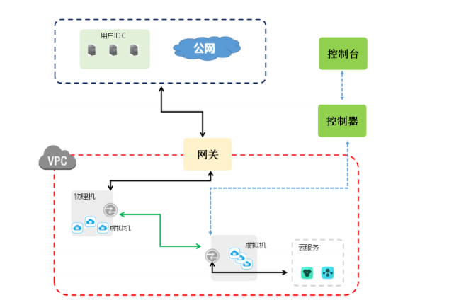
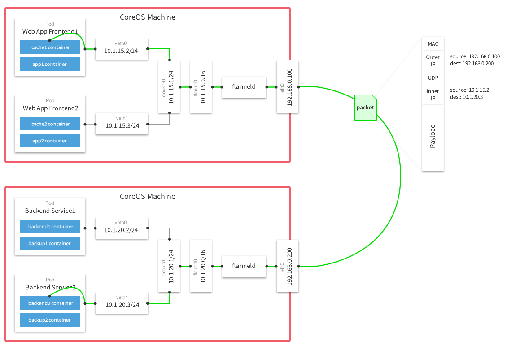

# overlay网络

overlay网络是应用层的网络，你不需要考虑过多的物理上的问题，建立overlay网络的主要原因主要是建立在物理结构上的虚拟网络，以IP的基础网络技术为主。

我们在阿里云服务器上建立的集群是在一个VPC下，该VPC就是一个overlay网络，在集群还未建立之前，我们的ECS之间是用VPC进行通信，拥有用户自定义分配的IP。

之后再我们建立集群之后，我们在集群内部的Pod or Service上之间用于通信的IP是我们集群内部的“虚拟子网”，即我们最终落脚的overlay网络。

### ARP与广播风暴

ARP其实与ICS课堂上对于以太网的科普是非常相关的。

在应用上我们会指定IP来用于通信，而更加低层的，我们是需要知道各物理机的MAC地址的，这个时候我们要在局域网中使用以太网的“广播”功能，当对方是我们需要通信的IP时，对方会向我们发送其IP地址。

我们会想到，假设我们在一个同一局域网下的物理机过多，我们的广播影响就越大，如果在没有cache的情况下，要求n个IP之间进行通信，则arp是需要平方的复杂度，这显然是不能够接受的，而这带来的就是广播风暴。

### ARP 代理

从性能上将我们肯定是尽可能的减少广播这样的操作，因而我们需要进一步的在局域网内进行分组，这个地方就涉及到ARP代理，详情可见[这里](https://www.2cto.com/net/201307/228504.html)，简单描述就是proxy提前应答了相应的mac地址，之后再进行定向转发到其他的子网。

我们这里不具体详谈overlay网络的实现，我们主要考察的是calico和flannel这两款kubernetes CNI plugin的实现方式和各项比较。

## Calico

Calico是一个纯三层的数据中心（overlay网络是中心化的），能够提供可控的VM、容器、裸机之间的IP通信。

Calico的原理是通过修改每个主机节点上的iptables和路由表规则，来实现网络的控制，因此calico是部署在各个node节点上的。

Calico实现了arp proxy，让所有转发都在第三层网络层的基础上来进行，详情可见[这里](http://ju.outofmemory.cn/entry/367749)。

Calico使用IPIP的方式将虚拟网络中IP作为物理网络IP包中的payload进行发送，主义这个地方不是使用默认的网口，而是IPIP对应的网口，拥有对应的IPIP驱动。

更加具体的内容[见此](https://mp.weixin.qq.com/s?__biz=MzAwMDU1MTE1OQ==&mid=2653549285&idx=1&sn=4656a16f84edf4ce2315e808986abfea&chksm=813a637db64dea6bfb162c852a5cd7acf83990bac98695b09e8e59b99d8b8f456fd8d401f8e3&mpshare=1&scene=1&srcid=0907acA812Nv2HNqfF0AdEuc)。这里有个细节，就是为什么我们说要发给另一子网的PC，我们在IPIP的网口的地方为什么会知道对方的mac地址呢，这个地方我认为就是arp proxy所起的作用。

## Flannel

总体来讲就是flannel做了一次代理，并且拥有统一的节点间路由表（etcd），flannel在每个节点上是一个二层设备，也必须知道对应的mac地址，但这个时候flannel是不会去发送arp的，而是在etcd中查询到对应的mac地址，对应的数据包再经过vxlan进行封装之后，会查询vxlan fdb（其实就是etcd的一个cache）。

