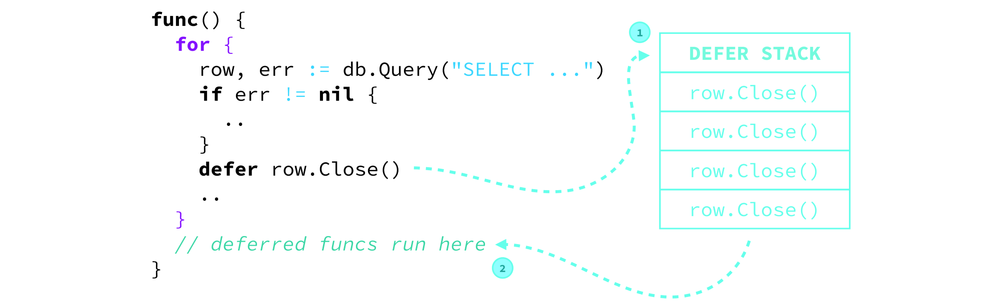

# golang defer的实现原理和使用规范

撰写本文的初衷是因为写出了如下的代码，产生了一些问题。

```go
var c2 inter.UserClient
defer c2.Close()
c2 = client.NewUserClientImpl("test1", "127.0.0.1", ":50002", "127.0.0.1:50000", nil)
```

本意是希望还函数结束的时候关闭掉c2，但是却会报出Nil pointer的运行时错误，因此想进一步的了解golang defer的实现原理并学习到相应的使用规范。


## 实现原理

defer按照运行时的顺序先进后出。defer trigger的情况为：

1. 包裹着defer语句的函数返回时
2. 包裹着defer语句的函数执行到最后时
3. 当前goroutine发生Panic时（声明在panic之后的不会执行，也符合语义。）

这里还要提到defer是有可能会影响到返回值的，进一步剖析其在函数返回（不是单单指return）的时候的相关执行顺序：

1. 先给返回值赋值（如果你指定好了返回值的具体variable，那就是拷贝variable的指针。
2. 执行defer语句
3. return 返回

这里就会出现在使用有名返回值的时候，defer语句是会对其造成影响的，匿名返回值是在return执行时被声明。

defer具体实现是使用如下的数据结构：

```go
type _defer struct {
            siz     int32 
            started bool
            sp      uintptr // sp at time of defer
            pc      uintptr
            fn      *funcval
            _panic  *_panic // panic that is running defer
            link    *_defer
    }
```

sp和pc就是指向现在的栈指针和程序计数器。defer声明的时候会调用runtime.deferproc，最后会挂在当前runtime的defer链表上。每次我们获得一个_defer的结构体的时候不是当场new一个的，是从deferpool中获取到一个，这样也是一个性能的优化。

回到我们问这个问题的本源，为什么这样写会报错。

这主要的原因是，我们以为defer是一个在编译期就已经知道c2最终的指向（或者就是一根指针，当然要是我从都到尾都没有初始化c2，那再报错也是合理的），但是这最终的情况是，他是在runtime的时候执行的，因此他这里当场就会去检查c2的指针，发现是Nil，那自然是没有c2.Close的说法的。

也见识了如下的代码：

```go
func() {
  var run func() = nil
  defer run()
  fmt.Println("runs")
}
```

最终runs会被打印，但是defer的run会报runtime的错误。

defer的本质是最终找到能执行的代码。比如我们可以看到如下的代码：

```go
type A struct {
    c int
    d int
}
type I interface {
    P(int)
}
func (a *A) p(i int) {
    fmt.Printf("time %d\n", i);
    if (a == nil) {
        fmt.Println("nil is ok");
    }
}

func main() {
    var a *A = nil
    var i I = a
    defer i.p(1)
    a.p(1)
    defer a.p(2)
    defer a.p(3)
    a.p(4)
}

```

执行的输出为

```
time 1
nil is ok
time 4
nil is ok
time 3
nil is ok
time 2
nil is ok
time 1
nil is ok
```

这里我们看到，其实a仍旧是一个没有初始化的对象，但是这里我们的interface被赋值了a，因为interface中有两个域，一个是type一个是value，此时value被赋值为nil，type被赋值为A，在执行defer的时候，可以通过type查找到执行函数的实现，因此即使实例为nil，也能够执行。但我们如果给interface直接赋值为nil，则value和type都为nil。

另一个要注意的点是，defer的函数的返回值会被忽略

```go
type database struct{}
func (db *database) connect() (disconnect func()) {
  fmt.Println("connect")
  return func() {
    fmt.Println("disconnect")
  }
}
db := &database{}
defer db.connect()
 
fmt.Println("query db...")
```

这里最后的输出为，因为defer的是db.connect，而不是其return的func

```
query db...
connect
```

当然你可以选择`defer db.connect()()`也可以做到“disconnect”

defer关于context的模式是选择直接当场保留上下文，即

> Remember that the passed params to a deferred func are saved aside immediately without waiting for the deferred func to be run.

```go
type Car struct {
  model string
}
func (c Car) PrintModel() {
  fmt.Println(c.model)
}
func main() {
  c := Car{model: "DeLorean DMC-12"}
  defer c.PrintModel()
  c.model = "Chevrolet Impala"
}
```

最终的输出是DeLorean DMC-12，当然如果你使用的是“指针”，就和c语言的行为是相似的了。这里的保存上下文也是defer中比较的一部分性能开销。

## 使用规范

因为defer是需要有额外的空间和性能开销的，因此规范的使用非常有必要。

1. 不要在for中直接使用defer

   

   可以选择for里面执行一个函数，这样defer可以在每次执行结束时处理，而不是一直积累

2. 在有error返回时，可以使用defer

   ```go
func Divide(i int) error {
    mu.Lock()
    defer mu.Unlock()
    
    if i == 0 {
        return errors.New("Can't divide by zero!")
    }
    
    val /= i
    return nil
}
   ```

​	这样的好处是在于在返回error时也会帮助你处理Lock的问题。