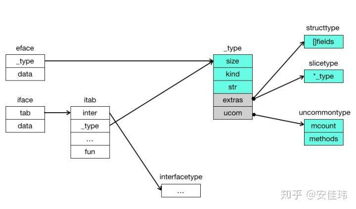

# Interface

Interface在go中的地位非常特殊，首先是不需要显示的声明类型的继承关系，并且能够在编译期就发现错误。

## Interface的数据结构

Interface分为两种，eface和iface

- `eface` 表示空的 `interface{}`，它用两个机器字长表示，第一个字 _type 是指向实际类型描述的指针，第二个字 data 代表数据指针。
- `iface` 表示至少带有一个函数的 interface， 它也用两个机器字长表示，第一个字 tab 指向一个 itab 结构，第二个字 data 代表数据指针。itab中会存有相应的类型

关于data中存储的值，会有两种情况：

因为 golang 在函数传参和赋值时是 `值传递` 的，所以：

1. 如果实际类型是一个值，那么 interface 会保存这个值的一份拷贝。interface 会在堆上为这个值分配一块内存，然后 data 指向它。
2. 如果实际类型是一个指针，那么 interface 会保存这个指针的一份拷贝。由于 data 的长度恰好能保存这个指针的内容，所以 data 中存储的就是指针的值。它和实际数据指向的是同一个变量。

这就是为什么我们在C/C++中会存在对指针中值的操作需要加上`*`号或者使用`->`，但是在golang中不论是实例还是指针，其对于字段的使用都是使用`.`

itab实质上是建立一个interface和type的mapping，其中fun的部分是对于实际类型而言，interface中所有函数的地址。_type信息在编译时就可以生成，但是建立itab是在运行时建立的。

