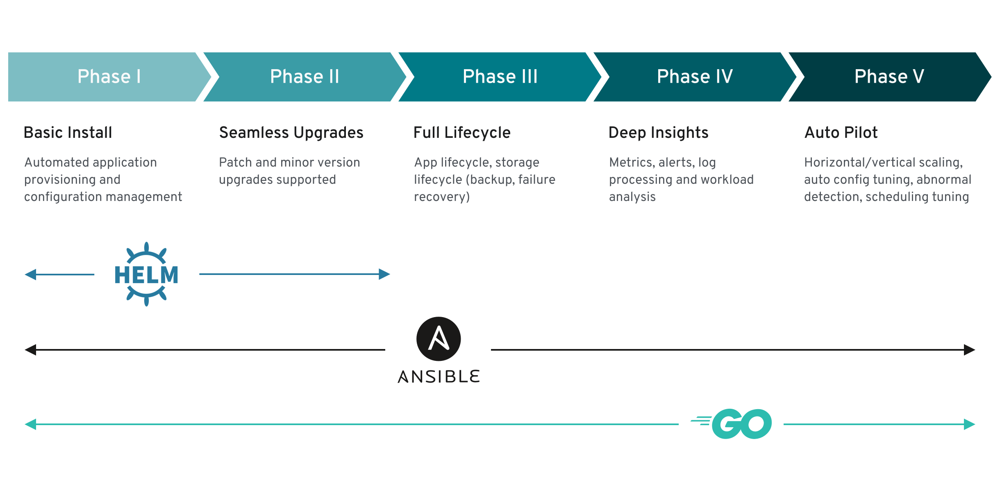

# helm 略进阶一点点的使用

本文档主要是记录在使用[redis-cluster](https://hub.helm.sh/charts/inspur/redis-cluster)时我们为了的让upgrade中将新instance加入到集群后，需要将一些slot分配给新加入集群的实例，而原redis-cluster的chart里面是没有这个feature的，因此为了使用更加方便，我们决定将其chart进行小小的改造并进行使用。

```bash
helm pull --untar inspur/redis-cluster # pull
```



之后我们需要了解到helm的hook机制
在 Helm 中定义了如下一些可供我们使用的 Hooks：

预安装pre-install：在模板渲染后，kubernetes 创建任何资源之前执行
安装后post-install：在所有 kubernetes 资源安装到集群后执行
预删除pre-delete：在从 kubernetes 删除任何资源之前执行删除请求
删除后post-delete：删除所有 release 的资源后执行
升级前pre-upgrade：在模板渲染后，但在任何资源升级之前执行
升级后post-upgrade：在所有资源升级后执行
预回滚pre-rollback：在模板渲染后，在任何资源回滚之前执行
回滚后post-rollback：在修改所有资源后执行回滚请求
crd-install：在运行其他检查之前添加 CRD 资源，只能用于 chart 中其他的资源清单定义的 CRD 资源。

那么我们这个业务中，主要在于操作post-upgrade之后进行相应cluster的rebalance

```yaml
apiVersion: batch/v1
kind: Job
metadata:
  name: "{{ template "redis-cluster.fullname" . }}-post-upgrade"
  labels:
    app.kubernetes.io/managed-by: {{ .Release.Service | quote }}
    app.kubernetes.io/instance: {{ .Release.Name | quote }}
    app.kubernetes.io/version: {{ .Chart.AppVersion }}
    helm.sh/chart: "{{ .Chart.Name }}-{{ .Chart.Version }}"
  annotations:
    "helm.sh/hook": post-upgrade
    "helm.sh/hook-weight": "0"
    "helm.sh/hook-delete-policy": "hook-succeeded,before-hook-creation"
spec:
  backoffLimit: 1
  template:
    metadata:
      name: "{{ template "redis-cluster.fullname" . }}-post-upgrade"
      labels:
        app.kubernetes.io/managed-by: {{ .Release.Service | quote }}
        app.kubernetes.io/instance: {{ .Release.Name | quote }}
        helm.sh/chart: "{{ .Chart.Name }}-{{ .Chart.Version }}"
    spec:
      restartPolicy: Never
      volumes:
      - name: config
        configMap:
          name: {{ template "redis-cluster.fullname" . }}-configmap
      containers:
      - name: post-upgrade-job
        image: {{ .Values.image.name }}:{{ .Values.image.tag }}
        command:
        - sh
        - "/configmap/scale-cluster.sh"
        volumeMounts:
        - mountPath: /configmap
          name: config

```

找到相应的文件，我们发现这个Job上有相关helm的label，与chart关联，有相关hook的annotation，与hook的时机相关联，确立了一个hook-weight，与执行的先后顺序有关，这主要都是一些helm metadata，我们会发现这里面mount了一个configmap，我们进一步查看configmap

```sh
echo "Rebalance all slots"
redis-cli --cluster fix ${ip}:${PORT}
redis-cli --cluster rebalance --cluster-use-empty-masters ${ip}:${PORT}
```

之后我们对这个修改过的chart进行打包：

```sh
helm package --app-version 0.0.1
helm repo index charts --url http://106.15.225.249:7070
```

之后将index.html & redis-cluster-0.0.1.tgz 都放到7070对应的文件夹下即可

之后我们改写k3s中的helmChart进行测试

```yaml
apiVersion: helm.cattle.io/v1
kind: HelmChart
metadata:
  name: redis-cluster
  namespace: redis-cluster
spec:
  chart: redis-cluster
  repo: http://106.15.225.249:7070
  targetNamespace: redis-cluster
  set:
    persistentVolume.storageClass: "local-path"
    shards: 4
```

之后我们修改shards值为5，使之添加一个新的shard，在完成之后我们直接进入到集群中，查看集群状态：

```sh
/data # redis-cli -c cluster nodes
c4afe77ef37a14dc012f4c4669b7298ecb272497 10.43.106.60:6379@16379 master - 0 1576914127514 3 connected 9012-12287
5c38d94cefaef6f92d7812aa0edd99173bf2e17f 10.43.181.195:6379@16379 slave a552448c866a629705135fc696a8f1d764977bff 0 1576914127515 2 connected
9d5bb0778886592d15637882441381fd7b639e41 10.43.107.80:6379@16379 myself,master - 0 1576914124000 5 connected 0-819 4096-4915 8192-9011 12288-13107
47494836b06df5e51c5ec77b34c6847f453ba477 10.43.118.172:6379@16379 slave f1ef5b360cd8f84e853c803f2f3d1fab2f1b918f 0 1576914126000 4 connected
f1ef5b360cd8f84e853c803f2f3d1fab2f1b918f 10.43.129.254:6379@16379 master - 0 1576914127415 4 connected 13108-16383
029a7adceb55be532f1fbd264a52066f66f78e0d 10.43.168.207:6379@16379 slave 9d5bb0778886592d15637882441381fd7b639e41 0 1576914126000 5 connected
b00618f828eb01d7d02227b0b7329904cc5efe99 10.43.180.73:6379@16379 slave 34e922619fb974d2be1e970a397580427177a339 0 1576914126000 1 connected
c4479a31f8a07f8161fb58930bf377e22ee18fe9 10.43.28.135:6379@16379 slave c4afe77ef37a14dc012f4c4669b7298ecb272497 0 1576914125411 3 connected
34e922619fb974d2be1e970a397580427177a339 10.43.222.46:6379@16379 master - 0 1576914126413 1 connected 820-4095
a552448c866a629705135fc696a8f1d764977bff 10.43.144.194:6379@16379 master - 0 1576914126513 2 connected 4916-8191

```

