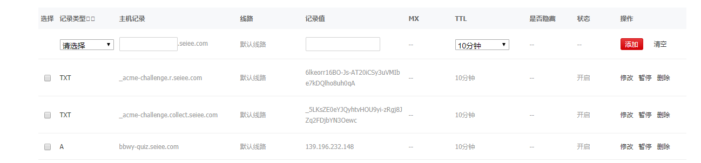
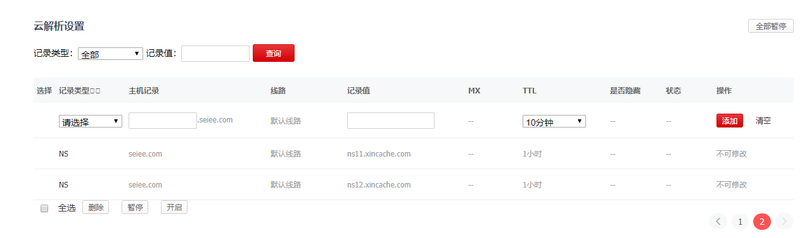

### DNS 

本质是为了handon-1，实质带有相关其余的一些知识在其中

### role

以树状结构为基础，用于解析IP，层层分担责任（分发与解析）和享受其（分配）权利的系统。

## 域名解析记录

域名解析记录顾名思义就是对域名的解析进行设置，设置可以简单理解为键值对，value的解释可以是多样的，这看你的具体需求是什么。

### A记录

IP指向，记录的主要是域名所需要对应的IP。

在支持的情况下，可以设置多个相同子域名有多个目标地址，表示轮询。

### CNAME记录

别名指向可以设置一个别名来指向另一个域名，即其值为域名不为IP。A记录优先于CNAME记录，即如果一个域名同时存在A记录和CNAME记录，则CNAME记录不生效。

### MX记录

邮件交换记录。用于将以该域名为结尾的电子邮件指向对应的邮件服务器以进行处理。如：用户所用的邮件是以域名mydomain.com为结尾的，则需要在管理界面中添加该域名的MX记录来处理所有以@mydomain.com结尾的邮件。

### SN记录

主要是指定子域名解析的服务器是哪一个服务器，这个地方默认会使用厂商的服务器，但是有的大网站会使用自己的子域名，这样会导致成环因此他需要显示的另行指定好对应的DNS服务器的IP。

## 以seiee.com为例进行相关解释





首先是TXT部分，这个部分主要是因为我们的服务器上面会指定说通过https+非443端口绕开备案工作。我们需要acme challenge因此会在证书更新时修改该值，cerbot会读取到该值进行核对。

其次是非常平凡的A记录，对我们的一个三级域名进行了IP指向。之后最后是我们的NS记录，主要是指定了两个DNS服务器来解析三级域名，如果将这两行记录删去，则会出现我们的三级域名无法被解析的情况。

### 使用dig

使用dig仍旧探究seiee

```bash
ubuntu@node1:~$ dig seiee.com
; <<>> DiG 9.10.3-P4-Ubuntu <<>> seiee.com
;; global options: +cmd
;; Got answer:
;; ->>HEADER<<- opcode: QUERY, status: NOERROR, id: 58328
;; flags: qr rd ra; QUERY: 1, ANSWER: 0, AUTHORITY: 1, ADDITIONAL: 1

;; OPT PSEUDOSECTION:
; EDNS: version: 0, flags:; udp: 4096
;; QUESTION SECTION:
;seiee.com.			IN	A

;; AUTHORITY SECTION:
seiee.com.		2824	IN	SOA	ns12.xincache.com. hostmaster.xincache.com. 2011022412 3600 900 720000 3600

;; Query time: 313 msec
;; SERVER: 202.120.2.101#53(202.120.2.101)
;; WHEN: Wed Oct 16 13:02:46 UTC 2019
;; MSG SIZE  rcvd: 99
ubuntu@node1:~$ dig seiee.com ns

; <<>> DiG 9.10.3-P4-Ubuntu <<>> seiee.com ns
;; global options: +cmd
;; Got answer:
;; ->>HEADER<<- opcode: QUERY, status: NOERROR, id: 35586
;; flags: qr rd ra; QUERY: 1, ANSWER: 2, AUTHORITY: 0, ADDITIONAL: 1

;; OPT PSEUDOSECTION:
; EDNS: version: 0, flags:; udp: 4096
;; QUESTION SECTION:
;seiee.com.			IN	NS

;; ANSWER SECTION:
seiee.com.		3600	IN	NS	ns12.xincache.com.
seiee.com.		3600	IN	NS	ns11.xincache.com.

;; Query time: 75 msec
;; SERVER: 202.120.2.101#53(202.120.2.101)
;; WHEN: Wed Oct 16 13:06:30 UTC 2019
;; MSG SIZE  rcvd: 85
```

基本和前文图片描述一致。

### 指定的DNS解析器

```
ubuntu@node1:~$ dig @8.8.8.8 seiee.com

; <<>> DiG 9.10.3-P4-Ubuntu <<>> @8.8.8.8 seiee.com
; (1 server found)
;; global options: +cmd
;; Got answer:
;; ->>HEADER<<- opcode: QUERY, status: NOERROR, id: 17296
;; flags: qr rd ra; QUERY: 1, ANSWER: 0, AUTHORITY: 1, ADDITIONAL: 1

;; OPT PSEUDOSECTION:
; EDNS: version: 0, flags:; udp: 512
;; QUESTION SECTION:
;seiee.com.			IN	A

;; AUTHORITY SECTION:
seiee.com.		1799	IN	SOA	ns12.xincache.com. hostmaster.xincache.com. 2011022412 3600 900 720000 3600

;; Query time: 349 msec
;; SERVER: 8.8.8.8#53(8.8.8.8)
;; WHEN: Wed Oct 16 13:08:17 UTC 2019
;; MSG SIZE  rcvd: 99
```

### dig展示一步步查询的过程

```bash
ubuntu@node1:~$ dig . ns

; <<>> DiG 9.10.3-P4-Ubuntu <<>> . ns
;; global options: +cmd
;; Got answer:
;; ->>HEADER<<- opcode: QUERY, status: NOERROR, id: 24990
;; flags: qr rd ra ad; QUERY: 1, ANSWER: 13, AUTHORITY: 0, ADDITIONAL: 1

;; OPT PSEUDOSECTION:
; EDNS: version: 0, flags:; udp: 4096
;; QUESTION SECTION:
;.				IN	NS

;; ANSWER SECTION:
.			2015	IN	NS	d.root-servers.net.
.			2015	IN	NS	a.root-servers.net.
.			2015	IN	NS	g.root-servers.net.
.			2015	IN	NS	l.root-servers.net.
.			2015	IN	NS	f.root-servers.net.
.			2015	IN	NS	h.root-servers.net.
.			2015	IN	NS	j.root-servers.net.
.			2015	IN	NS	k.root-servers.net.
.			2015	IN	NS	c.root-servers.net.
.			2015	IN	NS	e.root-servers.net.
.			2015	IN	NS	i.root-servers.net.
.			2015	IN	NS	m.root-servers.net.
.			2015	IN	NS	b.root-servers.net.

;; Query time: 1 msec
;; SERVER: 202.120.2.101#53(202.120.2.101)
;; WHEN: Wed Oct 16 13:12:38 UTC 2019
;; MSG SIZE  rcvd: 239
ubuntu@node1:~$ dig @d.root-servers.net edu norecurs

; <<>> DiG 9.10.3-P4-Ubuntu <<>> @d.root-servers.net edu
; (2 servers found)
;; global options: +cmd
;; Got answer:
;; ->>HEADER<<- opcode: QUERY, status: NOERROR, id: 25395
;; flags: qr rd; QUERY: 1, ANSWER: 0, AUTHORITY: 13, ADDITIONAL: 27
;; WARNING: recursion requested but not available

;; OPT PSEUDOSECTION:
; EDNS: version: 0, flags:; udp: 4096
;; QUESTION SECTION:
;edu.				IN	A

;; AUTHORITY SECTION:
edu.			172800	IN	NS	h.edu-servers.net.
edu.			172800	IN	NS	e.edu-servers.net.
edu.			172800	IN	NS	k.edu-servers.net.
edu.			172800	IN	NS	l.edu-servers.net.
edu.			172800	IN	NS	d.edu-servers.net.
edu.			172800	IN	NS	b.edu-servers.net.
edu.			172800	IN	NS	m.edu-servers.net.
edu.			172800	IN	NS	a.edu-servers.net.
edu.			172800	IN	NS	j.edu-servers.net.
edu.			172800	IN	NS	i.edu-servers.net.
edu.			172800	IN	NS	g.edu-servers.net.
edu.			172800	IN	NS	c.edu-servers.net.
edu.			172800	IN	NS	f.edu-servers.net.

;; ADDITIONAL SECTION:
a.edu-servers.net.	172800	IN	A	192.5.6.30
b.edu-servers.net.	172800	IN	A	192.33.14.30
c.edu-servers.net.	172800	IN	A	192.26.92.30
d.edu-servers.net.	172800	IN	A	192.31.80.30
e.edu-servers.net.	172800	IN	A	192.12.94.30
f.edu-servers.net.	172800	IN	A	192.35.51.30
g.edu-servers.net.	172800	IN	A	192.42.93.30
h.edu-servers.net.	172800	IN	A	192.54.112.30
i.edu-servers.net.	172800	IN	A	192.43.172.30
j.edu-servers.net.	172800	IN	A	192.48.79.30
k.edu-servers.net.	172800	IN	A	192.52.178.30
l.edu-servers.net.	172800	IN	A	192.41.162.30
m.edu-servers.net.	172800	IN	A	192.55.83.30
a.edu-servers.net.	172800	IN	AAAA	2001:503:a83e::2:30
b.edu-servers.net.	172800	IN	AAAA	2001:503:231d::2:30
c.edu-servers.net.	172800	IN	AAAA	2001:503:83eb::30
d.edu-servers.net.	172800	IN	AAAA	2001:500:856e::30
e.edu-servers.net.	172800	IN	AAAA	2001:502:1ca1::30
f.edu-servers.net.	172800	IN	AAAA	2001:503:d414::30
g.edu-servers.net.	172800	IN	AAAA	2001:503:eea3::30
h.edu-servers.net.	172800	IN	AAAA	2001:502:8cc::30
i.edu-servers.net.	172800	IN	AAAA	2001:503:39c1::30
j.edu-servers.net.	172800	IN	AAAA	2001:502:7094::30
k.edu-servers.net.	172800	IN	AAAA	2001:503:d2d::30
l.edu-servers.net.	172800	IN	AAAA	2001:500:d937::30
m.edu-servers.net.	172800	IN	AAAA	2001:501:b1f9::30

;; Query time: 31 msec
;; SERVER: 199.7.91.13#53(199.7.91.13)
;; WHEN: Wed Oct 16 13:14:13 UTC 2019
;; MSG SIZE  rcvd: 827
ubuntu@node1:~$ dig @a.edu-servers.net mit.edu

; <<>> DiG 9.10.3-P4-Ubuntu <<>> @a.edu-servers.net mit.edu
; (2 servers found)
;; global options: +cmd
;; Got answer:
;; ->>HEADER<<- opcode: QUERY, status: NOERROR, id: 25034
;; flags: qr rd; QUERY: 1, ANSWER: 0, AUTHORITY: 8, ADDITIONAL: 1
;; WARNING: recursion requested but not available

;; OPT PSEUDOSECTION:
; EDNS: version: 0, flags:; udp: 4096
;; QUESTION SECTION:
;mit.edu.			IN	A

;; AUTHORITY SECTION:
mit.edu.		172800	IN	NS	usw2.akam.net.
mit.edu.		172800	IN	NS	asia1.akam.net.
mit.edu.		172800	IN	NS	asia2.akam.net.
mit.edu.		172800	IN	NS	use2.akam.net.
mit.edu.		172800	IN	NS	ns1-37.akam.net.
mit.edu.		172800	IN	NS	ns1-173.akam.net.
mit.edu.		172800	IN	NS	eur5.akam.net.
mit.edu.		172800	IN	NS	use5.akam.net.

;; Query time: 403 msec
;; SERVER: 192.5.6.30#53(192.5.6.30)
;; WHEN: Wed Oct 16 13:15:39 UTC 2019
;; MSG SIZE  rcvd: 203
ubuntu@node1:~$ dig @usw2.akam.net csail.mit.edu

; <<>> DiG 9.10.3-P4-Ubuntu <<>> @usw2.akam.net csail.mit.edu
; (1 server found)
;; global options: +cmd
;; Got answer:
;; ->>HEADER<<- opcode: QUERY, status: NOERROR, id: 1006
;; flags: qr rd; QUERY: 1, ANSWER: 0, AUTHORITY: 4, ADDITIONAL: 6
;; WARNING: recursion requested but not available

;; OPT PSEUDOSECTION:
; EDNS: version: 0, flags:; udp: 4096
;; QUESTION SECTION:
;csail.mit.edu.			IN	A

;; AUTHORITY SECTION:
csail.mit.edu.		1800	IN	NS	auth-ns3.csail.mit.edu.
csail.mit.edu.		1800	IN	NS	auth-ns0.csail.mit.edu.
csail.mit.edu.		1800	IN	NS	auth-ns2.csail.mit.edu.
csail.mit.edu.		1800	IN	NS	auth-ns1.csail.mit.edu.

;; ADDITIONAL SECTION:
auth-ns0.csail.mit.edu.	1800	IN	A	128.30.2.123
auth-ns3.csail.mit.edu.	1800	IN	A	18.220.24.142
auth-ns1.csail.mit.edu.	1800	IN	A	128.31.0.18
auth-ns3.csail.mit.edu.	1800	IN	AAAA	2600:1f16:ceb:1302::a
auth-ns2.csail.mit.edu.	1800	IN	A	128.52.32.80

;; Query time: 510 msec
;; SERVER: 184.26.161.64#53(184.26.161.64)
;; WHEN: Wed Oct 16 13:34:36 UTC 2019
;; MSG SIZE  rcvd: 226
ubuntu@node1:~$ dig @auth-ns1.csail.mit.edu. lirone.csail.mit.edu

; <<>> DiG 9.10.3-P4-Ubuntu <<>> @auth-ns1.csail.mit.edu. lirone.csail.mit.edu
; (1 server found)
;; global options: +cmd
;; Got answer:
;; ->>HEADER<<- opcode: QUERY, status: NOERROR, id: 38772
;; flags: qr aa rd; QUERY: 1, ANSWER: 1, AUTHORITY: 0, ADDITIONAL: 1
;; WARNING: recursion requested but not available

;; OPT PSEUDOSECTION:
; EDNS: version: 0, flags:; udp: 4096
;; QUESTION SECTION:
;lirone.csail.mit.edu.		IN	A

;; ANSWER SECTION:
lirone.csail.mit.edu.	1800	IN	A	128.52.129.186

;; Query time: 253 msec
;; SERVER: 128.31.0.18#53(128.31.0.18)
;; WHEN: Wed Oct 16 13:36:29 UTC 2019
;; MSG SIZE  rcvd: 65
```

### diff between www.twitter.com and www.baidu.com

```bash
ubuntu@node1:~$ dig www.baidu.com @1.0.0.0

; <<>> DiG 9.10.3-P4-Ubuntu <<>> www.baidu.com @1.0.0.0
;; global options: +cmd
;; connection timed out; no servers could be reached
ubuntu@node1:~$ dig www.twitter.com @1.0.0.0

; <<>> DiG 9.10.3-P4-Ubuntu <<>> www.twitter.com @1.0.0.0
;; global options: +cmd
;; Got answer:
;; ->>HEADER<<- opcode: QUERY, status: NOERROR, id: 17383
;; flags: qr rd ra; QUERY: 1, ANSWER: 1, AUTHORITY: 0, ADDITIONAL: 0

;; QUESTION SECTION:
;www.twitter.com.		IN	A

;; ANSWER SECTION:
www.twitter.com.	115	IN	A	66.220.151.20

;; Query time: 27 msec
;; SERVER: 1.0.0.0#53(1.0.0.0)
;; WHEN: Wed Oct 16 14:56:49 UTC 2019
;; MSG SIZE  rcvd: 49

ubuntu@node1:~$ dig www.twitter.com @1.0.0.0

; <<>> DiG 9.10.3-P4-Ubuntu <<>> www.twitter.com @1.0.0.0
;; global options: +cmd
;; Got answer:
;; ->>HEADER<<- opcode: QUERY, status: NOERROR, id: 56353
;; flags: qr rd ra; QUERY: 1, ANSWER: 1, AUTHORITY: 0, ADDITIONAL: 0

;; QUESTION SECTION:
;www.twitter.com.		IN	A

;; ANSWER SECTION:
www.twitter.com.	118	IN	A	31.13.72.54

;; Query time: 27 msec
;; SERVER: 1.0.0.0#53(1.0.0.0)
;; WHEN: Wed Oct 16 14:56:51 UTC 2019
;; MSG SIZE  rcvd: 49

```

baidu是应该是在墙内的原因，twitter的怕是墙这边给做了反代然后就每次都随机一个值了。

对于google我事实上是一个都ping不通，当然他返回得是0.0.0.0这个ip，即根本找寻不到，这也是墙做了反代吧。