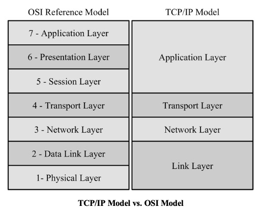
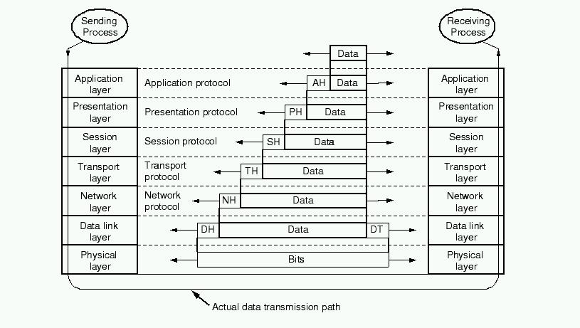
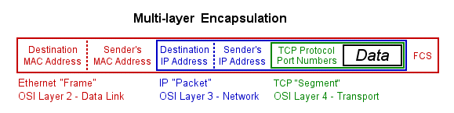
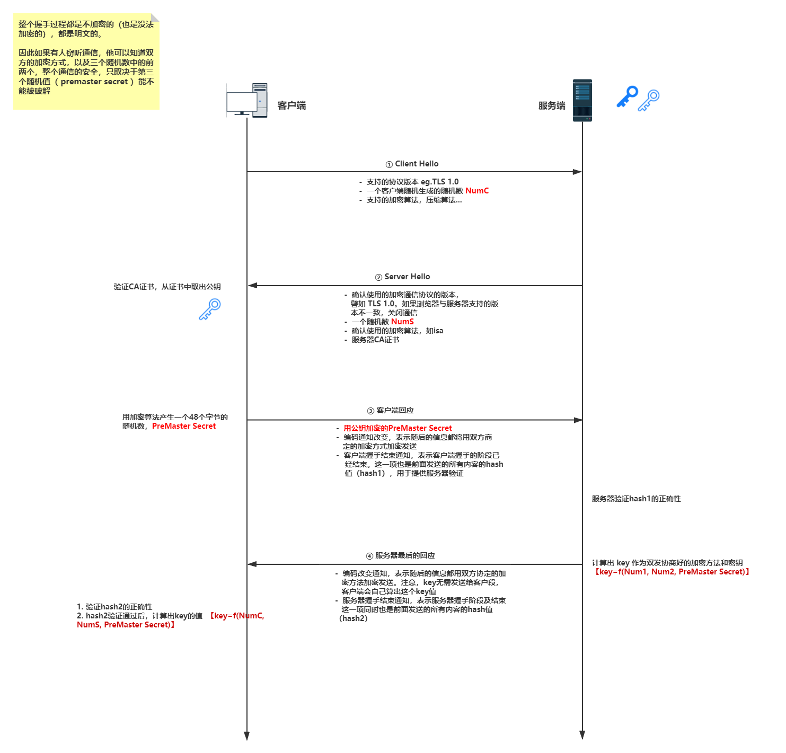
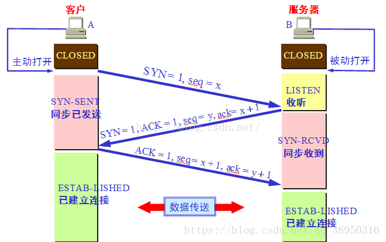
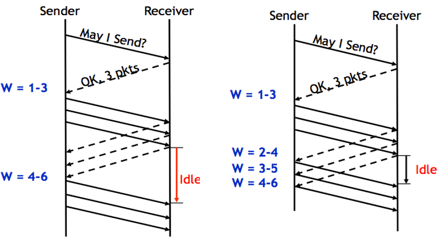
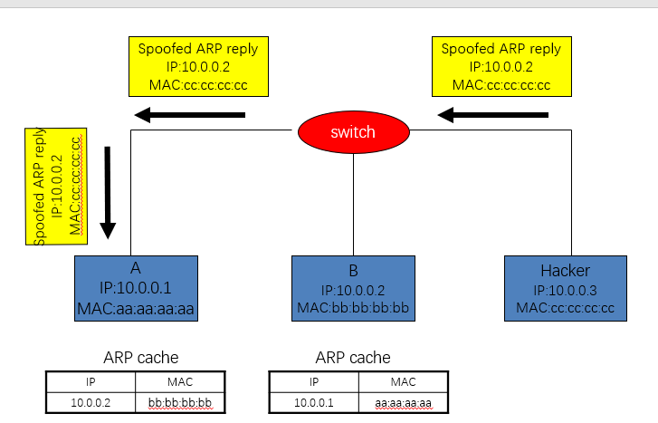
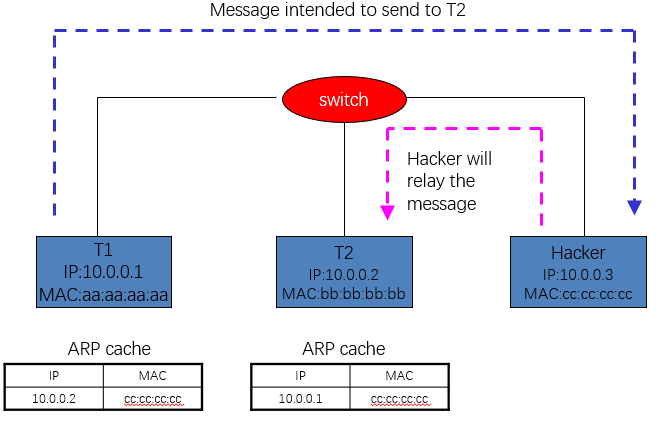

# OSI七层网络

本文主要以OSI七层网络配合大四层网络，来进行网络上问题归纳与整理（想到啥说啥）








分层本来是一个消耗性能的操作，但是更有利于开发和思路的清晰，我们曾经读到过的一个paper就是讲有关于每一层应该做什么，什么不应该做。

### Application Layer

我们主要关注到的，是报文， 或者说是有语义的数据，我们将针对这些数据进行一些相应的操作，比如我们的HTTP header，我们的jaeger的trace就是在Istio-proxy的转发中就可以处理这个逻辑，在Istio框架下可以使用EnvoyFilter可以对相关的数据进行修改。在nginx下也可以在7层上进行相应的路由转发和修改HTTP header的操作。简而言之，**Application讲求的是语义**。

#### case study HTTP 1.0 1.1 2.0

**HTTP 1.0**的功能基本是完备的，关于status code、header等已经有了相应的实现，而且action已经完备(PUT DELETE GET POST etc)，增加了多字符支持，多部分发送，Authorization缓存等内容。

**HTTP 1.1**主要是有一些性能方面的考虑，我们在1.0版本当中主要是一个http请求与一个tcp请求对应，这样我们在加载一个页面时，就会开启多个tcp请求，那么建立一次http链接我们都要经过三次握手。创建连接是一个非常消耗资源和延迟较高的操作。因此其优化主要是在于只创建一个tcp链接，但是1.1版本的局限性在于，其发送的请求是需要进入到pipeline，即如果第一个请求没有快速返回，第二个请求等待的时间会变长，我们在时间流程图中会有清晰发现。自然而然，我们也会发现1.1版本开始支持keepalive，例如我们的event stream就是使用长连接进行单方面的数据推送。最后是增加了host，有了host之后，我们就可以在同一台服务器，我指的服务器是物理服务器，在这个服务器上，我们可以跑多个不同的服务。

**HTTP 2.0**主要是围绕如何能够不适用pipeline的方式来进行请求，我们在1.1版本中使用的传输大部分都是字符串的形式传输，所以它的数据分片的方式不太一样，在HTTP2.0中希望能够以二进制帧来进行传输，这样我们同一个连接里面发送多个请求就不需要按照顺序来执行，他可以同时返回几个请求的不同response。另外http2.0对头信息进行了压缩，减小了带宽的压力。最后就是增加了一个主动推送的功能，因为大部分情况下，我们不会只请求一个html，我们会配套的下载相应的css和js，则在2.0版本中，可以做到客户端在请求html时，服务端主动的推送相应的css和js，而不是客户端单独对css和js进行再一次的请求（不知道会不会对爬虫有什么影响）。

#### SSL & TLS

SSL 和TLS都是基于TCP的，因此我们在此将TCP的相关操作透明，我们关注的是两者之间额的交互。



注意一个问题，就是CA证书，实际是可以看做是对某网站的公钥进行加密，这个加密是使用第三方权威机构的私钥进行加密，是属于一个根证明的情况。因为我们可能会出现man in the middle的攻击。主要是需要证明这把所谓A的公钥是A的公钥这件事情。

比如我们在使用cerbot使用Let's Encrypt作为第三方权威机构，其需要的challenge中有一种方式就是你在相应的dns解析中写入其发给你的值到对应的TXT记录中，这说明你确实能够掌控该域名，因此它会给你的网站发放相应的证书。

## Transport Layer

传输层主要是关注两个协议TCP/UDP。首先是四层是从高层向下看，是将高层的报文分割成更小的无意义的单元进行传输的，所以四层的数据获取到也没有太大的意义，传输层的最终目的是向它的用户提供高效的、可靠的和成本有效的数据传输服务，简单而言，传输层是为了保证用户获取到数据的服务质量的，因为有关于三层的相关的内容，大部分都是被网络运营商控制着，为了能够使用户（进程）能够完整的收到数据，我们需要在三层之上建立第四层（当然你NAT也就把三层四层给拉到一起去了）。

#### TCP

TCP协议保证的信息的完整性，保证了信息的有序性。

TCP协议的mechanism如下：

**建立连接**——三次握手



三次握手主要是个两山问题，不仅因此会有最后一次ACK，为了让服务端知道客户端已经知道了这样的消息。 

**数据传输**——pipeline



最简单的我们肯定会想到发一个segment之后就返回一个ACK，然后循环往复，这基本为最悲观的行为，我们相对乐观的行为应该是使用pipeline模式就如同上右图，但是这个时候可能我们的pipe的长度（或称为window的大小）就会是一个很棘手的，问题，因为网络的稳定性并不好，所以size的大小也应该是动态调整的。

注意我们Receiver的ACK具体中具体的序号是其需要的segment的序号，因为包会乱序，我们是可能在Sender端收到多个对同一个segment的ACK，我们的优化是如果是出现收到三次同样的ACK说明有丢包的概率（三次ACK有可能丢包，但是也可能是乱序，如果丢包肯定是会有三次ACK），我们会启动快速修复，同时我们会缩小我们的window size。

**case study** 半包、黏包问题

黏包情况发生主要是出现在多个小包发送时，会被优化为一个大包的发送，这确实是一个优化，但是我们的TCP协议并不知道这其中的信息是两个小的独立的信息，从此发生黏包的情况，第一个信息不回理解返回给用户，而是需要第二条信息合在一起之后才会发送给用户。

类似于stdout没给flush一般。

类似的半包的情况是在于我们的信息内容太大，需要多次接收才会完整的，我们也有可能只传输半句话，但是这半句话被打印在了标准输出上。

这里我们的解决方法之一，是在封装数据时，在数据前10位（我按着1500算的）bit来表明相关的一个完整数据的大小，这里加上一个对于这个包大小的逻辑处理。

这个逻辑在曾经用python写相应的聊天室时进行过设计。

**关闭连接**——四次挥手


四次挥手是客户端发完消息触发的，客户端发送完所有的消息，开始向服务器请求关闭(FIN)，之后服务器返回收到客户端的FIN的对应的ACK，但是这个时候不能像connect的时候，客户端发送ACK就双方关闭，因为此时服务器可能还有消息会单方面发送给客户端，等到消息发送完毕，才会给客户端发送一次FIN，此时客户端会返回一个ACK，表明自己受到了服务器的FIN。

这个时候要强调一下TIME-WAIT，主要是因为最后一次ACK没有送到的话，我们的服务端会一直发送FIN，因此我们需要等待一段时间，可能一段时间之后网络问题自我恢复。

这里由于我们需要考虑到在HTTP/1.1中，我们其实会维护一个TCP长连接来下载相应的内容，则因此出现keepalive来周期性的健康检查启用 TCP Keepalive 的一端便会启动一个计时器，当这个计时器数值到达 0 之后（也就是经过tcp_keep-alive_time时间后，这个参数之后会讲到），一个 TCP 探测包便会被发出。这个 TCP 探测包是一个纯 ACK 包（规范建议，不应该包含任何数据，但也可以包含1个无意义的字节，比如0x0。），其 Seq号 与上一个包是重复的，所以其实探测保活报文不在窗口控制范围内。

1. 正常运行，计时器复位
2. 服务器崩溃，则在一段时间吼超时
3. 服务器崩溃后已经重新启动，则进行复位

TCP keepalive需要额外的流量开销，并且可能会因为短时的网络波动而断开连接。TCP keepalive是为了检查TCP的健康。

HTTP keep-Alive的主要目的是为了减少TCP创建和销毁的资源消耗，为了能够在一个TCP连接中传输多次HTTP内容。

#### UDP

UDP是没有连接这个概念的，他的眼里只有向某个地方发包他的包头结构只有源端口、目标端口、长度和checksum。

这可能在很多金融行业有很多用，因为相关的很多实时的数据都只是需要最新，UDP能够做到快速，且如果有一个消息丢包了，并不重要，只要我能拿到最新的就好。

#### Transport Layer的关注点

Transport Layer主要的关注点是在于Port，功利的讲，能够通过此来分辨一个功能所在的Layer，网络层的主要协议是IP，那管理的自然是IP Address，到了传输层，就要具体到传输的端口上，TCP和UDP的header上对此都有所体现。

但是IPV4确实是有点不够用，所以NAT才站出来，但是让三层和四层合并这个操作增加了耦合性。

**case study nginx 7层转发和4层转发**

**4层转发**：

四层转发所做的事情，其实就是NAT技术，作为网关，NAT主要是修改Package Header和Segment Header，修改其中的IP和port，从而进行转发，在数据出网关时，又一次进行相应的包头的替换。

在此层次设置load balancer，实现的具体细节以TCP为例，当client请求给LB发送完相应的消息之后，会发送一次FIN，这个时候我们的load balancer会直接发送ACK给到client，client此时等待最终的response，然后load balancer会给相应的后端建立TCP connection，等后端回复之后将数组发送回用户。

在此层次设置load balancer，其管理的粒度是在一次connection，但是我们常常会使用多路复用的技术，则我们默认一次connection的包大小几乎相等这一条会被打破，会出现一次connection进行大量的数据传输，则对应的压力也就来到的了对应的backend。

**7层转发**：

7层的转发相对的版块比较丰富，能够控制的内容更多，我们在之前就提到，相应的cookie，url以及http层面所有能看到的内容都是可见的，因此都可以做相应的控制。

#### DNS

虽然我们没有提及到第三层非常多的东西，但是我们需要较为详细的讲解一下DNS的相关问题。

首先是域名，域名到IP就是一个简单的映射，但是因为域名有一定的商业意义等，域名是按照层级进行管理的。而域名到IP的解析记录，就是由DNS服务器进行协调工作的。DNS 服务器是具有层级关系的，是一种逐层发放的关系。之后我们需要考虑到DNS解析记录如何能够修改，我们需要注意到，这个地方比较复杂的是DNS记录cache如何得到清理，DNS的cache有非常多的层次，就几个地方的缓存进行讲解

##### 浏览器缓存

浏览器在获取网站域名的实际IP地址后会对其IP进行缓存，减少网络请求的损耗。每种浏览器都有一个固定的DNS缓存时间，其中Chrome的过期时间是1分钟，在这个期限内不会重新请求DNS。Chrome浏览器看本身的DNS缓存时间比较方便，在地址栏输入`chrome://net-internals/#dns`

##### OS缓存

OS缓存会参考DNS服务器响应的TTL值，但是不完全等于TTL值。

##### jvm缓存

Java的网络应用程序的DNS缓存是由JVM的缓存策略控制的，当`InetAddress`类第一次使用某个域名（如www.google.com）创建`InetAddress`对象后，JVM就会将这个域名和它从DNS上获得的信息（如IP地址）都保存在DNS缓存中。当下一次`InetAddress`类再使用这个域名时，就直接从DNS缓存里获得所需的信息，而无需再访问DNS服务器。

一般情况下我们不需要完全取消JVM的DNS缓存，只需要调小有效时间，经过一些测试发现一下结论：
1）1个域名对应一个IP和一个域名对应12个IP，DNS查询响应时间差别极少，后者占用cpu稍高一点点；
2）在高并发时，不做DNS缓存时的CPU耗用比做了3s缓存的CPU耗用要高3/4倍，实时DNS请求相当耗用CPU；
3）3s和30s缓存有效时间对dns查询响应时间的影响差别不大，cpu内存占用都比较接近；
4）建议使用3秒缓存，兼顾运维和性能；

##### 运营商缓存

运营商缓存相对而言是不靠谱的，有些缓存服务器（不多）会忽略网站DNS提供的TTL，自己设置一个较长的TTL，导致顶级DNS更新时不能及时拿到新的IP地址。

#### 次结构化的意义

- 层次化同样代表着责任的划分（上层一般不会记录和cache一个孙子记录，只会让你去找儿子记录）
- 每一个区域都是代表着一个小的部分
- 层次结构限制了模块之间的交互

- 去中心化 

### DNS设计的优点

- 全局命名，不存在上下文
- 可扩展性强，在性能和管理上
- 高容错

### DNS设计的缺点

- 关于根节点的控制应该在谁手里
- 根节点的大量负载，以及潜在的DDOS攻击的风险
- 安全，用户只能100%相信返回值，并且对于域名解析的合法性很难做到保证（至少在这一层上）。

## Data Link Layer

data link layer的关注对象为帧(Frame)和Mac地址。

不同的物理硬件拥有不同的mac地址，从这个角度来讲，似乎使用mac地址来替代IP地址，将会有一个不错的效果。这个地方要注意到mac就类似于uuid，这样的情况，我们两个连续的mac地址其实除去unique，没有任何其他与该硬件有关的相关信息，mac地址存在于计算机的网卡之中，对于虚拟机有虚拟网卡（局部范围内如果有一个mac地址和另一个局部中的mac地址相同是没有问题的）

而IP地址由于分段，有组织结构，因此IP的分布是存在地域性的，这种组织结构能够使得数据传输是更加有效的，能够优化有关传输路径方面的工作，也即，第三层网络层开始，才有了路由的概念。

mac地址(48 bit)现如今主要用在局域网内，我们在此观察一个计算机在发出数据（帧）时的相关过程：

1. 首先在局域网内广播，每一个在局域网内的计算机都将收到相应的数据，如果数据的mac地址段与自己的mac地址相同，则接收包，如果不相同则丢弃。
2. 此时，如果该网络中存在交换机或路由器，一切在内网中不存在的mac地址都会被集中收取到交换机或路由器中
3. 路由器将package header的相关内容进行替换，替换成自己的公网IP，之后向外进行发包。

注意到，这里在局域网内部的信息传播方式，是广播的方式，可以想象，如果使用mac地址取代IP地址，则会出现多少信息量的冗余，并且相应的信息内容会非常的不安全。

`ARP Request`:

```
Sender MAC: interface:mac:address:here
Sender IP: interface.ip.goes.here
Target MAC: FF:FF:FF:FF:FF:FF (Broadcast)
Target IP: target.ip.goes.here
```

当然，如果每次都进行广播，在局域网内也是没法忍受的。

因此存在ARP表，通过ARP表来进行这一层次的mapping。这一层次的表的更新，他是使用ARP来进行更新的。

1. 发送端需要查看自己的ARP表，查看是否存在接收端的ARP表项。
2. 如果找不到接收端的MAC地址，将以广播的方式发送一个ARP请求报文，其中带有发送端的IP地址，接收端收到相关的IP地址后与自己的IP地址进行比较，最终会返回自己的mac地址，让发送方进行登记。
3. 如果接收端并不跟自己在同一个网段中，则这个时候我们的路由器会主动站出来发送自己的MAC地址给发送端（ARP欺骗）。

之前们可以认为数据传输的整个过程无状态，但是有了ARP表之后，拥有状态，就存在状态不一致的情况，则hacker就有可能进行欺骗攻击，最终形成中间人攻击。



