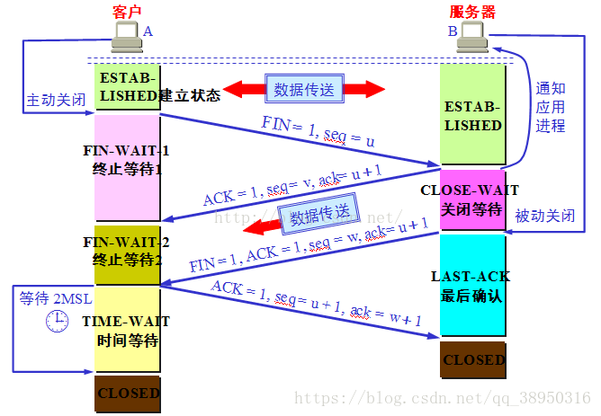

# OSI七层网络

本文主要以OSI七层网络配合大四层网络，来进行网络上问题归纳与整理（想到啥说啥）

分层本来是一个消耗性能的操作，但是更有利于开发和思路的清晰，我们曾经读到过的一个paper就是讲有关于每一层应该做什么，什么不应该做。

### Application Layer

我们主要关注到的，是报文， 或者说是有语义的数据，我们将针对这些数据进行一些相应的操作，比如我们的HTTP header，我们的jaeger的trace就是在Istio-proxy的转发中就可以处理这个逻辑，在Istio框架下可以使用EnvoyFilter可以对相关的数据进行修改。在nginx下也可以在7层上进行相应的路由转发和修改HTTP header的操作。

## Transport Layer

传输层主要是关注两个协议TCP/UDP。首先是四层是从高层向下看，是将高层的报文分割成更小的无意义的单元进行传输的，所以四层的数据获取到也没有太大的意义，传输层的最终目的是向它的用户提供高效的、可靠的和成本有效的数据传输服务，简单而言，传输层是为了保证用户获取到数据的服务质量的，因为有关于三层的相关的内容，大部分都是被网络运营商控制着，为了能够使用户（进程）能够完整的收到数据，我们需要在三层之上建立第四层（当然你NAT也就把三层四层给拉到一起去了）。

#### TCP

TCP协议保证的信息的完整性，保证了信息的有序性。

TCP协议的mechanism如下：

**建立连接**——三次握手

三次握手主要是个两山问题，不仅因此会有最后一次ACK，为了让服务端知道客户端已经知道了这样的消息。 

**数据传输**——pipeline

最简单的我们肯定会想到发一个segment之后就返回一个ACK，然后循环往复，这基本为最悲观的行为，我们相对乐观的行为应该是使用pipeline模式就如同上右图，但是这个时候可能我们的pipe的长度（或称为window的大小）就会是一个很棘手的，问题，因为网络的稳定性并不好，所以size的大小也应该是动态调整的。

注意我们Receiver的ACK具体中具体的序号是其需要的segment的序号，因为包会乱序，我们是可能在Sender端收到多个对同一个segment的ACK，我们的优化是如果是出现收到三次同样的ACK说明有丢包的概率（三次ACK有可能丢包，但是也可能是乱序，如果丢包肯定是会有三次ACK），我们会启动快速修复，同时我们会缩小我们的window size。

**case study** 半包、黏包问题

黏包情况发生主要是出现在多个小包发送时，会被优化为一个大包的发送，这确实是一个优化，但是我们的TCP协议并不知道这其中的信息是两个小的独立的信息，从此发生黏包的情况，第一个信息不回理解返回给用户，而是需要第二条信息合在一起之后才会发送给用户。

类似于stdout没给flush一般。

类似的半包的情况是在于我们的信息内容太大，需要多次接收才会完整的，我们也有可能只传输半句话，但是这半句话被打印在了标准输出上。

这里我们的解决方法之一，是在封装数据时，在数据前10位（我按着1500算的）bit来表明相关的一个完整数据的大小，这里加上一个对于这个包大小的逻辑处理。

这个逻辑在曾经用python写相应的聊天室时进行过设计。

**关闭连接**——四次挥手

四次挥手是客户端发完消息触发的，客户端发送完所有的消息，开始向服务器请求关闭(FIN)，之后服务器返回收到客户端的FIN的对应的ACK，但是这个时候不能像connect的时候，客户端发送ACK就双方关闭，因为此时服务器可能还有消息会单方面发送给客户端，等到消息发送完毕，才会给客户端发送一次FIN，此时客户端会返回一个ACK，表明自己受到了服务器的FIN。

这个时候要强调一下TIME-WAIT，主要是因为最后一次ACK没有送到的话，我们的服务端会一直发送FIN，因此我们需要等待一段时间，可能一段时间之后网络问题自我恢复。

#### UDP

UDP是没有连接这个概念的，他的眼里只有向某个地方发包他的包头结构只有源端口、目标端口、长度和checksum。

这可能在很多金融行业有很多用，因为相关的很多实时的数据都只是需要最新，UDP能够做到快速，且如果有一个消息丢包了，并不重要，只要我能拿到最新的就好。

#### Transport Layer的关注点

Transport Layer主要的关注点是在于Port，功利的讲，能够通过此来分辨一个功能所在的Layer，网络层的主要协议是IP，那管理的自然是IP Address，到了传输层，就要具体到传输的端口上，TCP和UDP的header上对此都有所体现。

但是IPV4确实是有点不够用，所以NAT才站出来，但是让三层和四层合并这个操作增加了耦合性。

**case study nginx 7层转发和4层转发**

**4层转发**：

四层转发所做的事情，其实就是NAT技术，作为网关，NAT主要是修改Package Header和Segment Header，修改其中的IP和port，从而进行转发，在数据出网关时，又一次进行相应的包头的替换。

**7层转发**：

7层的转发相对的版块比较丰富，能够控制的内容更多，我们在之前就提到，相应的cookie，url以及http层面所有能看到的内容都是可见的，因此都可以做相应的控制。

## Data Link Layer

data link layer的关注对象为帧(Frame)和Mac地址。

不同的物理硬件拥有不同的mac地址，从这个角度来讲，似乎使用mac地址来替代IP地址，将会有一个不错的效果。这个地方要注意到mac就类似于uuid，这样的情况，我们两个连续的mac地址其实除去unique，没有任何其他与该硬件有关的相关信息，mac地址存在于计算机的网卡之中，对于虚拟机有虚拟网卡（局部范围内如果有一个mac地址和另一个局部中的mac地址相同是没有问题的）

而IP地址由于分段，有组织结构，因此IP的分布是存在地域性的，这种组织结构能够使得数据传输是更加有效的，能够优化有关传输路径方面的工作，也即，第三层网络层开始，才有了路由的概念。

mac地址现如今主要用在局域网内，我们在此观察一个计算机在发出数据（帧）时的相关过程：

1. 首先在局域网内广播，每一个在局域网内的计算机都将收到相应的数据，如果数据的mac地址段与自己的mac地址相同，则接收包，如果不相同则丢弃。
2. 此时，如果该网络中存在交换机或路由器，一切在内网中不存在的mac地址都会被集中收取到交换机或路由器中
3. 路由器将package header的相关内容进行替换，替换成自己的公网IP，之后向外进行发包。

注意到，这里在局域网内部的信息传播方式，是广播的方式，可以想象，如果使用mac地址取代IP地址，则会出现多少信息量的冗余，并且相应的信息内容会非常的不安全。

当然，如果每次都进行广播，在局域网内也是没法忍受的。

因此存在ARP表，通过ARP表来进行这一层次的mapping。这一层次的表的更新，他是使用ARP来进行更新的。

1. 发送端需要查看自己的ARP表，查看是否存在接收端的ARP表项。
2. 如果找不到接收端的MAC地址，将以广播的方式发送一个ARP请求报文，其中带有发送端的IP地址，接收端收到相关的IP地址后与自己的IP地址进行比较，最终会返回自己的mac地址，让发送方进行登记。
3. 如果接收端并不跟自己在同一个网段中，则这个时候我们的路由器会主动站出来发送自己的MAC地址给发送端（ARP欺骗）。

之前们可以认为数据传输的整个过程无状态，但是有了ARP表之后，拥有状态，就存在状态不一致的情况，则hacker就有可能进行欺骗攻击，最终形成中间人攻击。

