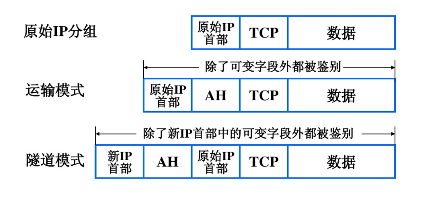

# underlay & overlay network intro

在网络通信中，overlay和underlay都是相对传统VPN管道而言。我们将就简单的VPN技术进行基本的介绍，并对underlay和overlay网络与VPN进行相应的对比。

## VPN

VPN的基础是在于要建立两个私有网络之间的隧道，实质上是了类似于两个gateway，但是具体的实现不是使用NAT来实现，NAT的是是直接进行相应端口和IP的映射，替换掉相应的IP包头，在response回到本机的时候，又会进行包头的替换。可以发现VPN协议和NAT协议都是通过重新构建一个IP首部来实现的，但他们的实现又有区别，VPN是将内部IP数据报加密后打包成外部IP数据报的数据部分，它的主要目的是为了数据的保密性，而NAT是纯进行地址转换，它的目的是为了解决本地编址的内部网络与外网通信的问题。

VPN有两种模式，一个是隧道模式，一个是传输模式。

### 隧道模式

我们可以看到这里有三层协议，传输协议负责在互联网中进行传输的相关内容时进行使用，隧道协议是用于在公网传输时，因为公网传输现在最普适的就是IP协议，因此传输协议可以认为是三层的协议；隧道协议既可以是三层的协议，也可以是二层的协议，其负责对乘客协议进行安全保护，负责隧道的建立、保持和拆除。乘客协议同上，也可以是三层协议，也可以是二层协议，在我们日常的使用中，仍然是以IP协议为主。

这里我们就隧道协议进行进一步讨论，以IPSec为基础，我们需要在IP层实现安全性，主要包括

鉴别：提供报文信源鉴别和完整性鉴别

机密性：通过报文加密可防止第三方窃听报文

密钥管理：处理密钥的安全交换

这里IP首部对应传输协议，IPSec首部对应隧道协议，安全IP有效载荷对应乘客协议和数据。

我们IPSec部分主要是IPSec安全协议部分的内容比较重要：

**ESP**：封装安全荷载协议，能够进行数据加密和数据摘要

**AH**：网络认证协议，只能进行hash，不能实现数据加密

这里我们主要是要看到，我们是通过新IP头来进行传输工作，因此这种情况下是可以进行与NAT一起进行工作，可以在ESP头前加上一个新的UDP头，就能够进行端口的映射。

但是如果是使用AH模式，因为AH模式将IP已经hash了，则NAT没有办法对IP进行修改。

### 传输模式

传输模式希望通过对比数据封装来进行说明，上图中的data即为IP报文，可以认为是乘客协议的相关内容，我们可以看到transport是不会在IP头之上再加入一个IP头的，则源IP的相关信息会暴露，并不会进行加密，transport模式的是不允许修改IP的，因此这种情况下必须是两个服务器直接可以拥有通信，而不能通过任何的网关，因为通过网关会需要修改IP头，则无法进行验证。

AH：

ESP：

这里无法验证是AH和ESP都无法验证，AH会对原始IP 多做Hash，ESP不会对原始IP进行hash

，而传输是只识别原 IP 的，这样就会被直接丢弃掉。

## Overlay

overlay的核心就是隧道，比如我们云上，容器发出的包，其中的源IP、目标IP、源MAC、目标MAC都是假的，经过宿主机的vxlan协议封装之后，外层的源IP、目标IP、源MAC、目标MAC都是将变成真的，内层封装仍旧是容器的包。这里我们还是以flannel为例，flannel的底层是按照vxlan将二层frame进行封装，以UDP形式进行运输。

这里我们要强调flannel需要使用到etcd来管理相关的网段分配相关的内容，记录相应Pod的IP。

