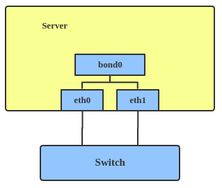
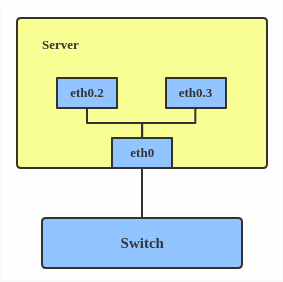
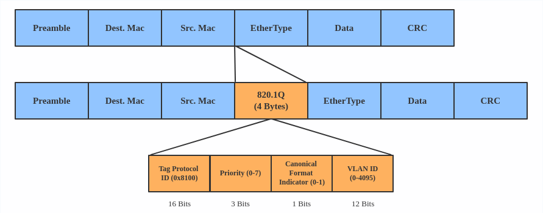
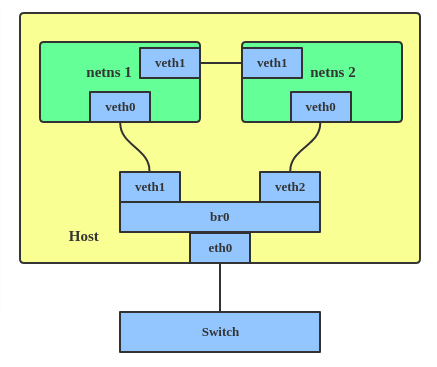

# Virtual Internet

本文就几种简单常用的虚拟网络接口进行相应的介绍。更加详细的内容源自[这里](https://developers.redhat.com/blog/2018/10/22/introduction-to-linux-interfaces-for-virtual-networking/)

## Bridge

Bridge可能相对而言是一个组件，正如其名字一般，主要是为了建立多种网路之间的通信，而我们常见的多种网络类型非常的繁多，但是bridge结构下都是能够统一进行处理的。

## Bounded 

该是我本身没有实践过，根据文档所说主要是为了流量层面上的负载均衡和容错而准备的，具体的需要由选择的模式进行定夺。

## VLAN

VLAN的主要功能是在网络下创建子网(subnet)，而不是说隔离更深层次的namespace，乍一眼看，有些类似于桥接模式，两个子网之间能够连通，但是没有bridge的中间处理，bridge更加泛化，会有中间处理。

## VETH

VETH(virtual Ethernet) device是成对创建的，一对主要是在两端建立网络通道。通过配置VETH，可以让不同的namespace之间相互连通，并且能够连通在bridge上，bridge如果与外网能够连通，就能够让namespace与外网进行通信。

