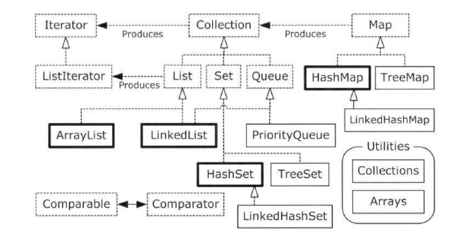

# Java Container



本章主要根据上图来进行逐一的阐述，其中虚线框表示Interface， 实线框表示Class，虚线箭头便是实现，实线箭头表示继承

## Collection

collection接口继承于Iterator接口，其接口基本是Set的接口，但是List和Queue也是继承Collection，至于List中的get方法并不继承于此。

## List

List相对于Collection主要保证的是要有序——能够有序的存储和有序的访问

实现List的两个主要的数据结构为`ArrayList`和`LinkedList`

### ArrayList

这个ArrayList的实现实质上是比较像c++的vector的

我们重点关注几个重要的函数的实现

add：

```java
public boolean add(E e) {
        ensureCapacityInternal(size + 1);  // Increments modCount!!
        elementData[size++] = e;
        return true;
    }
public void add(int index, E element) {
        rangeCheckForAdd(index);

        ensureCapacityInternal(size + 1);  // Increments modCount!!
        System.arraycopy(elementData, index, elementData, index + 1,
                         size - index);
        elementData[index] = element;
        size++;
    }
```

add操作肯定是会先检查容积和检查index是否正确，确定是否触发扩容的操作，另外一方面我们如果使用第二种insert的方式，实质上性能确实是会差不少，这个copy的过程还是非常耗时的。

remove：

```java
public E remove(int index) {
        rangeCheck(index);

        modCount++;
        E oldValue = elementData(index);

        int numMoved = size - index - 1;
        if (numMoved > 0)
            System.arraycopy(elementData, index+1, elementData, index,
                             numMoved);
        elementData[--size] = null; // clear to let GC do its work

        return oldValue;
}
public boolean remove(Object o) {
        if (o == null) {
            for (int index = 0; index < size; index++)
                if (elementData[index] == null) {
                    fastRemove(index);
                    return true;
                }
        } else {
            for (int index = 0; index < size; index++)
                if (o.equals(elementData[index])) {
                    fastRemove(index);
                    return true;
                }
        }
        return false;
}
private void fastRemove(int index) {
        modCount++;
        int numMoved = size - index - 1;
        if (numMoved > 0)
            System.arraycopy(elementData, index+1, elementData, index,
                             numMoved);
        elementData[--size] = null; // clear to let GC do its work
}
```

首先是对于java的缩容，这里可以看到是eager的，直接置为null显示的让GC去回收。另外我们还需要观察modCount这个参数，modCount记录的是结构性改变的次数，修改了列表大小的操作。

我们会在remove和add的时候对这个参数进行修改，在使用get会对该参数在Interable层面上进行检查。

```java
private void checkForComodification() {
      if (ArrayList.this.modCount != this.modCount)
           throw new ConcurrentModificationException();
}
public E set(int index, E e) {
       rangeCheck(index);
       checkForComodification();
       E oldValue = ArrayList.this.elementData(offset + index);
       ArrayList.this.elementData[offset + index] = e;
       return oldValue;
}
public E get(int index) {
       rangeCheck(index);
       checkForComodification();
       return ArrayList.this.elementData(offset + index);
}
```

但是我们确实有时候需要在遍历的时候进行一些操作，这个时候我们需要使用iterator层面的接口，我们的遍历也用interator的遍历方式。

```java
List<String> strList = new ArrayList<>();
strList.add("a");
strList.add("b");
strList.add("c");
Iterator<String> iterator = strList.iterator();
while (iterator.hasNext()) {
    String str = iterator.next();
    if ("a".equals(str)) {
        iterator.remove();
    }
}
```

```java
public void remove() {
    if (lastRet < 0)
        throw new IllegalStateException();
    checkForComodification();
    try {
        ArrayList.this.remove(lastRet);
        cursor = lastRet;
        lastRet = -1;
        expectedModCount = modCount;
    } catch (IndexOutOfBoundsException ex) {
        throw new ConcurrentModificationException();
    }
}
```

上述代码产是Iterable中的remove，其调用的子类的remove并更新

grow：

```java
private void grow(int minCapacity) {
        // overflow-conscious code
        int oldCapacity = elementData.length;
        int newCapacity = oldCapacity + (oldCapacity >> 1);
        if (newCapacity - minCapacity < 0)
            newCapacity = minCapacity;
        if (newCapacity - MAX_ARRAY_SIZE > 0)
            newCapacity = hugeCapacity(minCapacity);
        // minCapacity is usually close to size, so this is a win:
        elementData = Arrays.copyOf(elementData, newCapacity);
    }
```

如果minCapacity大于现有容积的1.5倍，则按照minCapacity执行，否则执行1.5速率的增长，当然要检查是否超过了`MAX_ARRAY_SIZE`

最后需要注意ArrayList不是线程安全的，需要根据情况手动实现。

### LinkedList

LinkedList是链表实现，LinkedList这种实现不仅仅是实现了List，也实现了Queue，因为可以通过对链表头尾的操作来实现入队出队。

观察整个实现我们发现，有关于其数组方面性质的操作（List Interface），也都是检查了相应的modCount的

```java
public E next() {
    checkForComodification();
    if (!hasNext())
        throw new NoSuchElementException();

    lastReturned = next;
    next = next.next;
    nextIndex++;
    return lastReturned.item;
}
```

```java
public void add(E e) {
            checkForComodification();
            lastReturned = null;
            if (next == null)
                linkLast(e); // modCount++;
            else
                linkBefore(e, next);
            nextIndex++;
            expectedModCount++; // can pass check
        }
```

如果直接调用容器的add，其实主动调用的是`linkLast(Integer)`。则会出现`ConcurrentModificationException`，Deque方面也是调用的几个linkedList的内部函数，所以也是有相应的modCount检查。

## Map

我们首先讲Map的主要原因是Set基本是基于Map来进行实现的。

### HashMap

HashMap主要由Node(Map.Entry)的数组和一个hash算法构成，另外还有一个的Set来拥有cached的数据，基本可以理解为一个两层次的数据结构（冷热数据）。

threshold是capacity * load factor，load factor控制数组的密集程度，越密集则容量越大，但是相对的冲突的概率也将变大，因此threshold即为Map的实际容量。

```java
Node(int hash, K key, V value, Node<K,V> next) {
            this.hash = hash;
            this.key = key;
            this.value = value;
            this.next = next;
        }
```

Node作为Map的Entry，我们可以看到其是一个闭散列的实现，使用链表来解决冲突。

```java
public HashMap(int initialCapacity) {
        this(initialCapacity, DEFAULT_LOAD_FACTOR);
    }
```

另一方面，我们可以看到，在构造函数中其实并不存在对相应数组的分配功空间。

```java
final V putVal(int hash, K key, V value, boolean onlyIfAbsent,
                   boolean evict) {
        Node<K,V>[] tab; Node<K,V> p; int n, i;
        if ((tab = table) == null || (n = tab.length) == 0)
            n = (tab = resize()).length;
        if ((p = tab[i = (n - 1) & hash]) == null)
            tab[i] = newNode(hash, key, value, null);
        else {
            Node<K,V> e; K k;
            if (p.hash == hash &&
                ((k = p.key) == key || (key != null && key.equals(k))))
                e = p;
            else if (p instanceof TreeNode)
                e = ((TreeNode<K,V>)p).putTreeVal(this, tab, hash, key, value);
            else {
                for (int binCount = 0; ; ++binCount) {
                    if ((e = p.next) == null) {
                        p.next = newNode(hash, key, value, null);
                        if (binCount >= TREEIFY_THRESHOLD - 1) // -1 for 1st
                            treeifyBin(tab, hash);
                        break;
                    }
                    if (e.hash == hash &&
                        ((k = e.key) == key || (key != null && key.equals(k))))
                        break;
                    p = e;
                }
            }
            if (e != null) { // existing mapping for key
                V oldValue = e.value;
                if (!onlyIfAbsent || oldValue == null)
                    e.value = value;
                afterNodeAccess(e);
                return oldValue;
            }
        }
        ++modCount;
        if (++size > threshold)
            resize();
        afterNodeInsertion(evict);
        return null;
    }
```

在上述代码中的`resize()`代码就是为了对在插入时分配空间。

```java
Node<K,V>[] oldTab = table;
        int oldCap = (oldTab == null) ? 0 : oldTab.length;
        int oldThr = threshold;
        int newCap, newThr = 0;
        if (oldCap > 0) {
            if (oldCap >= MAXIMUM_CAPACITY) {
                threshold = Integer.MAX_VALUE;
                return oldTab;
            }
            else if ((newCap = oldCap << 1) < MAXIMUM_CAPACITY &&
                     oldCap >= DEFAULT_INITIAL_CAPACITY)
                newThr = oldThr << 1; // double threshold
        }
        else if (oldThr > 0) // initial capacity was placed in threshold
            newCap = oldThr;
        else {               // zero initial threshold signifies using defaults
            newCap = DEFAULT_INITIAL_CAPACITY;
            newThr = (int)(DEFAULT_LOAD_FACTOR * DEFAULT_INITIAL_CAPACITY);
        }
        if (newThr == 0) {
            float ft = (float)newCap * loadFactor;
            newThr = (newCap < MAXIMUM_CAPACITY && ft < (float)MAXIMUM_CAPACITY ?
                      (int)ft : Integer.MAX_VALUE);
        }
		threshold = newThr;
```

首先是关于容量的控制，如果没有初始化，就按照初始化的threshold进行工作，如果没有设置loadFactor，则按照默认值进行工作，正常的情况下直接倍增容积，检查了相关边界。

```java

        @SuppressWarnings({"rawtypes","unchecked"})
        Node<K,V>[] newTab = (Node<K,V>[])new Node[newCap];
        table = newTab;
        if (oldTab != null) {
            for (int j = 0; j < oldCap; ++j) {
                Node<K,V> e;
                if ((e = oldTab[j]) != null) {
                    oldTab[j] = null;
                    if (e.next == null)
                        newTab[e.hash & (newCap - 1)] = e;
                    else if (e instanceof TreeNode)
                        ((TreeNode<K,V>)e).split(this, newTab, j, oldCap);
                    else { // preserve order
                        Node<K,V> loHead = null, loTail = null;
                        Node<K,V> hiHead = null, hiTail = null;
                        Node<K,V> next;
                        do {
                            next = e.next;
                            if ((e.hash & oldCap) == 0) {
                                if (loTail == null)
                                    loHead = e;
                                else
                                    loTail.next = e;
                                loTail = e;
                            }
                            else {
                                if (hiTail == null)
                                    hiHead = e;
                                else
                                    hiTail.next = e;
                                hiTail = e;
                            }
                        } while ((e = next) != null);
                        if (loTail != null) {
                            loTail.next = null;
                            newTab[j] = loHead;
                        }
                        if (hiTail != null) {
                            hiTail.next = null;
                            newTab[j + oldCap] = hiHead;
                        }
                    }
                }
            }
        }
        return newTab;
    }
```

我们仔细分析上段代码，主要是要结合hash的办法，看如何在扩容的情况下保证hash算法的普适性，我们`e.hash & oldCap`计算得知的是该Entry是否需要迁移位置，如果不需要位置的迁移，之后便把节点迁移进入到数组中，如果需要迁移就直接迁移到高位，注意原来在一个链里面的现在就会被拆成两部分，就像在容积16的情况下使hash=1和hash=17都是在index为1的链表中，但是在扩容为32之后就会被拆成两个链表。然后`e.hash & (newCap - 1)`是可以直接算出迁移的坐标地址的。

有关HashMap中存储的对象需要同时重写equals和hashCode，`HashMapTest.java`中有所体现。

```java
/**
     * Implements Map.get and related methods.
     *
     * @param hash hash for key
     * @param key the key
     * @return the node, or null if none
     */
    final Node<K,V> getNode(int hash, Object key) {
        Node<K,V>[] tab; Node<K,V> first, e; int n; K k;
        if ((tab = table) != null && (n = tab.length) > 0 &&
            (first = tab[(n - 1) & hash]) != null) {
            if (first.hash == hash && // always check first node
                ((k = first.key) == key || (key != null && key.equals(k))))
                return first;
            if ((e = first.next) != null) {
                if (first instanceof TreeNode)
                    return ((TreeNode<K,V>)first).getTreeNode(hash, key);
                do {
                    if (e.hash == hash &&
                        ((k = e.key) == key || (key != null && key.equals(k))))
                        return e;
                } while ((e = e.next) != null);
            }
        }
        return null;
    }
```

我们的hashCode覆写是为了能够让两次索引是相同的值，默认不重写其直接使用的是Object的hashCode函数，找到索引后，我们还需要在链表中查找，对应的是一个`k == e.key`操作，调用`equals(Object o)`函数，而默认的Object的equals函数是使用比较地址的方式来工作的，也不符合我们的业务逻辑。


### LinkedHashMap

LinkedHashMap需要在HashMap的基础之上，再添加一个顺序访问的稳定性，可选的是插入顺序或者是访问顺序。

```java
/**
     * HashMap.Node subclass for normal LinkedHashMap entries.
     */
    static class Entry<K,V> extends HashMap.Node<K,V> {
        Entry<K,V> before, after;
        Entry(int hash, K key, V value, Node<K,V> next) {
            super(hash, key, value, next);
        }
    }
```

```java
public LinkedHashMap(int initialCapacity, float loadFactor) {
        super(initialCapacity, loadFactor);
        accessOrder = false;
    }
```

除去HashMap的相关内容，多加入一个参数accessOrder，如果accessOrder为true，则我们的顺序是依照访问顺序进行，而保证顺序执行的关键就在于我们的`LinkedHashMap.Entry`中存在的before和after指针以及整个容器维护的tail和head指针

```java
public V get(Object key) {
        Node<K,V> e;
        if ((e = getNode(hash(key), key)) == null)
            return null;
        if (accessOrder)
            afterNodeAccess(e);
        return e.value;
    }
```

重点关注一下`afterNodeAccess`函数

```java
void afterNodeAccess(Node<K,V> e) { // move node to last
        LinkedHashMap.Entry<K,V> last;
        if (accessOrder && (last = tail) != e) {
            LinkedHashMap.Entry<K,V> p =
                (LinkedHashMap.Entry<K,V>)e, b = p.before, a = p.after;
            p.after = null;
            if (b == null)
                head = a;
            else
                b.after = a;
            if (a != null)
                a.before = b;
            else
                last = b;
            if (last == null)
                head = p;
            else {
                p.before = last;
                last.after = p;
            }
            tail = p;
            ++modCount;
        }
    }

```

主要的功能就是把访问的元素从链表中取出，然后放到尾部。

### TreeMap

本质是使用红黑树，需要传入`comparator`来辅助元素的比较。

有关TreeMap相关的红黑树的操作，主要观察一下几个函数

```java
private void fixAfterInsertion(Entry<K,V> x) {
        x.color = RED;

        while (x != null && x != root && x.parent.color == RED) {
            if (parentOf(x) == leftOf(parentOf(parentOf(x)))) {
                Entry<K,V> y = rightOf(parentOf(parentOf(x)));
       			// y 是叔父节点
                if (colorOf(y) == RED) {
                    // y 是叔父红色，则翻转颜色
                    setColor(parentOf(x), BLACK);
                    setColor(y, BLACK);
                    setColor(parentOf(parentOf(x)), RED);
                    x = parentOf(parentOf(x));
                } else {
                    // 如果叔父节点不存在或者颜色为黑色
                    if (x == rightOf(parentOf(x))) {
                        // 如果加入的节点作为其父节点的右节点，则我们要调整成全坐树
                        x = parentOf(x);
                        rotateLeft(x);
                    }
                    // 以插入节点的父节点为轴向右翻转
                    setColor(parentOf(x), BLACK);
                    setColor(parentOf(parentOf(x)), RED);
                    rotateRight(parentOf(parentOf(x)));
                }
            } else {
                // 父节点在右边 ，几乎是与上文的轴对称操作
                Entry<K,V> y = leftOf(parentOf(parentOf(x)));
                if (colorOf(y) == RED) {
                    setColor(parentOf(x), BLACK);
                    setColor(y, BLACK);
                    setColor(parentOf(parentOf(x)), RED);
                    x = parentOf(parentOf(x));
                } else {
                    if (x == leftOf(parentOf(x))) {
                        x = parentOf(x);
                        rotateRight(x);
                    }
                    setColor(parentOf(x), BLACK);
                    setColor(parentOf(parentOf(x)), RED);
                    rotateLeft(parentOf(parentOf(x)));
                }
            }
        }
        root.color = BLACK;
    }
```

```java
/** From CLR */
    private void fixAfterDeletion(Entry<K,V> x) {
        while (x != root && colorOf(x) == BLACK) {
            if (x == leftOf(parentOf(x))) {
                // x是父节点的左儿子
                Entry<K,V> sib = rightOf(parentOf(x));
                // sib是兄弟节点
                if (colorOf(sib) == RED) {
                    // sib是红色，这个时候向做翻转，兄弟当爹，然后继续对兄弟的儿子进行递归操作
                    setColor(sib, BLACK);
                    setColor(parentOf(x), RED);
                    rotateLeft(parentOf(x));
                    sib = rightOf(parentOf(x));
                }

                if (colorOf(leftOf(sib))  == BLACK &&
                    colorOf(rightOf(sib)) == BLACK) {
                    // 现在兄弟节点是爹，兄弟节点的左右是黑的，则兄弟节点自己设置为红的，向上传递继续递归。
                    setColor(sib, RED);
                    x = parentOf(x);
                } else {
                    // 统一转到右边
                    if (colorOf(rightOf(sib)) == BLACK) {
                        setColor(leftOf(sib), BLACK);
                        setColor(sib, RED);
                        rotateRight(sib);
                        sib = rightOf(parentOf(x));
                    }
                    setColor(sib, colorOf(parentOf(x)));
                    setColor(parentOf(x), BLACK);
                    setColor(rightOf(sib), BLACK);
                    rotateLeft(parentOf(x));
                    x = root;
                }
            } else { // symmetric
                Entry<K,V> sib = leftOf(parentOf(x));

                if (colorOf(sib) == RED) {
                    setColor(sib, BLACK);
                    setColor(parentOf(x), RED);
                    rotateRight(parentOf(x));
                    sib = leftOf(parentOf(x));
                }

                if (colorOf(rightOf(sib)) == BLACK &&
                    colorOf(leftOf(sib)) == BLACK) {
                    setColor(sib, RED);
                    x = parentOf(x);
                } else {
                    if (colorOf(leftOf(sib)) == BLACK) {
                        setColor(rightOf(sib), BLACK);
                        setColor(sib, RED);
                        rotateLeft(sib);
                        sib = leftOf(parentOf(x));
                    }
                    setColor(sib, colorOf(parentOf(x)));
                    setColor(parentOf(x), BLACK);
                    setColor(leftOf(sib), BLACK);
                    rotateRight(parentOf(x));
                    x = root;
                }
            }
        }

        setColor(x, BLACK);
    }
```

注意到这里的TreeMap是继承`NavigableMap`则相对于`HashMap`则会多出一些接口，主要是因为TreeMap是基于红黑树进行工作的，因此TreeMap可以做一些scope(bound)类型的操作。

详细的接口见[这里](https://docs.oracle.com/javase/8/docs/api/java/util/NavigableMap.html)

## Set

set的接口和Collection完全一致，因此其就只是`extends Collection<E>`，Set里面更加强调的是其中没有重复元素。

### HashSet

这个HashSet实质上是使用HashMap实现的

create:

```java
/**
     * Constructs a new set containing the elements in the specified
     * collection.  The <tt>HashMap</tt> is created with default load factor
     * (0.75) and an initial capacity sufficient to contain the elements in
     * the specified collection.
     *
     * @param c the collection whose elements are to be placed into this set
     * @throws NullPointerException if the specified collection is null
     */
    public HashSet(Collection<? extends E> c) {
        map = new HashMap<>(Math.max((int) (c.size()/.75f) + 1, 16));
        addAll(c);
    }
```

首先是一个容量上的控制，这里是有一个较为乐观的估计，所以在使用Collection初始化的时候使用了3/4Collection的容量，HashSet的初始化都是用的HashMap的构造函数。

add:

```java
public boolean add(E e) {
    return map.put(e, PRESENT)==null;
}
```

remove:

```java
public boolean remove(Object o) {
        return map.remove(o)==PRESENT;
    }
```

`PRESENT`对象是一个静态变量，是一个在类加载时就存在的常量

### LinkedHashSet

由上述源代码可见，LinkedHashSet 通过继承 HashSet，底层使用 LinkedHashMap，以很简单明了的方式来实现了其自身的所有功能。

### TreeSet

同上，本质是使用TreeMap进行实现。

## Queue

### ArrayQueue

ArrayQueue是通过数组实现队列。

```java
 private static int calculateSize(int numElements) {
 6         int initialCapacity = MIN_INITIAL_CAPACITY;
 7         if (numElements >= initialCapacity) {
 8             initialCapacity = numElements;
 9             initialCapacity |= (initialCapacity >>>  1);
10             initialCapacity |= (initialCapacity >>>  2);
11             initialCapacity |= (initialCapacity >>>  4);
12             initialCapacity |= (initialCapacity >>>  8);
13             initialCapacity |= (initialCapacity >>> 16);
14             initialCapacity++;
15 
16             if (initialCapacity < 0) 
17                 initialCapacity >>>= 1;
18         }
19         return initialCapacity;
20     }
```

上述代码计算比numElements大的最小2的幂次方，主要是要找到最高位的1在哪里，然后最后加1即可，[这里](https://www.cnblogs.com/mfrank/p/9600137.html)讲述的比较详细

```java
/**
     * Inserts the specified element at the front of this deque.
     *
     * @param e the element to add
     * @throws NullPointerException if the specified element is null
     */
    public void addFirst(E e) {
        if (e == null)
            throw new NullPointerException();
        elements[head = (head - 1) & (elements.length - 1)] = e;
        if (head == tail)
            doubleCapacity();
    }

    /**
     * Inserts the specified element at the end of this deque.
     *
     * <p>This method is equivalent to {@link #add}.
     *
     * @param e the element to add
     * @throws NullPointerException if the specified element is null
     */
    public void addLast(E e) {
        if (e == null)
            throw new NullPointerException();
        elements[tail] = e;
        if ( (tail = (tail + 1) & (elements.length - 1)) == head)
            doubleCapacity();
    }
```

tail和head的更新详细的说明一下

因为`elements.length`是二次的次幂，因此`elements.length-1`相当于是一个mask，可以则如果说`tail`已经是数组的最大index，则`(tail + 1) & (elements.length - 1)`的结果为0，则此时就实现了循环数组的概念。类似的如果head-1为0，则`-1 & (elements.length - 1)`，此时

```java
/**
     * Doubles the capacity of this deque.  Call only when full, i.e.,
     * when head and tail have wrapped around to become equal.
     */
    private void doubleCapacity() {
        assert head == tail;
        int p = head;
        int n = elements.length;
        int r = n - p; // number of elements to the right of p
        int newCapacity = n << 1;
        if (newCapacity < 0)
            throw new IllegalStateException("Sorry, deque too big");
        Object[] a = new Object[newCapacity];
        System.arraycopy(elements, p, a, 0, r);
        System.arraycopy(elements, 0, a, r, p);
        elements = a;
        head = 0;
        tail = n;
    }
```

这里扩容使用的是固定操作，即copy head之后元素到新数组头部。

```java
public boolean hasNext() {
            return cursor != fence;
        }

        public E next() {
            if (cursor == fence)
                throw new NoSuchElementException();
            @SuppressWarnings("unchecked")
            E result = (E) elements[cursor];
            // This check doesn't catch all possible comodifications,
            // but does catch the ones that corrupt traversal
            // 如果移除了尾部元素，会导致 tail != fence
            // 如果移除了头部元素，会导致 result == null
            if (tail != fence || result == null)
                throw new ConcurrentModificationException();
            lastRet = cursor;
            cursor = (cursor + 1) & (elements.length - 1);
            return result;
        }
```

我们看了很多的容器，发现这里首先是没有用modCount来实现所谓的版本控制的，而是使用简单的`tail != fence || result == null`，不能检查到在此时从尾部取出一个元素在加入一个元素的情况，但是这个容器也没有说自己是一个多线程安全的容器，甚至主动暴露这种问题，显示的让程序员自己去解决是有一定好处的。

ArrayDeque和LinkedList相比有什么优势？ArrayDeque通常来说比LinkedList更高效，因为可以在常量时间通过序号对元素进行定位，并且省去了对元素进行包装的空间和时间成本。

ArrayDeque的应用场景是什么？在很多场景下可以用来代替LinkedList，可以用做队列或者栈。

### PriorityQueue

PriorityQueue是使用堆实现。对于堆而言，主要就是维护堆的正确定，因此插入一个元素的时间为`O(logn)`

```java
private void siftUpUsingComparator(int k, E x) {
        while (k > 0) {
            int parent = (k - 1) >>> 1;
            Object e = queue[parent];
            if (comparator.compare(x, (E) e) >= 0)
                break;
            queue[k] = e;
            k = parent;
        }
        queue[k] = x;
    }
private void siftDownComparable(int k, E x) {
        Comparable<? super E> key = (Comparable<? super E>)x;
        int half = size >>> 1;        // loop while a non-leaf
        while (k < half) {
            int child = (k << 1) + 1; // assume left child is least
            Object c = queue[child];
            int right = child + 1;
            if (right < size &&
                ((Comparable<? super E>) c).compareTo((E) queue[right]) > 0)
                c = queue[child = right];
            if (key.compareTo((E) c) <= 0)
                break;
            queue[k] = c;
            k = child;
        }
        queue[k] = key;
    }
```

## StringBuilder & StringBuffer

StringBuilder和StringBuffer的出现主要是因为String在java中是一个不可变的量，你如果对String做所谓的修改操作，只会生成新的对象，但是我们总归会需要有进行频繁操作字符串的情况，这个时候就需要使用到`StringBuffer`和`StringBuilder`

### StringBuffer

StringBuffer的主要数据结构为

```java
private transient char[] toStringCache; // 用于缓存toString()方法返回的最近一次value数组中的字符，如果value被修改，这个数组直接被清空


char[] value;// 从value可以看出这个内部的实现是依靠的char实现的

int count; // 用于记录value中字符的长度，因为可能扩容的时候是倍扩。
```

这里我们观察一下StringBuffer，其主要是extends AbstractStringBuilder，主要是一些修改的相关操作，Serializable主要是保证可序列化，CharSequeue主要是有关于长度，获取相关位置的char等操作。注意上述的数据结构都是在其父类AbstractStringBuilder。

我们观察到StringBuffer里面的append和相关的修改操作都是加了synchronized关键字的，因为其父类AbstractStringBuilder其实已经把相应的实现已经实现了，但是我们的StringBuffer是需要线程安全的，所以所有的接口都加上了synchronized。

### StringBuilder

我们仔细看了看StringBuilder和StringBuffer继承的类没有本质的区别，只是StringBuider类没有synchronized的关键字，适合在单线程情况下的大量数据读写。