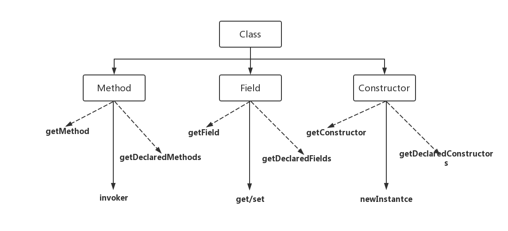

# Java reflect & invoke

本文主要围绕java的reflect和invoke进行初步的使用和比较。

## reflect的意图

reflect指在运行状态中，对于任意一个类或类的实例，都能知道这个类的所有属性和方法。比如在jdk1.8的时候，还能够使用反射调用实例的私有函数。

reflect对于一个类主要是能检查到如下的放个方面

利用reflect进行的相关简单代码的执行在测试代码中都有提及。

## 利用reflect实现JAVA代理模式

我们用reflect实现一个Interceptor，在博客中提到一个想法是，代理模式是为了能够在基础函数上进行相应的扩展工作，而不损害基础函数的功能。我们的springboot中的相关AOP作为切片进行变成，其实就是讲信息变成了一个pipeline，你可以在特定的hook下进行相应的操作，比如打log，比如的错误处理，比如鉴权等等。

## invoke

invoke这个库是在JAVA 7引入，是轻量级的操作方式，因为invoke是在字节码层面上进行模拟操作。

## invoke与reflect的区别

Reflect和MethodHandle机制本质上都是在模拟方法调用，但是Reflection是在模拟JAVA代码层次的方法调用，而MethodHandle是在模拟字节码层次的方法调用。几个字节码指令的执行权限校验行为，而这些底层细节在使用Reflection API时不需要考虑

