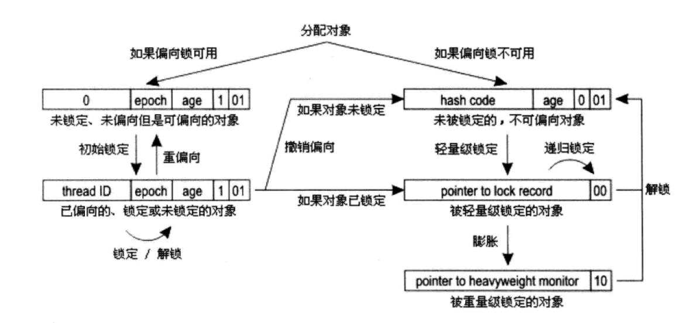

# Thread & Synchronization

这里以java为背景，介绍java有关线程的实现，由于多线程的出现，随即就出现了多线程中有关资源的共享与控制，有关synchronization，我们有相关的方法针对不同的场景来使用不同的方法解决问题。

## Thread

实现thread在编程语言层面上，有不同的方法，在java语言上，实际的实现是由具体的jvm来选择的，我们将进一步对相关方法进行分析。

### 内核线程实现

内核线程(KLT)是直接由操作系统内核支持的线程，线程的调度也直接交由给内核调度器。

优点：线程调度，线程声明周期管理，并不需要更多用户过多的考虑。

缺点： 相关有关线程的操作都需要系统调用，因此系统调用的代价相对较高，需要在用户态和内核态来回切换。

### 用户线程实现

用户线程实现要解决的主要问题，是为了减少系统调用，减少用户态和内核态来回切换。用户线程的生命周期相关事务都是在用户态完成。但是相对的，就是需要用户能够管理好线程，因此需要相关语言提供库或者语言基本的机制进行支持。

### 混合实现

在混合模式实现下，既存在用户线程，也存在轻量级线程。用户线程还是完全建立在用户空间中，因此用户线程的生命周期依然廉价，并且可以支持大规模的用户线程并发。而操作系统支持的轻量级进程则作为用户线程和内核线程之间的桥梁，这样可以使用内核提供的线程调度功能以及处理器映射。

java的主要实现是使用内核线程建立所谓1:1的线程模型，但是有部分虚拟机会有不同实现方式，这里以主流的Hotpot虚拟机为例。

### 调度

thread调度分为协同式调度和抢占式调度，两种调度的主要区别在于是否存在明显的核心（scheduler）

#### 协同式调度

协同式调度的线程执行时间完全是由正在运行的线程决定的，如若线程忘记进行线程切换，则会出现程序阻塞的情况，而我们作为用户却对此无可奈何。

#### 抢占式调度

抢占式调度拥有明显的核心，线程只能使用时间，当然对于各线程优先级，在java线程中可以进行设置，但是这种设置在内核中的映射，在各种操作系统上，是不相同的，可能在java中是不同级别的线程，但是在相应的系统中，则可能是同一个的等级。

内核线程模型是如今java虚拟机线程实现的主流选择，但是这种映射到操作系统上的线程天然的缺陷就是切换、调度的成本高昂，系统能容纳的线程数量也很有限。

因此会提出使用基于协同调度的用户态线程——“协程”。

### java协程与golang协程

java的协程和golang的协程，在概念上有着相应的区别。

golang的协程提出是在内核线程上进一步做文章，进一步建立模型，对执行在线程上的函数进行调度，即线程(M)的调度由内核管理，线程上执行什么(G)由线程上的调度器(P)进行管理。因此其敢说自己是轻量级的调度，而实际使用的内核线程数量由参数`gomaxprocs`来决定。

而java的协程，主要是基于用户态线程来实现的，运行时，我们仍旧需要进行线程切换，只是我们在切换时，能够有更多的方法来进行上下文切换，节约更多的时间。

## java多线程资源管理

java多线程的机制下，必然会有一套方法有关于能够完成对于多线程场景下，相应资源如何进行管理

### 线程安全

在论述相应方法之前，我们先对线程安全进行一个描述，这其中的标准是我们的目标。

#### 不可变

不可变的对象一定是线程安全的，无论是对象的方法实现还是方法的调用者，都不需要再进行任何线程安全保障措施。

#### 绝对线程安全

线程的绝对安全，并不是体现在方法调用上的（在方法调用上是否使用了synchronized关键字），更加绝对的，是在对应的资源身上，因为操作的线程安全，并不能代表资源的线程安全。

#### 相对线程安全

相对线程安全就相对宽松，只需要单次对资源的操作，是线程安全的即可。我们就可以在方法上设置synchronized来进行串行化执行。

下文提到的方法，我们都会相应的与上文的安全级别进行一个对比。

### 线程安全的实现

#### volatile

volatile是哪个级别，我自己也说不清楚，我更感觉他是一种非常浅层次的线程可见性表述。是对可见性的一种保证——当一个线程修改了共享变量的值时，其他线程能够立即得知这个修改。我们对此的应用场景在书中提到两个场景：

1. 运行结果并不爱依赖变量的当前值（true or false）

2. 变量不需要与其他的状态变量共同参与不变约束。

config load和工作线程，工作线程需要等待config loading结束之后，才能开始进行相应的工作。

volatile的具体实现如下

首先是在java字节码中的`getstatic` 和`putstatic`进行具体的体现，在x86架构下，具体体现在`lock`汇编指令上

lock指令的语义为建立一个内存屏障，指重排序时不能把后面的指令重排序到内存屏障之前的位置。

而`lock addl $0x0 (%esp)`指令的语义为，将本处理器的缓存写入内存进行同步，会引起别的处理器或者别的内核无效化其对应的缓存。

### 互斥同步

同步是指在多个线程并发访问共享数据时，保证共享数据在同一个时刻只被一条（或者是一些）线程使用。而互斥是其中一种实现同步的手段。我们在此介绍几种互斥的实现方式

#### synchronized

synchronized关键字最终的实现在字节码上的表现为使用`monitorenter`和`monitorexit`来实现对代码块的控制。synchronized的使用注意事项如下：

1. 同步块对同一条线程来说是可以重入的，这意味着统一鲜橙反复进入同步会不会出现把自己锁死的情况
2. 被synchronized修饰的同步块在持有锁的线程执行完毕并释放锁之前，会无条件的阻塞其他线程的进入。

阻塞和唤醒一个线程，需要进入内核态操作，但是相应的状态转换的时间可能比实际执行事务的时间更长。

#### lock

非常传统的方式进行相应的实现，不再是代码块级别的同步，相应的，是对相应资源的管控。Lock在此主要是以重入锁为例，重入锁的功能是synchronized的超集主要多出的功能如下：

1. 等待可中断，当持有锁的线程长期不释放锁的时候，可以选择放弃等待，改为执行其他指令
2. 公平锁，多个线程在等待同一个锁时，按时间先后顺序进行获取，保证平稳的latency，但是性能会下降很多
3. 可绑定多个条件

性能已经不再是选择synchronized或者重入锁的决定因素了，某种程度上讲，如何让程序员写起来更舒适，更简洁明了，更加有优势。synchronized在java语法层面上同步，足够清晰，也足够简单。而Lock必须要能够在finally块中释放锁，这是一个需要程序员保证的点。

以下我们简介有关锁的优化，主要是有关悲观的成分太重，需要一些较为激进的优化方式。

##### 自旋锁

相对乐观的估计，锁即使是被拿了，也是会非常迅速的归还的，基于这个场景，可以选择使用自旋，避免在出现阻塞时，就开始wait挂起线程，相反的，开始等待非常小一段时间，获取到锁，从此节约了时间。

自旋等待本身虽然避免了线程切换的开销，但它是要占用处理器时间的，所以如果锁被占用时间很短，自旋等待的效果就很好，反之，自旋只会浪费处理器资源。因此，我们需要对自旋的时间进行动态的调整，简单而言，对于通过自旋能够获取到锁节约时间的，可以适当增加其自旋时间，反之，如果自旋无法获取到锁，则减半其自旋时间。在高并发的情况下，自旋锁基本可以认为退化为普通的锁。

##### 锁消除&锁粗化

简单而言，就是针对数据，对锁进行合并，从管理一个资源，到管理多个资源，去掉没有必要的锁，减少锁的开销。这个优化应该是在执行过程中逐步进行优化的。

##### 锁的动态等级（锁的膨胀）

**偏向锁** 偏向锁主要是操作对象头的Mark Word，如果一个线程使用了某对象，可以使用CAS操作把这个锁的线程ID记录在Mark Word中，表示该对象已被该线程使用。一旦出现另外一个线程去尝试获取这个锁的情况，偏向模式马上宣告结束。另外的情况在于，如果对象已经计算过一致性hash了，则直接膨胀进入到重量级锁。

**轻量级锁** 轻量级锁的实现依赖于当前thread在栈帧中建立的Lock Record，用于存储锁对象的Mark Word副本。

说明当前线程已经拥有了这个对象的锁，那直接进入同步块执行即可，但是如果是其他线程对该对象进行访问达到了两条以上，则将膨胀为重量级锁，此时将Mark Word中的值重量级锁的指针

#### 非阻塞同步

Lock是一种悲观的解决并发的方式，我们只在使用锁时，默认是认为只要不加锁，就会出现问题。而相对乐观一点的情况，就是先进行执行，如若没有出现异常，则完成任务。乐观的非阻塞同步都是基于在并发数不多的情况下，保证最终数据的正确性，而这一切的基础，都是指令集中出现这种语义对应的原子操作后才有的。

这里以CAS举例论证`CompareAndSwap(var, oldValue, newValue)`当var的值等于oldValue时，才会将newValue赋值给var。这里也存在ABA问题。即，值没有变，不代表没有发生过改变，但是如果这只是一个简单的状态机，其实并不会带来相关的问题，因为在此时，其就应该被赋值为新值。

#### Thread Local Map

如果一个变量只要被某个线程独享，java中可以使用ThreadLocal类来实现线程本地存储，主要的使用场景是，在需要统一的初始化对象分发到各个线程中之后，线程保存期副本然后对其进行使用，比如我们初始化的相关数据库连接。

## 线程间通信

在此介绍三种线程间通信的方式

### volitale一次性通知

使用volitale关键字可以处理好一写多读这样的多线程情况，这一写主要是通知性的写。

### synchronized体系使用wait/notify(All)

是比较标准的一套工作体系，向两个不同的线程传入相同的数据结构，对数据结构进行synchronized保护，但注意，请格外注意使用notify()和notifyAll()，使用notify只会唤醒一个线程，如果唤醒的是同类线程，有可能会导致假死的情况，即所有的线程都是wait状态。

### java管道

java这个管道让我感受到了写golang channel的快乐，稍微繁琐了一点点，`PipedInputStream` `PipedOutputStream`两者进行绑定之后，直接将`PipedInputStream`分发给消费者，把`PipedOutputStream`分发给生产者，这个地方敢这么做是因为在PipedInputStream中的receive函数是被synchronized修饰的，因此写入Input的Buffer这个动作是串行化的，是线程安全的。

