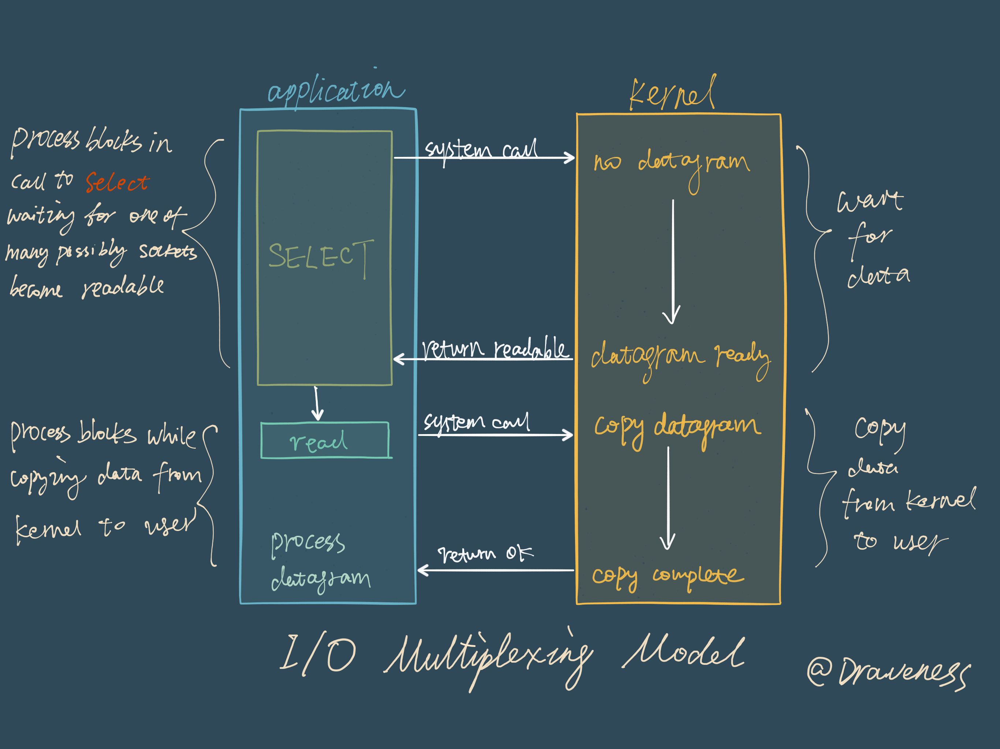

# I/O 多路复用

I/O多路复用主要需要解决的问题是在I/O密集的情况下，能够在不阻塞的情况下，同时能够对多个客户进行服务。

**IO多路复用不是指多个服务共享一个连接，而仅仅是指多个连接的管理可以在同一进程**。在网络服务中，IO多路复用起的作用是**一次性把多个连接的事件通知业务代码处理**。

比如我们拥有多个的用户对我们的server进行请求，我们与用户之间进行交互是通过多个SocketChannel进行工作，但是因为用户的输入会需要一定的时间，我们不能一直等待用户输入。

我们更希望有一种类似于condition variable的机制，当这边已经系统层面已经将数据准备好之后，再让我们的application被唤醒开始读取数据进行相应的操作，而这个相应的操作，是通过最开始注册好的一个函数。

我们自己写的这个结构是一个Selector对象来管理socket，我们的ServerSocketChannel来负责accept连接，accept后会创建独立的socket来进行与用户的交互，我们单独创建一个线程来将这个单独的socket注册进入Selector体系之中。之后我们的会在主线程中一直轮询，等待是否有已经有消息来或者有消息发送这样的情况。如果有，则调用其对应的注册的函数即可。

