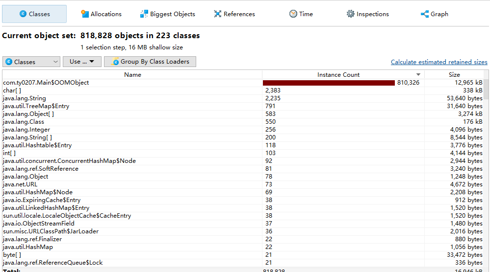

# JAVA内存区域与内存溢出

## case study

### String::intern

主要围绕常量池的问题进行探讨，相关的常量（ref）将进入到常量池中，

### Jprofiler

Jprofiler通过添加参数`-XX:+HeapDumpOnOutOfMemoryError`在发生OOM错误之后会export出hprof文件，导入到Jprofiler中进行解析，可以非常详细的看到heap的情况，我们编写了一个简单的程序来造成OOM。

### NIO

[多路复用的几种策略](https://blog.csdn.net/m0_37524661/article/details/87916779)

有关于简单的NIO进行聊天的代码，在java-reactor-demo有具体的代码，NIO里面主要强调一个channel的使用，我们这里简单的可以和[该篇博客](https://www.cnblogs.com/piperck/p/6435512.html)中golang的多路复用进行一些对比，select语法其实就是对应selector，channel的概念是基本相同的，这应该是golang吸取的相关设计经验得来的。

然后有课程[PDF](http://106.15.225.249:7070/nio.pdf)

