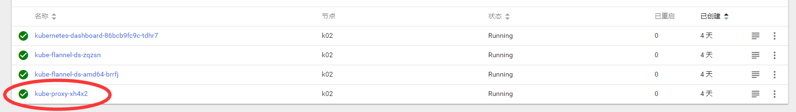

# k8s

## 概念简介

[**Kubernetes**](https://www.kubernetes.org.cn/)是一个开源的，用于管理云平台中多个主机上的容器化的应用，Kubernetes的目标是让部署容器化的应用简单并且高效（powerful）,Kubernetes提供了应用部署，规划，更新，维护的一种机制。

Kubernetes中的最基础单元是一个Pod，一个Pod可以承载一个或者多个相关的容器。

Kubernetes可以维护Pod的总数，对无响应的Pod进行删除，并创建新的Pod。当Pod里的某个容器停止时，Kubernetes会自动检测到这个问起并且重启这个Pod（重启Pod里的所有容器），如果Pod所在的Node宕机，则会将这个Node上的所有Pod重新调度到其他节点上。

Service会管理多个Pod，用于提供服务会存在一个虚拟的IP和端口，等待用于更上层的负载均衡器等对其进行调用。

NodePort

系统会在Kubernetes集群中的每个Node上打开一个主机的真实端口，这样，能够访问Node的客户端就能通过这个端口访问到内部的Service了

上图为某app的部署架构，我们在多态服务器（虚拟机）上进行部署，我们对各项服务进行分离，一共分为三个板块——ES、serverA、serverB，每一个小的模块都是一个微服务，我们对每一类型的服务进行弹性的部署。

## 相关cli的初始化使用

## kubeadm kubectl kubelet

三个工具是三个层次，分别有不同的作用.

### kubeadm

创造整个kebernet架构，在master进行init，这个地方需要先提前安装网络插件，这个地方因为我们的container是默认的docker，因而我们需要进行设置CNI，这个需要进行配置插件fannel

### kubectl

### kubelet

## 集群高可用的实现方式

集群中可能会存在多个master节点我们有两种方式来实现这样的高可用：

1. 设置反向代理

   我们使用在某个节点上使用proxy，然后该节点上都是访问这个proxy的监听的端口，这个代理来看是哪个master能够来进行管理。

   

2. 设置固定ip

   在靠近master的地方进行监控，master自行检测心跳，看谁比较合适来接下这个包。

