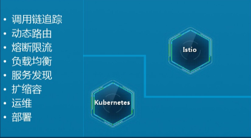
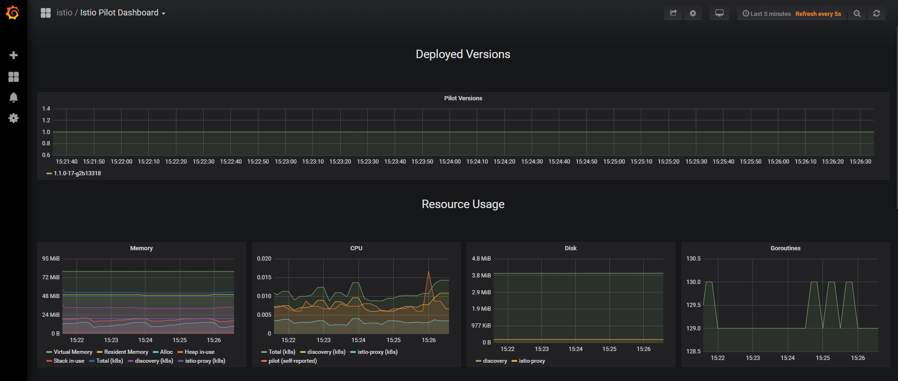
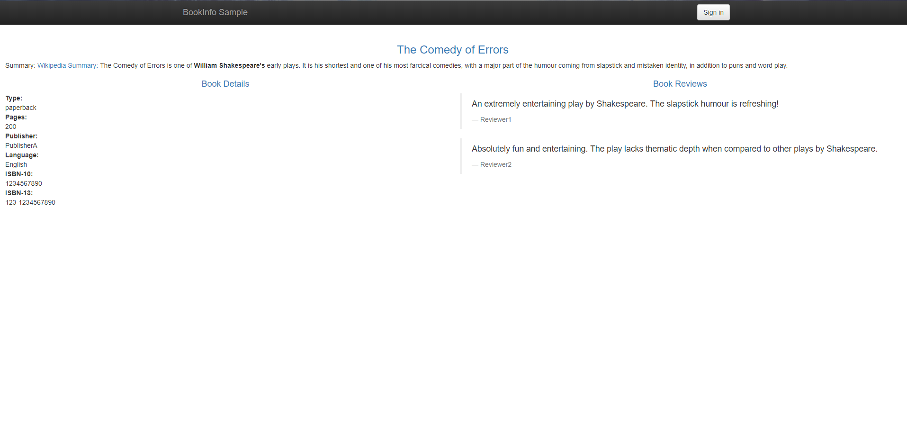
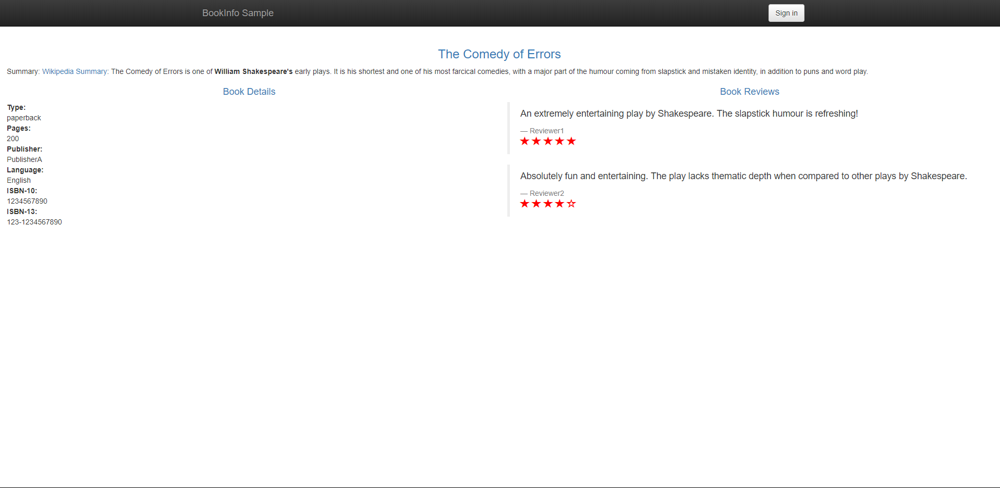
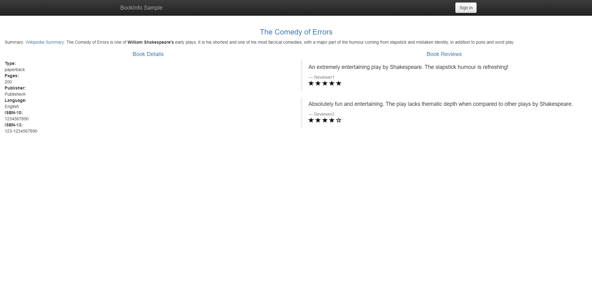
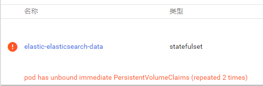

# kubernetes 安装部署全过程

## 简介

kubernetes=1.13.5 kubedashboard=1.10.3  ubuntu 18.03

### 通用操作

1. 科学上网

   有部分镜像是pull不下来的，需要我们使用国内源（见下）进行操作

   ```bash
   docker pull xxxx/name:0.0
   docker tag xxxx/name:0.0 k8s.gcr.io/name:0.0
   ```

2. 基本环境的搭建

   ```bash
   sudo apt-get install \
       apt-transport-https \
       ca-certificates \
       curl \
       gnupg-agent \
       software-properties-common
   curl -fsSL https://download.docker.com/linux/ubuntu/gpg | sudo apt-key add -
   sudo add-apt-repository \
      "deb [arch=amd64] https://download.docker.com/linux/ubuntu \
      $(lsb_release -cs) \
      stable"
   sudo apt-get update
   sudo apt-get install docker-ce docker-ce-cli containerd.io
   ### 安装docker 完成
   sudo vim /etc/apt/sources.list
   添加下列源用于安装各项kubernetes的部件
   #deb [arch=amd64] https://mirrors.ustc.edu.cn/kubernetes/apt kubernetes-xenial main
   gpg --keyserver keyserver.ubuntu.com --recv-keys BA07F4FB
   gpg -a --export 6A030B21BA07F4FB | sudo apt-key add - #OK
   # 添加源对应的key
   sudo apt-get update
   sudo apt-get install -y kubelet kubeadm
   ```

## master

```shell
sudo kubeadm reset
# 如果是重装，执行上述命令
sudo kubeadm init --pod-network-cidr=10.244.0.0/16 # 参数要求是flannel的要求
# 请记录下kubeadm join这行命令，用于后序方便的添加node
### 给予一般用户权限进行操作
mkdir -p $HOME/.kube 
sudo cp -i /etc/kubernetes/admin.conf $HOME/.kube/config
sudo chown $(id -u):$(id -g) $HOME/.kube/config
###
###
vim /etc/kubernetes/manifests/kube-apiserver.yaml
command: 
- --enable-admission-plugins=NamespaceLifecycle,LimitRanger,ServiceAccount,DefaultStorageClass,DefaultTolerationSeconds,MutatingAdmissionWebhook,ValidatingAdmissionWebhook,ResourceQuota
### 记得把老的那个没running的kube-apiserver给删了,上述的操作可以不做，主要是为了能够
kubectl apply -f kube-flannel.yml # 创建flannel
kubectl apply -f ssl-kube-dashboard.yaml # 创建dashboard
kubectl -n kube-system edit service kubernetes-dashboard # 将dashboard改为NodePort的 type
kubectl -n kube-system get service kubernetes-dashboard # 查看service的类型
### 上面这一步已经可以看到具体的页面了，但是没有任何的权限
kubectl create -f 328-admin-user.yaml
### 创建用户并给予角色
kubectl -n kube-system describe secret $(kubectl -n kube-system get secret | grep kubernetes-dashboard | awk '{print $1}')# 查看token
https://<master-ip>:<apiserver-port> # 访问dashboard
```

## node

安装各插件的操作与master相同。

```bash
 # master 上执行
 scp ./config administrator@192.168.0.192:~/admin.conf
 # node 上执行
 sudo cp admin.conf /etc/kubernetes/admin.conf
### 首先将master节点上的./kube/config复制为该node节点上的/etc/kubernetes/admin.conf
mkdir -p $HOME/.kube 
sudo cp -i /etc/kubernetes/admin.conf $HOME/.kube/config
sudo chown $(id -u):$(id -g) $HOME/.kube/config
###
# sudo vim /etc/systemd/system/kubelet.service.d/10-kubeadm.conf 这个操作不靠谱，在高版本里面，因为这个参数的设置地点不在这里了，而且如果是修改其中某句话，将是一个没网的孤立节点
# https://kubernetes.io/docs/setup/cri/ 供大家参考
sudo swapoff -a # 关闭交换区

sudo kubeadm join xxx
# 如果出现错误，大致是token的问题 在master上面使用kubeadm token create --print-join-command生成新的替换
# 如果遇到“kubelet-config-1.14" is forbidden: User "system:bootstrap:gmt42b" cannot get resource "configmaps" in API group "" in the namespace "kube-system"请核对你master上的kubeadm、kubectl、kubelet的版本号和node节点上的一不一样，下载正确的版本
# 版本号非常的奇特是x.xx.x-00
# 似乎kubeadm可以直接降级upgrade
### 如果节点已经加入到了集群中，如果仍旧是notready的状态，那我们需要debug就可以看日志
journalctl -u kubelet
###
# 常见的错误是node服务器上面的网络设置出现问题，可以通过我们之前设置的dashboard查看错误


### Container runtime network not ready: NetworkReady=false reason:NetworkPluginNotReady message:docker

docker pull quay.io/coreos/flannel:v0.10.0-amd64 
mkdir -p /etc/cni/net.d/
sudo cat <<EOF> /etc/cni/net.d/10-flannel.conf
{"name":"cbr0","type":"flannel","delegate": {"isDefaultGateway": true}}
EOF
mkdir /usr/share/oci-umount/oci-umount.d -p
mkdir /run/flannel/
cat <<EOF> /run/flannel/subnet.env
FLANNEL_NETWORK=172.100.0.0/16
FLANNEL_SUBNET=172.100.1.0/24
FLANNEL_MTU=1450
FLANNEL_IPMASQ=true
EOF
kubectl apply -f https://raw.githubusercontent.com/coreos/flannel/v0.9.1/Documentation/kube-flannel.yml
### flannel 没装没配置
### 如果报pull image相关的错误，详见前方的通用操作。
### 建议在join之前先直接把flannel装好就差不多了
```

### node使用nodeport简易部署一个nginx服务

相关附件后文显示

```bash
### 使用deployment部署一个类型的集群
kubectl apply -f nginx-deployment.yaml
###
### 创建service与pod进行对接，在此service的type为NodePort
kubectl apply -f nginx-service.yaml
###
### 如果需要删除某部署，则直接进行kubectl delete deployment xxx
```

```yaml
# nginx-deployment.yaml
apiVersion: apps/v1
kind: Deployment
metadata:
  name: nginx-deployment
  labels:
    app: nginx # 是与service联系的纽带
spec:
  replicas: 3
  selector:
    matchLabels:
      app: nginx
  template:
    metadata:
      labels:
        app: nginx
    spec:
      containers:
      - name: nginx
        image: nginx:1.7.9
        ports:
        - containerPort: 80 # container向外暴露的端口
```

```yaml
# nginx-service.yaml
apiVersion: v1
kind: Service
metadata:
  name: nginx-service-nodeport
spec:
  selector:
    app: nginx # 联系上development中定制的pods
  ports:
   - name: http
     port: 8080 
     protocol: TCP
     targetPort: 80
  type: NodePort

```

## nodePort port targetPort的不同点

1. nodePort是指在设定为NodePort类型下的service 在物理机上能够用`<IP>:<nodePort>`进行访问

2. port是指在clusterIP下对应的端口，即`<clusterIP>:<port>`能访问到

3. targetPort是指我们直接访问pod(endpoint)的时候的端口，要保证有效必须要能够和我们的pod上暴露的端口要一致（在此都是nginx的http默认端口80）

   ```bash
   endpoint:10.244.1.2:80,10.244.1.3:80,10.244.1.4:80
   curl 10.244.1.2:80
   ```

   结果为：

   ```html
   <!DOCTYPE html>
   <html>
   <head>
   <title>Welcome to nginx!</title>
   <style>
       body {
           width: 35em;
           margin: 0 auto;
           font-family: Tahoma, Verdana, Arial, sans-serif;
       }
   </style>
   </head>
   <body>
   <h1>Welcome to nginx!</h1>
   <p>If you see this page, the nginx web server is successfully installed and
   working. Further configuration is required.</p>
   
   <p>For online documentation and support please refer to
   <a href="http://nginx.org/">nginx.org</a>.<br/>
   Commercial support is available at
   <a href="http://nginx.com/">nginx.com</a>.</p>
   
   <p><em>Thank you for using nginx.</em></p>
   </body>
   </html>
   ```
## Helm 和 Tiller的安装

   这个部分是随着历史的演进而来的，我们如果有很大的工程的话，我们将会存在多个deployment、service文件，并且启动的先后顺序也是非常敏感的，我们手动去一个个启动可能会出现错误，管理将存在很大的问题。最终将Helm作为包管理器，则能够解决这问题，将一个体系的deployment、service打包，成为一个chart，最终可以将这些chart以某种顺序进行部署。

   ```bash
   sudo docker pull haojianxun/gcr.io.kubernetes-helm.tiller:v2.13.1
   sudo docker tag haojianxun/gcr.io.kubernetes-helm.tiller:v2.13.1 gcr.io/kubernetes-helm/tiller:v2.13.1 # 每个节点上都需要pull该images
   # helm 请自行前往官网直接下载相关二进制编译好的文件， 直接cp到bin里面去就能用了https://helm.sh/docs/install/
   ### install tiller
   wget https://raw.githubusercontent.com/istio/istio/release-1.1/install/kubernetes/helm/helm-service-account.yaml
   kubectl apply -f helm-service-account.yaml # 为tiller 创建账户
   helm init --service-account tiller --skip-refresh # 通过helm的init创建tiller
   ###
   ### 但是我直接装没发现怎么装istio-injector，找了个博客去生成模板去create istio.yaml
   # 
   helm template install/kubernetes/helm/istio --name istio --namespace istio-system --set sidecarInjectorWebhook.enabled=true --set ingress.service.type=NodePort --set gateways.istio-ingressgateway.type=NodePort --set gateways.istio-egressgateway.type=NodePort --set tracing.enabled=true --set servicegraph.enabled=true --set prometheus.enabled=true --set tracing.jaeger.enabled=true --set grafana.enabled=true > istio.yaml
   
   kubectl create namespace istio-system
   kubectl apply -f ./install/kubernetes/helm/istio-init/files/crd-11.yaml
   kubectl apply -f ./install/kubernetes/helm/istio-init/files/crd-certmanager-10.yaml
   kubectl apply -f ./install/kubernetes/helm/istio-init/files/crd-10.yaml
   kubectl apply -f istio.yaml# 我们自己的文件去istio的安装目录下去找
### 如果发生helm install 停留时间非常长，且最终不成功的情况，应该是“网络不好”，我们的方案是换国内阿里源。
# 可能安装的中途会有些报错，这个是启动的先后顺序的问题，等一会就好了
# 先移除原先的仓库
helm repo remove stable
# 添加新的仓库地址
helm repo add stable https://kubernetes.oss-cn-hangzhou.aliyuncs.com/charts
# 更新仓库
helm repo update
### 
   ```

## HorizontalPodAutoscaler


我们之前要实现伸缩，我们需要主动的去往kubedashboard进行手动调整Pod数量，如果我们需要通过观测我们CPU的使用情况或者metrics达到一定规则时，我们的集群能够自动的讲该项服务进行扩展，以保证我们项目的正常工作。

```bash
kubectl autoscale deployment  --max=8 --min=2 --cpu-percent=80
kubectl edit deployment wordladder-v1 #注意这里 我们需要去给pod写清楚具体的CPU和内存上限，不然不会去监测。

```

我们发现按照上述的操作仍旧是不能够进行监控的，道理是在于kubernetes 1.11以后的版本中将不再使用heapster插件来监控资源的使用状态，但是到了新的版本1.13.5的时候，你会发现这个metric-server才是新版本的监控资源服务，你需要到进行新的[配置](https://github.com/kubernetes-incubator/metrics-server/tree/master/deploy/1.8%2B)，你可以按照该[教程](https://blog.csdn.net/ygqygq2/article/details/82971338)进行配置，注意下镜像的版本，因为可能版本差异过大会造成问题（v0.3.1 和v0.3.2亲自试毒没有大区别）


   ## Istio

   

   我们的kubernetes实现了分布式部署的相关工作，但对于在线管理上kubernetes能做的并不多，我们需要实现熔断限流、动态路由，因而我们需要在kubernetes的体系下融入Istio。

### 初步试探相关bookinfo的相关结果

   对官网的bookinfo进行了一些初步试探，得到的初步的结论如下：

   1. gateway是整个流量的入口。
   2. 会使用某个Istio的Virtual Service，设置其对应的gateway
   3. 在Virtual Service中设置相应路由，路由直接我们定义的实际Service挂钩（host与Service的name）
   4. Service回到kubernetes的Service和Deploy的层级，如果不对外暴露，则直接使用ClusterIP即可

   ### 初步试探熔断机制的相应结果

   熔断机制的实现是针对某项服务而言的，当访问该服务达到一定的条件之后，我们将对其进行相应的阻拦[ref](https://istio.io/zh/docs/reference/config/istio.networking.v1alpha3/#trafficpolicy)

   ```yaml
   apiVersion: networking.istio.io/v1alpha3
   kind: DestinationRule
   metadata:
     name: httpbin
   spec:
     host: httpbin # 某个服务的名称
     trafficPolicy: # 设置上游池的连接设置
       connectionPool:
         tcp:
           maxConnections: 1
         http:
           http1MaxPendingRequests: 1
           maxRequestsPerConnection: 1
       outlierDetection:
         consecutiveErrors: 1
         interval: 1s
         baseEjectionTime: 3m
         maxEjectionPercent: 100
   ```

   ### Istio的可视化工作

   直接将grafana转变为NodePort，因为之前已经配置过，所以没有太大的问题。

   

   ### bookinfo示例的使用过程

   

   

   

   当我们按照官方[bookinfo](https://istio.io/zh/docs/examples/bookinfo/)（注意一定要把DestinationRule 给配置了，不然到后面，我们进行引流的时候会发现Error）进行完成安装之后，我们在浏览器中打开对应的页面，将会看到上面三个图（F5刷新）的界面，这是由于我们对reviews设置了v1-v3，而如果没有进行流量的控制，则实行的策略将是按顺序进行访问，我们使用[教程](https://istio.io/zh/docs/tasks/traffic-management/request-routing/)中的相关方法，会讲v2定向给jason用户，而未登录用户则无法看到reviews的评级。

   之后我们按照[分流配置文件](https://raw.githubusercontent.com/istio/istio/release-1.1/samples/bookinfo/networking/virtual-service-reviews-50-v3.yaml)可以让进行流量的分流，可以看到上图中v2与v1进行了基本均分的切换。


## ElasticSearch的搭建

### elasticsearch的helm安装

helm搭建集群非常类似于npm

   ```bash
helm repo add bitnami https://charts.bitnami.com # 添加仓库
helm install --name elastic -f values.yaml bitnami/elasticsearch # 按照values.yaml自定义属性进行安装
kubectl port-forward --namespace default svc/elastic-elasticsearch-coordinating-only 9200:9200 #将api的端口暴露出去
### 上述代码卡住的时候请直接edit svc 来改成nodePort
   ```

我们在得到了hello world的相关回应之后发现了另一个问题，elastic-elasticsearch-data-0这个pod一直是在pending的状态，我反过头去看配置的相关文档，发现了这里面的相关问题：



- Kubernetes 1.6+
- PV dynamic provisioning support on the underlying infrastructure

第一个条件我们显然满足，第二个条件我至少没有主动的实现过，则需要我们进行探索


首先我们要去了解PV和PVC的相关知识，我们可以从docker的Volume的讲起

### Volume, Persistent Volumes & Persistent Volumes Claim

Volume这个概念在docker当中就已经出现了，我们经常会将我们的代码相关放置在容器外层环境的目录下，对于这样我们可以很简单的对这些文件进行修改（例如git pull或者直接更换文件，但服务并不需要修改相关设置），我们会将该文件夹\文件挂载进我们的容器中（两边对文件的修改都是有效的，比如我们的数据库容器内部改或者外部我们进行清理都是有效的，但是代码一般情况我们选择在外部进行更改）。

而我们的讨论扩展到集群，则会发现，这样的挂载似乎是可能跨越物理机（或者虚拟机）的，我们需要进一步的进行抽象，才能够对其进行更加有效的管理，为了方便理解我们这里以static PV进行介绍。

Persistent Volumes Claim(PVC) 可以简单的认为是一种资源的请求，当我们启用PVC之后，我们的集群可以给予相应的PV，让资源能够被使用，但是我们的用户并不需要了解这其中的存储细节。

1. 首先是我们的管理员要对共有的资源进行设置，让他们成为一个PV，一个PV能够描述这各资源在哪个位置，能够描述对该资源的读写权限
2. 之后我们设置具体的PVC，我们需要设置我们需要什么样的资源，我们需要多大的空间，我们的权限是怎么样的。
3. 之后我们可以在某个具体的pod中进行设置，我们需要什么样的资源请求，我们的资源请求之后，在pod中具体mount到哪一个文件夹之下。

详情的一些细节文件的展示见[这里](https://kubernetes.io/docs/tasks/configure-pod-container/configure-persistent-volume-storage/)。

回到我们最开始的问题，我们需要的**PV dynamic provisioning support**所以我们需要进一步对我们的cluster进行设置。

在这个地方我搞了两个晚上，我最终在values.yaml中对相应的storageclassname进行了指定，并且调整了其大小，另一方面，我对stanard名下的PV设置了两个，一个node-k02一个负责node-k03。

我认为我应该还是没有完成一个动态PV的创建，但是鉴于我们的集群节点较小，则相对这样的配置还能接受。

之后我按照[基本教程](https://github.com/tx19980520/new-tech-stack/blob/master/search%20engine/elasticsearch/elasticsearch.md)进行了基础的配置，发现其是可用的，则基本确立了我们ES部分上线成功


## 2019年4月6日实践——将wordladder不同版本放置

我们决定将两位同学对wordladder的实现封装成容器，然后部署到我们的私有云上，组织一个流量分配，测试部署的难易程度。

我们在wordladder文件夹下配置了如下几个yaml文件

```bash
wordladder
-- wordladder-service.yaml # 负责具体pod对外暴露的service的声明和容器的部署
-- wordladder-gateway.yaml # 负责监控整个服务的流量
-- wordladder-virtualservice.yaml # 负责智能路由
kubectl edit svc -n istio-system istioingressgateway
### 修改http内部对应的端口，默认是31380，改成你能暴露的。
```

## 2019年4月8日实践——在k03节点上单独部署mysql并尝试与其他服务进行连接

我们首先准备使用mysql:5.7的官方数据库docker开始从scratch开始搭建，但是无奈不知道使该服务的pod保持active（或许真的是如同有些博客说的让内部系统一直sleep，但我们进行这一步的尝试），我最终决定使用helm的chart进行安装，为了保证一致性，并且我们暂不希望对数据库进行数据库集群的搭建，我们仅指定将我们的数据库服务部署在k03且只有一个pod。

```bash
kubectl label nodes k03 sql=yes
# values.yaml
mysqlRootPassword: temage
mysqlDatabase: temage
nodeSelector:# 该部分与我们的k03的标签是相同的，当然我们可以对几个的节点都设置这几个标签，这样就可以实现仅在这几个节点
  sql: "yes"
persistence:
  storageClass: standard #许诺其使用standard的storage类型，下面都是10g的相关持久化卷，mysql需要一个空文件夹的来做卷，所以路径要稍微改改


# default-storage-class.yaml
kind: PersistentVolume
apiVersion: v1
metadata:
  name: standard-pv2
  labels:
    type: local
spec:
  capacity:
    storage: 10Gi
  storageClassName: standard
  accessModes:
    - ReadWriteOnce
  hostPath:
    path: "/mnt/data/mysql" # 单独的一个文件夹给mysql使用
```

```bash
helm install --name mysql -f mysql/values.yaml stable/mysql
To get your root password run:

    MYSQL_ROOT_PASSWORD=$(kubectl get secret --namespace default mysql -o jsonpath="{.data.mysql-root-password}" | base64 --decode; echo)

To connect to your database:

1. Run an Ubuntu pod that you can use as a client:

    kubectl run -i --tty ubuntu --image=ubuntu:16.04 --restart=Never -- bash -il

2. Install the mysql client:

    $ apt-get update && apt-get install mysql-client -y

3. Connect using the mysql cli, then provide your password:
    $ mysql -h mysql -p

To connect to your database directly from outside the K8s cluster:
    MYSQL_HOST=127.0.0.1
    MYSQL_PORT=3306

    # Execute the following command to route the connection:
    kubectl port-forward svc/mysql 3306

    mysql -h ${MYSQL_HOST} -P${MYSQL_PORT} -u root -p${MYSQL_ROOT_PASSWORD}

```

到了这一步的情况下，我们最终只能在master中主动能进入到数据库中，但我们简单的测试之后发现我们的其他pod（建立了临时pod），却无法进入到mysql服务中去，我们设计的整个操作过程应该是使用kubernetes内部的DNS解析来进行联系，但是却发现无法进入到服务中，初步断定是数据库内部不允许其他IP进入到其中，但是我们forward到127.0.0.1之后却能在master上进行访问。我们现如今怀疑两点：

1. DNS没起作用（但直接用IP和用DNS得到的报错居然是一样的）
2. 数据库的设置出现了问题（server端或者是client端都有可能）

注，上述操作暂时只是理论上的成功，实践操作上仍旧处于失败状态，由于时间关系没有进一步研究。

我开始探究是不是DNS的相关问题，我在POD里面ping能ping通外网，但是无法ping通我们自己服务器的端口，且会出现wget connection reset by peer 的情况，我决定回头去检查一下Istio当时提供的bookinfo例子里面是不是有什么细节被我遗漏了，我们需要重新温习一下。

## 熔断机制的wordladder实验

我们准备通过wordladder来实践熔断机制，因为wordladder是前后端分离的，因此我们的调用链天然的是前端调用后端，我们设置一定的条件，在后端长时间未响应后，我们对其进行熔断，保证用户能够搜索单词，但是不允许进行BFS。

我的相应配置文件如下：

```yaml

```

