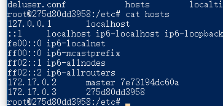
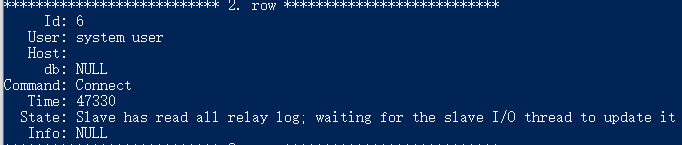

# mysql 主从数据库的探索

mysql的主从备份的实现机理是使用二进制log文件，master和所欲偶的slave都需要一个唯一的server-id

## 本机docker的实践

注：我们使用的是mysql5.6不适用更高的版本8的原因是要设置“另类”的auth，在功能实现层面上来说认为不必要，所以我们并没有关注该点，如果有需要，请查看[这里](https://dev.mysql.com/doc/refman/8.0/en/replication-howto-repuser.html)。

### bootstrap.cnf

```
[mysqld]
log-bin=mysql-bin
server-id = x

# 设置保证一致性
innodb_flush_log_at_trx_commit = 1
sync_binlog = 1
# slave节点需要的，需要的原因是因为default的是按照{hostname}-relay-bin来命名的，所以一旦hostname修改了就会无效。
relay-log=xxx
relay-log-index=xxxx
```


```bash
docker run -itd -p 3306:3306 --name master -v /usr/mysql/master/conf:/etc/mysql/conf.d -v /usr/mysql/master/data:/var/lib/mysql -e MYSQL_ROOT_PASlsSWORD=12345 --link master mysql:5.6 #master服务启动
docker run -itd -p 3307:3306 --name slave -v /usr/mysql/slave/conf:/etc/mysql/conf.d -v /usr/mysql/slave/data:/var/lib/mysql -e MYSQL_ROOT_PASSWORD=12345 --link master mysql:5.6
# slave服务启动，注意这里link了master

### master start ###
# 建议单独创建账号来进行主从的备份操作。
mysql -u root -p
 GRANT ALL PRIVILEGES ON *.* TO 'root'@'%' IDENTIFIED BY '12345' WITH GRANT OPTION;\
 FLUSH PRIVILEGES;
 FLUSH TABLES WITH READ LOCK;
 # 上面的语句是把数据flush之后把所有表锁住，以免在做后序操作的时候有数据插入进来
 UNLOCK TABLES; # 这一句是在所有的slave已经配置完成后再开启，主要是把表去掉，相当于开始服务。
 show master status;
 +------------------+----------+--------------+------------------+-------------------+
| File             | Position | Binlog_Do_DB | Binlog_Ignore_DB | Executed_Gtid_Set |
+------------------+----------+--------------+------------------+-------------------+
| mysql-bin.000006 |      412 |              |                  |                   |
+------------------+----------+--------------+------------------+-------------------+
# 记住这个filename，slave根据这个来同步
### master end ###

### slave start ###
mysql -u root -p
change master to 
master_host='master',master_user='root',master_password='12345',master_log_file='mysql-bin.000006';
start slave;
show slave status\G
### slave end ###
```

之后在master数据库里面进行操作会发现能同步到slave数据库中。

可能出现的错误：

1. server-id或uuid出现问题，例如两者一样，这主要是因为copy的缘故，uuid出问题请到data文件夹里面删除auto.cnf然后重启数据库就好，server-id可以写在my.cnf中，你可以修改该文件然后重启数据库。
2. 'aio write' returned OS error 122.出现这个问题的主要原因是我是windows系统，我的docker容器是跑在虚拟机中，我又希望在windows里面写配置文件，所以我把目录挂载进虚拟机，docker的目录又挂载到挂载目录，出现了文件系统不支持这样的问题。
3. master_host到底填什么，这个问题我之前一直以为是填192.168.99.100（我虚拟机在我电脑上的ip）或者是127.0.0.1或者直接0.0.0.0，这些都不对，应该是填master和slave两个容器link起来之后建立的网络中的ip地址，所以我选择了使用--link，并在slave中使用了master域名。



### log_slave_updates

根据文字的意图非常简单，就是是否在log中记录slave的更新。

可能出现问题的是以下这种情况：

A与B为主主复制，C为A的slave，则我们会发现C的更新只来源于A。

这就是因为默认的log_slave_updates为false，则A作为B的slave角色，则A确实会接受B的数据更新，但是A也同时是B的master，或者说至少身份不单纯，则A此时是不会讲B的更新放入自己的log中去的。

按照官方文档的意思，默认不设置**`--log-slave-updates`**的理由是为了in case you cause one of the slaves to become the new master. If `Slave 1` has [`--log-slave-updates`](https://dev.mysql.com/doc/refman/5.7/en/replication-options-slave.html#option_mysqld_log-slave-updates) enabled, it writes any updates that it receives from `Master` in its own binary log. This means that, when `Slave 2` changes from `Master` to `Slave 1` as its master, it may receive updates from `Slave 1` that it has already received from `Master`.

### 主从切换

我们的master节点出现故障时，需要我们将一个slave节点切换为新的master节点，并且将其余的slave作为新master的slave。


0. 确保每个slave节点都没有使用--log-slave-updates

1. 通过 `show processlist`查看

   

2. 对被选中的slave执行`stop slave`，`reset master`

3. 对其余节点`stop slave`并且`change master to`


### mysql on kubernetes with master-slave structure

我们按照[官方教程](https://kubernetes.io/docs/tasks/run-application/run-replicated-stateful-application/#deploy-mysql)我们进行配置

1. configmap

   configmap的主要用途是为了在后续部署时能够复用一部分的配置（主要是在slave上），并且以后修改可以集中进行修改，我们的write操作是走master节点的，read是走slave节点的。

   ```yaml
   apiVersion: v1
   kind: ConfigMap
   metadata:
     name: mysql
     labels:
       app: mysql
   data:
     master.cnf: |
       # Apply this config only on the master.
       [mysqld]
       log-bin
     slave.cnf: |
       # Apply this config only on slaves.
       [mysqld]
       super-read-only
   ```

2. 创建service，主要是注意mysql的master service需要的是一个stateful的，所以他不需要clusterIP，我们这个mysql service就只是来暴露write服务的。

   ```yaml
   application/mysql/mysql-services.yaml 
   
   # Headless service for stable DNS entries of StatefulSet members.
   apiVersion: v1
   kind: Service
   metadata:
     name: mysql
     labels:
       app: mysql
   spec:
     ports:
     - name: mysql
       port: 3306
     clusterIP: None
     selector:
       app: mysql
   ---
   # Client service for connecting to any MySQL instance for reads.
   # For writes, you must instead connect to the master: mysql-0.mysql.
   apiVersion: v1
   kind: Service
   metadata:
     name: mysql-read
     labels:
       app: mysql
   spec:
     ports:
     - name: mysql
       port: 3306
     selector:
       app: mysql
   
   
   ```

3. StatefulSet的创建

   ```yaml
   apiVersion: apps/v1
   kind: StatefulSet
   metadata:
     name: mysql
   spec:
     selector:
       matchLabels:
         app: mysql
     serviceName: mysql
     replicas: 3
     template:
       metadata:
         labels:
           app: mysql
       spec:
         initContainers: # 这个里面的都是为了init一个container做的准备工作
         - name: init-mysql # 主要是准备好server-id，并且选择好正确的配置文件
           image: mysql:5.7
           command:
           - bash
           - "-c"
           - |
             set -ex
             # Generate mysql server-id from pod ordinal index.
             [[ `hostname` =~ -([0-9]+)$ ]] || exit 1
             ordinal=${BASH_REMATCH[1]}
             echo [mysqld] > /mnt/conf.d/server-id.cnf
             # Add an offset to avoid reserved server-id=0 value.
             echo server-id=$((100 + $ordinal)) >> /mnt/conf.d/server-id.cnf
             # Copy appropriate conf.d files from config-map to emptyDir.
             if [[ $ordinal -eq 0 ]]; then
               cp /mnt/config-map/master.cnf /mnt/conf.d/
             else
               cp /mnt/config-map/slave.cnf /mnt/conf.d/
             fi
           volumeMounts:
           - name: conf
             mountPath: /mnt/conf.d
           - name: config-map
             mountPath: /mnt/config-map
         - name: clone-mysql #主要是考虑到可能我们会迁移一些原始数据
           image: gcr.io/google-samples/xtrabackup:1.0
           command:
           - bash
           - "-c"
           - |
             set -ex
             # Skip the clone if data already exists.
             [[ -d /var/lib/mysql/mysql ]] && exit 0
             # Skip the clone on master (ordinal index 0).
             [[ `hostname` =~ -([0-9]+)$ ]] || exit 1
             ordinal=${BASH_REMATCH[1]}
             [[ $ordinal -eq 0 ]] && exit 0
             # Clone data from previous peer.
             ncat --recv-only mysql-$(($ordinal-1)).mysql 3307 | xbstream -x -C /var/lib/mysql
             # Prepare the backup.
             xtrabackup --prepare --target-dir=/var/lib/mysql
           volumeMounts:
           - name: data
             mountPath: /var/lib/mysql
             subPath: mysql
           - name: conf
             mountPath: /etc/mysql/conf.d
         containers: # 这里声明的两个容器和前面两个步骤使用的容器是对应的
         - name: mysql
           image: mysql:5.7
           env: # 允许进去就不需要密码，需要密码应该是需要启动指令加密码就好 mysql:8.0注意权限又其他设置
           - name: MYSQL_ALLOW_EMPTY_PASSWORD
             value: "1"
           ports:
           - name: mysql
             containerPort: 3306
           volumeMounts:
           - name: data
             mountPath: /var/lib/mysql
             subPath: mysql
           - name: conf
             mountPath: /etc/mysql/conf.d
           resources:
             requests:
               cpu: 500m
               memory: 1Gi
           livenessProbe:
             exec:
               command: ["mysqladmin", "ping"]
             initialDelaySeconds: 30
             periodSeconds: 10
             timeoutSeconds: 5
           readinessProbe: #是一个探针，专门来看这个数据库是否存活
             exec:
               # Check we can execute queries over TCP (skip-networking is off).
               command: ["mysql", "-h", "127.0.0.1", "-e", "SELECT 1"]
             initialDelaySeconds: 5
             periodSeconds: 2
             timeoutSeconds: 1
         - name: xtrabackup
           image: gcr.io/google-samples/xtrabackup:1.0
           ports:
           - name: xtrabackup
             containerPort: 3307
           command:
           - bash
           - "-c"
           - |
             set -ex
             cd /var/lib/mysql
   
             # Determine binlog position of cloned data, if any.
             if [[ -f xtrabackup_slave_info ]]; then
               # XtraBackup already generated a partial "CHANGE MASTER TO" query
               # because we're cloning from an existing slave.
               mv xtrabackup_slave_info change_master_to.sql.in
               # Ignore xtrabackup_binlog_info in this case (it's useless).
               rm -f xtrabackup_binlog_info
             elif [[ -f xtrabackup_binlog_info ]]; then
               # We're cloning directly from master. Parse binlog position.
               [[ `cat xtrabackup_binlog_info` =~ ^(.*?)[[:space:]]+(.*?)$ ]] || exit 1
               rm xtrabackup_binlog_info
               echo "CHANGE MASTER TO MASTER_LOG_FILE='${BASH_REMATCH[1]}',\
                     MASTER_LOG_POS=${BASH_REMATCH[2]}" > change_master_to.sql.in
             fi
   
             # Check if we need to complete a clone by starting replication.
             if [[ -f change_master_to.sql.in ]]; then
               echo "Waiting for mysqld to be ready (accepting connections)"
               until mysql -h 127.0.0.1 -e "SELECT 1"; do sleep 1; done
   
               echo "Initializing replication from clone position"
               # In case of container restart, attempt this at-most-once.
               mv change_master_to.sql.in change_master_to.sql.orig
               mysql -h 127.0.0.1 <<EOF
             $(<change_master_to.sql.orig),
               MASTER_HOST='mysql-0.mysql',
               MASTER_USER='root',
               MASTER_PASSWORD='',
               MASTER_CONNECT_RETRY=10;
             START SLAVE;
             EOF
             fi
   
             # Start a server to send backups when requested by peers.
             exec ncat --listen --keep-open --send-only --max-conns=1 3307 -c \
               "xtrabackup --backup --slave-info --stream=xbstream --host=127.0.0.1 --user=root"
           volumeMounts:
           - name: data
             mountPath: /var/lib/mysql
             subPath: mysql
           - name: conf
             mountPath: /etc/mysql/conf.d
           resources:
             requests:
               cpu: 100m
               memory: 100Mi
         volumes: # 因为这个是我们提供的，所以我们要主动的挂载进去，这个和前面的VolumesMount里面的conf/config-map是对应好的。
         - name: conf
           emptyDir: {}
         - name: config-map
           configMap:
             name: mysql
     volumeClaimTemplates:
     - metadata:
         name: data
       spec:
         accessModes: ["ReadWriteOnce"]
         resources:
           requests:
             storage: 10Gi
   ```

