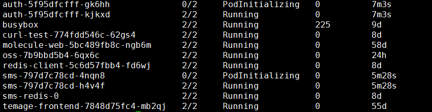

# SpringBoot best practice in kubernetes

参考自[这里](https://medium.com/faun/java-application-optimization-on-kubernetes-on-the-example-of-a-spring-boot-microservice-cf3737a2219c
)

## QOS

kubernetes中有三种策略，分别为Guaranteed、Burstable、BestEffort。

Guaranteed：我们针对每个容器都必须设置CPU和Memory的请求，且对于这个CPU和Memory的请求和限制，两者的数值必须是要相等，如果你设置了相应的limit，但是没有设置相应request，kubernetes会自动补全一个对等值request

Burstable：至少设置一个CPU或Mmeory的请求

BestEffort：request和limit全部都不设置，容器资源使用上限为所在node的capacity

三者对应被kill的情况：

Guaranteed：只有当其达到Memory上限时将会被kill

Burstable：在node的资源消耗完时且其使用值超过请求时，会在被kill掉的集合内

Best Effort：在资源消耗完是最容易被kill掉的

简单的讲，Guaranteed的Pod是等级最高，保护等级最高，最不容易被kill掉的

限制既是自由

### CPU & Memory

在集群中存在两种类型的资源，一种为可压缩资源，一种为不可压缩资源。

可压缩资源(conpressible resurces)——CPU资源

可压缩主要在于，即便资源不够使用，Pod仍旧能够正常的使用，CPU的时间分片能够解决这个问题。

不可压缩资源(non-compressible resources)——内存和磁盘资源

指如果不能达到实际需要的请求，则Pod无法正常进行工作

### CPU资源和Memory资源的限制

#### CPU 资源对启动的影响

springboot是一个重型框架，启动时间较长，我们需要考虑到在更新过程中的时长问题，因此在Pod启动过程中考虑CPU是非常有必要的，在[此文](https://medium.com/faun/java-application-optimization-on-kubernetes-on-the-example-of-a-spring-boot-microservice-cf3737a2219c)中对CPU进行进行限制，所得实践得出CPU请求越多，Pod启动的时间越短。

通过对不同deployment的Pod进行测试找到这个tricky的CPU请求值直接设置该值就好，我们但是与此同时我们需要考虑到，这样的设置会导致我们在每一个Pod上面能够部署的量将非常小，我们一个Pod在实际使用或外部请求较少时使用较少CPU，此时如若启动新Pod，可以使用到更多CPU进行启动。因此我们会认为说直接请求到如此高值是不合适的（仅峰值会使用）

因此对于CPU的限制，我们应当是观察该服务在日常使用情况下CPU的使用实际使用量（建议使用Promethues + Grafana），对CPU仅设置request并不设置limit。

#### Memory的使用情况

因为Memory是不能够进行压缩的，我们对于Memory的考虑是与CPU完全不同的。

针对本项目而言，JVM会取用node上（所有）物理内存的四分之一作为其heap，这就导致其可能很容易就超出对Pod设置的限制值。

我们希望JVM能够遵从Pod的限制，从而我们能够在集群的层次上进行统一的管理。

这里我们在启动jar包时需要添加几个参数，注意需要确认清楚相应的java open-jdk版本，详情可以参考[这里](https://segmentfault.com/a/1190000014142950)。

如果设置该参数，JVM堆的大小是你提供值的四分之一，这也是一种浪费，因此我们建议是设置-Xmx来控制heap的大小，用-XX:MaxRAM来控制总内存的大小；而对应的在Pod的层级，我们对内存既设置限制，又设置请求。

### 如何应对springboot Pod restart

我们注意一下在JVM中的exit code是正常信号量+ 128

`EXIT-CODE = 128 + SIGNAL-CODE`

则我们比较关注的就是`SIGKILL 9`和`SIGTERM 15`

SIGTERM信号被收到后的行为可能如下：

- 程序立刻停止

- 当程序释放相应资源后再停止

- 程序可能仍然继续运行

JVM可能使用该信号量来完成更加平滑的kill

而如果直接接收到了SIGKILL，不会被应用程序所捕获，也不能被阻塞或忽略，而是立即结束指定的进程

kubernetes终止一个Pod的顺序如下：

1. 执行lifecycle的preStop hook
2. 发送SIGTERM给指定Pod
3. 等待 grace-period time（默认30s）给contianer时间去cleanup
4. 如果仍旧在运行，直接发送SIGKILL给container

该处的grace-period是kubectl里面的一个参数，在`kubectl delete --force --grace-period=0 pod xxxx`的时候会有所体现，即不给该pod提供任何grace-period。

在springboot里面存在默认的SIGTERM的对应的handler，在我们发送SIGTERM信号之后，会得到如下的结果。

`2019-07-23 11:01:21.604  INFO 30198 --- [       Thread-3] o.s.s.concurrent.ThreadPoolTaskExecutor  : Shutting down ExecutorService 'applicationTaskExecutor'`

之后JVM平滑的结束。

## 集群中的相关实践

我们发现的确在集群中对pod进行部署，如果request的CPU值降低，的确会降低启动的速度（auth与sms这两个服务的启动速度一般情况下是在30s左右）

