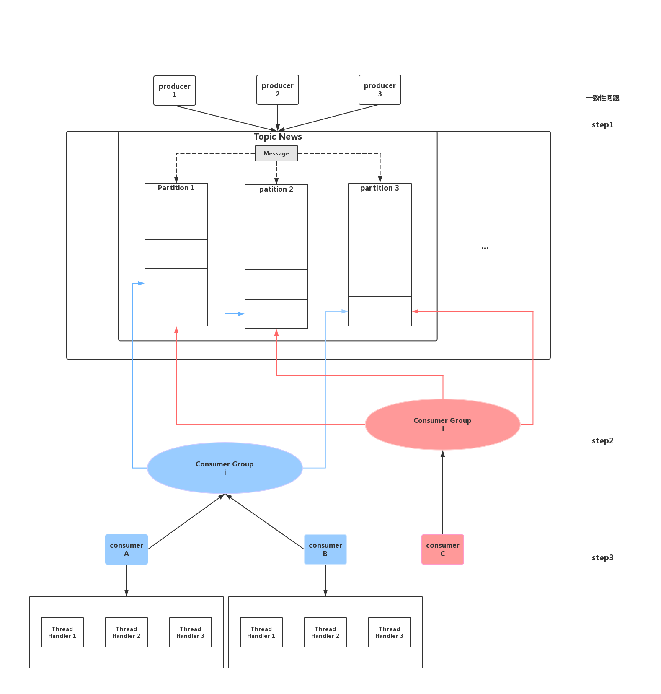
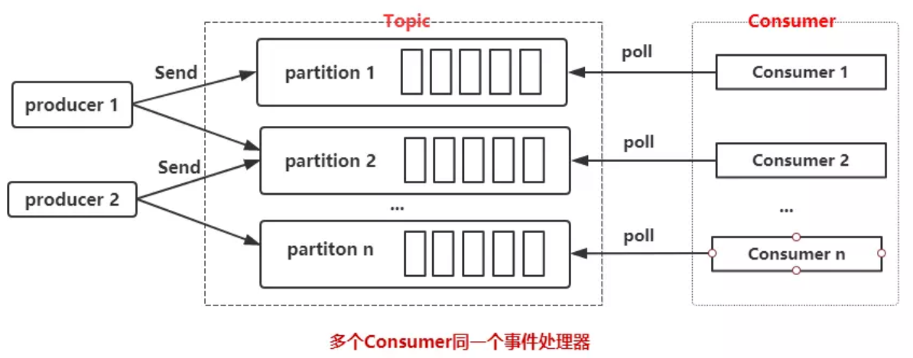
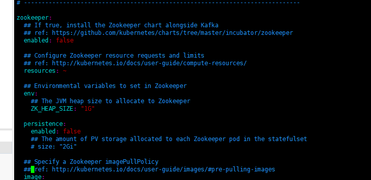

# Kafka概念简介

本文将介绍Kafka的相关概念，并在之后进行本地操作的实践和集群中的实践，并配上相关的操作。

## Kafka概念

Zookeeper: 主要用于调度Kafka，属于总控系统，consumers请求数据前会向Zookeeper进行请求。

Producer: 向系统提供新信息资源的角色

Brokers: 是存储信息的物理服务器，具有主从关系，高冗余

Topics: 逻辑概念，一个topic可以认为是一类消息，每个topic可以被划分成多个partition(区),每个partition在存储层面是append log文件。任何发布到此partition的消息都会被直接追加到log文件的尾部，每条消息在文件中的位置称为offset(偏移量)，offset为一个Long型数字，他是log中一条消息的唯一标识。kafka并没有提供其他额外的索引机制来存储offset,因为kafka的消息读写机制是顺序读写，保证kafka的吞吐率，几乎不允许（可以）对消息进行随机读取。即使消息被消费了，消息仍然不会被立即删除。日志文件将会根据broker中的配置要求，将message保留一段时间后再删除。比如将log文件保留2天，那么两天后，该文件将会被删除，无论其中的消息是否被消费。kafka通过这种简单的方式来释放磁盘空间。

另外，其引入了一个消费者组的概念，一个消费者组存在多个消费者。对于一个消费者组，一个消息只需要被组内其中任一消费者消费一次。而一个消息对于多个消费者组，是广播的，也就是所有订阅主题消费者组都必须收到这个消息一次。即存在一个基本的概念是组件广播，组内负载均衡。

## step 1 

该阶段主要是需要能够将一个信息写入到partition中这个时候首先是producer将信息发送到broker，broker这个时候需要给producer一个返回，但是这个返回的时机是有所讲究的，是关乎到一致性和可用性两者之间的一个取舍。

producer向leader发送数据时，可以通过request.required.acks参数设置数据可靠性的级别
1（默认）：这意味着producer在ISR中的leader已成功接收到数据。如果leader宕机了，则会丢失数据。
0：这意味着producer无需等待来自broker的确认而继续发送下一批消息。这种情况下数据传输效率最高，但是数据可靠性确实最低的。
all：producer需要等待ISR中所有follower都确认接收到数据后才算一次发送完成，可靠性最高。但是这样也不能保证数据不丢失，比如当ISR中只有Leader时（ISR中的成员由于某些情况会增加也会减少，最少就只剩下一个leader）。
注意这里的partition为了达到高容错，选择了对partition进行多备份和选举机制。
这里存在的疑问主要是，如果产生选举，则在原leader的信息是最新最全的，那么原master可能连任的概率很大，因此基本只会出现在leader崩了的情况下会存在相应的有意义的选举，或者就日常不进行选举。
Kafka的选举机制如下：

其次，关于写入到哪一个partition，这个地方有相应策略的选择。如果写入的message中的key不为空，则进行hash来堆放相应的partition，如果key为null，则直接进行round robin。

## step2

第二步主要是关于consumer接收的情况。
这里主要是强调，consumer接收的单位是以consumer group的概念进行接收。在zookeeper中只会说存储我们consumer group对每一个自己订阅的topic中的partition都进行了相应的指针记录。
而这些记录最终的使用者是consumer。

## step3

这里主要是强调step2中consume热group 接收数据之后，将是由具体的consumer进行工作，则实质上是一个consumer和多个partition之间存在relation，这样的关系是相对固定的。而另一方面，主要是当如果存在某个consumer崩溃，则consumer对应的partition将会被分配给其他的consumer。这个地方一共是两种模式进行工作。

第一种方式每个consumer都要维护一个独立的TCP连接，如果分区数和创建consumer线程的数量过多，会造成不小系统开销。但是如果处理消息足够快速，消费性能也会提升,如果慢的话就会导致消费性能降低。

第二种方式是采用一个consumer，多个消息处理线程来处理消息，其实在生产中，瓶颈一般是集中在消息处理上的(可能会插入数据到数据库，或者请求第三方API)，所以我们采用多个线程来处理这些消息。

我们的图中对应的是两者的混合体，我们今后将对着三种状态进行一个测试来看如何处理会达到比较好的性能。

我们考虑到在使用时，我们如果是一个http请求，则我们需要对用户返回response，这个时候我们会想，如何将handler的处理的结果“呈现”给用户呢？

我们思考如下的场景，我们使用支付宝给校园卡充值，或者使用交大V卡进行支付，我们会发现这个账单都会有一定的延迟。实质上，这个订单的创建是在支付宝确认支付或扫二维码的时候就已经创建了，但这个支付的message是进入到了消息队列中，其下游是学校校园卡充值的接口或者是微信的支付接口，充值接口和支付接口是不会返回任何业务逻辑相关的信息的，也没有办法进行返回。只能是对相应的数据库进行操作。

因此基本可以认为handler里面的操作是procedure，甚至MQ中处理的都不是主流业务，而是例如记录用户行为的相关操作，用于中后台显示分析的。

## Kafka的本地实践

### demo性质的实践

我们在本地windows环境下启动Kafka和Zookeeper

按照[官方](<https://kafka.apache.org/quickstart>)给出的教程跑是没有问题的，只要注意我们在windows下面需要的我们去使用bin/windows即可，其余的不需要太过担心。

### 利用spring boot调用Kafka

#### 主要考虑实现一个producer-consumer的模型

拿库写两个类就好，consumer这边当做一个小的server就好。

### kubernetes集群的部署与操作

考虑使用helm进行安装

发现原有的values.yaml里面存在着说是关闭了zookeeper的情况，我们可能需要进行相应的操作，并不清楚是否是准备直接和kafka进行直接交互还是说我们把zookeeper和kafka分离开来。

