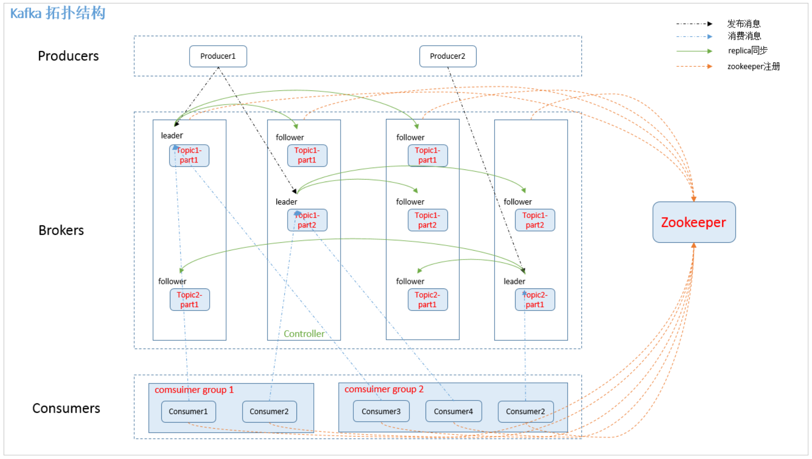

# Kafka概念简介

本文将介绍Kafka的相关概念，并在之后进行本地操作的实践和集群中的实践，并配上相关的操作。

## Kafka概念

Zookeeper: 主要用于调度Kafka，属于总控系统，consumers请求数据前会向Zookeeper进行请求。

Producer: 向系统提供新信息资源的角色

Brokers: 是存储信息的物理服务器，具有主从关系，高冗余

Topics: 逻辑概念，一个topic可以认为是一类消息，每个topic可以被划分成多个partition(区),每个partition在存储层面是append log文件。任何发布到此partition的消息都会被直接追加到log文件的尾部，每条消息在文件中的位置称为offset(偏移量)，offset为一个Long型数字，他是log中一条消息的唯一标识。kafka并没有提供其他额外的索引机制来存储offset,因为kafka的消息读写机制是顺序读写，保证kafka的吞吐率，几乎不允许（可以）对消息进行随机读取。即使消息被消费了，消息仍然不会被立即删除。日志文件将会根据broker中的配置要求，将message保留一段时间后再删除。比如将log文件保留2天，那么两天后，该文件将会被删除，无论其中的消息是否被消费。kafka通过这种简单的方式来释放磁盘空间。

## Kafka的本地实践

### demo性质的实践

我们在本地windows环境下启动Kafka和Zookeeper

按照[官方](<https://kafka.apache.org/quickstart>)给出的教程跑是没有问题的，只要注意我们在windows下面需要的我们去使用bin/windows即可，其余的不需要太过担心。

### 利用springboot调用Kafka

