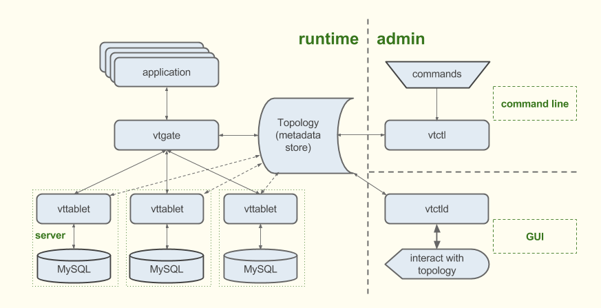

# Vitess学习、实践与测评

## Vitess的简介与使用理由

ref: <https://vitess.io/docs/overview/whatisvitess/>

Vitess提供一种部署、扩容和管理大型MySQL集群的解决方案

注意这里提到的是MySQL而不是其他数据库，例如PostgreSQL

我们可能会了解到，对数据库进行分片分库HA可能对于NoSQL而言，是一件比较容易的事情（e.g. MongoDB），但在关系型数据库上进行相应的操作不仅仅在实现上有一定的困难，并且会带来性能上的下降。

**为何不考虑NoSQL？**

1. NoSQL does not support transaction

   NoSQL不支持transaction在很多的领域可能相对没有那么的重要，但是在一些电商领域或一些相对严谨的领域，transaction是非常有必要的。

2.  NoSQL solutions provide limited support for database indexes compared to MySQL.

   NoSQL对于index的支持比较少，在这个方面上不如关系型数据库，对性能会有一定的影响。 

## Vitess相关名词简介



### Topology

一个数据仓库，主要是存放相关附加数据，有助于vtgate获取进行分析，和DBA获取相关信息进行分析。

### vtgate

一个轻量级的代理服务，主要是把相应的请求分发到正确的vttablet上去，他需要通过所有分片的相关信息进行分析，考虑相关vttablet的负载均衡，具体的实现我认可可假定为一个nginx

### vttablet

每一个MySQL都有一个vttablet作为代理服务。在这个层次上可以进行的操作是对数据库的保护（从连接数和单次连接两个角度），query rewriting（我个人对此的理解认为主要不是为了性能进行query rewriting，而是为了Vitess想实现的抽象而做出的相应更改），query de-duping( the same as cache)

### vtctl

a command line tool for Vitess

### vtctld

web GUI

### vtworker

是几个长期运行的进程，主要任务为：

1. 负责reshading，不论是在自动或者手动的情况下
2. 负责在已经垂直分表的情况下分配不同的join任务和split任务

整体上来讲，Vitess给MySQL多做了两个层次上的工作，这可能会造成一些性能上的损失，我们需要相应的尝试后才能最终得出结论。

## Vitess在Kubernetes集群上面的实践

我们没有在minikube进行体验式的实践，而是选择在使用kubeadm创建的kubernetes集群上面进行部署实践。

```bash

```

