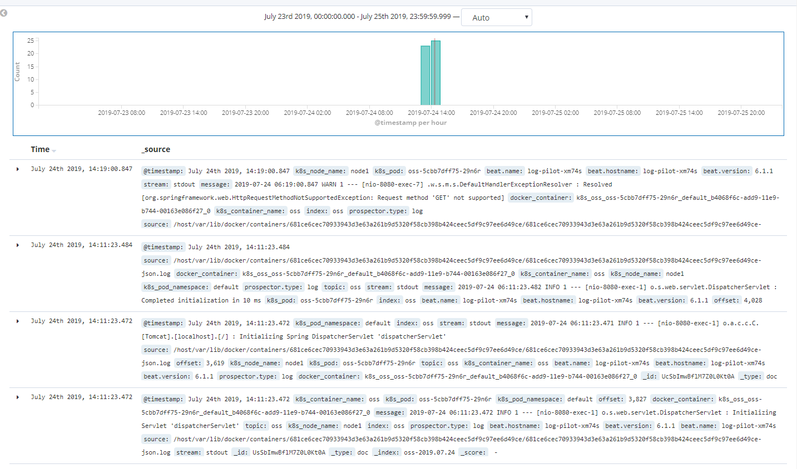

# Kubernetes Centralized Logging

借鉴于[阿里云](https://yq.aliyun.com/articles/674327)和[medium](https://medium.com/@maanadev/centralized-logging-in-kubernetes-d5a21ae10c6e)

我们在集群中之前会采集到集群平台层级上的logs，但对于我们整个项目而言，可能更加重要的是收集每一个pod的相关信息，以便于我们了解到Pod  restart或者rescheduled的原因，我们能够在统一的center进行查询和比对。

## 日志采集难点

### 容器角度

#### 采集目标多

容器一般推荐将日志直接输出在标准输出中，但是对于容器内部的文件日志采集，现在并没有太好的工具能够采集。

#### 弹性伸缩

弹性伸缩意味着采集工具必然是以sidecar的形式或是node+agent的形式存在在pod中，实时监控pod中的日志情况，并发送到logging center，事先配置好日志采集路径也将是一个比较艰巨的问题

### 采集工具缺陷

#### 缺乏动态配置的能力

目前的采集工具都需要我们事先手动配置好日志采集方式和路径等信息，由于它无法能够自动感知到容器的生命周期变化或者动态漂移，所以它无法动态地去配置。

#### 日志采集重复或丢失

现有的一些采集工具基本上是通过 tail 的方式来进行日志采集的，那么这里就可能存在两个方面的问题：一个是可能导致日志丢失，比如采集工具在重启的过程中，而应用依然在写日志，那么就有可能导致这个窗口期的日志丢失；而对于这种情况一般保守的做法就是，默认往前多采集 1M 日志或 2M 的日志，那么这就又会可能引起日志采集重复的问题。

#### 未明确标记日志源
一个应用可能有很多个容器，输出的应用日志也是一样的，那么当我们将所有应用日志收集到统一日志存储后端时，在搜索日志的时候，我们就无法明确这条日志具体是哪一个节点上的哪一个应用容器产生的。

## Log-Pilot & Logstash

我们将对着两者进行评测和原理上的简单对比

### Log-Pilot

#### 特性

1. 采集目标多：Log-Pilot 同时支持标准输出和容器内部文件日志采集。

2. 动态伸缩性：Log-Pilot 支持声明式的日志配置方式。

   主要是在于我们可以通过对Pod相应环境变量的设置，反应到logging过程中

3. 缺乏动态配置的能力：Log-Pilot 具有自动感知和发现的特性。

   事件监听 + 全量扫描，事件监听在前，因为对于一个Pod而言，存在一个窗口期，此时如果采用先全量扫描再进行事件监听，窗口期（全量扫描的过程中并且在注册事件监听之前），窗口期之间的事件就会丢失。

4. 日志采集重复和丢失：Log-Pilot 内部有 CheckPoint 和句柄保持的机制。

   Log-Pilot会维护一个offset来表明与log文件的映射关系，定期持久化到磁盘中。

   Log-Pilot 在监测到配置的日志路径目录下有新的日志文件产生时会主动地打开其句柄，并维持打开状态，这样是为了防止因日志采集工具比较慢或者应用日志输出速率特别大，比如说当前已经生成五个日志文件但只采集到第三个，后面两个还没有开始采集，一旦这个容器退出就可能导致后面两个文件的日志丢失了。

   因此 Log-Pilot 在监测到有新的日志产生的时候，会立即将其文件句柄打开，这样的话即使这个日志文件删除，它在磁盘中的数据并没有被擦除，只有当该日志文件采集完成后，我们才会主动去释放这个文件句柄，这样就可以保证日志文件里面的日志不会丢失。

5. 未明确标记日志源：Log-Pilot 支持日志自动数据打标。

   对于k8s，会按照：

   | 名称               | 来源                  |
   | ------------------ | --------------------- |
   | k8s_pod            | 容器所属pod的名称     |
   | k8s_pod_namespace  | 容器所在namespace名称 |
   | k8s_node_name      | 容器所在node名称      |
   | k8s_container_name | 自定义k8s容器名称     |

#### 实践

1. 建立elasticsearch的集群

   我们准备使用helm建立elastic集群，并且配置对应的kibana并对外网开放，建议直接使用dockerhub上面的官方镜像，其中自带x-pack，不需要单独安装。

2. 在node上建立log-pilot

   ```yaml
   apiVersion: extensions/v1beta1
   kind: DaemonSet
   metadata:
     name: log-pilot
     labels:
       app: log-pilot
     # 设置期望部署的namespace
     namespace: kube-system
   spec:
     updateStrategy:
       type: RollingUpdate
     template:
       metadata:
         labels:
           app: log-pilot
         annotations:
           scheduler.alpha.kubernetes.io/critical-pod: ''
       spec:
         # 是否允许部署到Master节点上
         tolerations:
         - key: node-role.kubernetes.io/master
           effect: NoSchedule
         containers:
         - name: log-pilot
           # 版本请参考https://github.com/AliyunContainerService/log-pilot/releases
           image: registry.cn-hangzhou.aliyuncs.com/acs/log-pilot:0.9.6-filebeat
           resources:
             limits:
               memory: 500Mi
             requests:
               cpu: 200m
               memory: 200Mi
           env:
             - name: "NODE_NAME"
               valueFrom:
                 fieldRef:
                   fieldPath: spec.nodeName
             - name: "LOGGING_OUTPUT"
               value: "elasticsearch"
             # 请确保集群到ES网络可达
             - name: "ELASTICSEARCH_HOSTS"
               value: "{es_endpoint}:{es_port}"
             # 配置ES访问权限
             - name: "ELASTICSEARCH_USER"
               value: "{es_username}"
             - name: "ELASTICSEARCH_PASSWORD"
               value: "{es_password}"
           volumeMounts:
           - name: sock
             mountPath: /var/run/docker.sock
           - name: root
             mountPath: /host
             readOnly: true
           - name: varlib
             mountPath: /var/lib/filebeat
           - name: varlog
             mountPath: /var/log/filebeat
           - name: localtime
             mountPath: /etc/localtime
             readOnly: true
           livenessProbe:
             failureThreshold: 3
             exec:
               command:
               - /pilot/healthz
             initialDelaySeconds: 10
             periodSeconds: 10
             successThreshold: 1
             timeoutSeconds: 2
           securityContext:
             capabilities:
               add:
               - SYS_ADMIN
         terminationGracePeriodSeconds: 30
         volumes:
         - name: sock
           hostPath:
             path: /var/run/docker.sock
         - name: root
           hostPath:
             path: /
         - name: varlib
           hostPath:
             path: /var/lib/filebeat
             type: DirectoryOrCreate
         - name: varlog
           hostPath:
             path: /var/log/filebeat
             type: DirectoryOrCreate
         - name: localtime
           hostPath:
             path: /etc/localtime
   ```

   参数说明：

   1. {es_endpoint}：ES集群的访问地址，若跟Kubernetes集群在同一个VPC下，则可直接使用私网地址；`请务必确保到ES集群网络可达`。
   2. {es_port}：ES集群的访问端口，一般是9200。
   3. {es_username}：访问ES集群的用户名。
   4. {es_password}：访问ES集群的用户密码。

3. 在deployment中使用

   ```yaml
   apiVersion: v1
   kind: Service
   metadata:
     name: oss
     labels:
       app: oss
   spec:
     ports:
     - port: 8080
       name: http
     selector:
       app: oss
   ---
   apiVersion: extensions/v1beta1
   kind: Deployment
   metadata:
     name: oss
     labels:
       app: oss
   spec:
     replicas: 1
     template:
       metadata:
         labels:
           app: oss
       spec:
         containers:
         - name: oss
           image: registry-vpc.cn-shanghai.aliyuncs.com/casecloud/oss:v1.5
           imagePullPolicy: Always
           env:
           - name: aliyun_logs_oss
             value: "stdout"
           livenessProbe:
             httpGet:
               path: /actuator/health
               port: 8080
             initialDelaySeconds: 60
             timeoutSeconds: 3
           resources:
                     requests:
               cpu: 0.5
               memory: 1024Mi
             limits:
               cpu: 1
               memory: 2048Mi
           ports:
           - containerPort: 8080
         imagePullSecrets:
         - name: regcred
   
   ```

   env的name遵循aliyun_logs_{name}最后name指index name in elasticsearch

   可能出现的情况是elasticsearch不允许生成index，注意去调试一下这个部分。

   该处我们只意在获取container stdout的log，可以存储相关的log文件夹下的log文件，支持通配符。

   最终的结果如下图所示：

   

### Logstash


**Logstash**作为Elasicsearch常用的实时数据采集引擎，可以采集来自不同数据源的数据，并对数据进行处理后输出到多种输出源，是Elastic Stack 的重要组成部分。


- **Inputs**：用于从数据源获取数据，常见的插件如file, syslog, redis, beats 等[[详细参考](https://www.elastic.co/guide/en/logstash/5.6/input-plugins.html)]  
- **Filters**：用于处理数据如格式转换，数据派生等，常见的插件如grok, mutate, drop,  clone, geoip等[[详细参考](https://www.elastic.co/guide/en/logstash/5.6/output-plugins.html)]  
- **Outputs**：用于数据输出，常见的插件如elastcisearch，file, graphite, statsd等[[详细参考](https://www.elastic.co/guide/en/logstash/5.6/filter-plugins.html)]  

