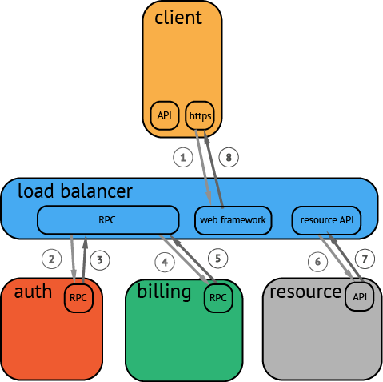

# 分布式追踪系统简介与JAEGER

### 分布式追踪系统简介

APM（Application Performance Management）系统致力于监控和管理应用软件性能和可用性。通过检测和诊断复杂应用程序的性能问题。来保证软件应用程序的良好运行与预期的服务。

 分布式追踪系统用于记录请求范围内的信息。例如，一次远程方法调用的执行过程和耗时。是我们排查系统问题和系统性能的利器。

 分布式追踪系统种类繁多，但是核心步骤有三个：**代码埋点**，**数据存储**和**查询展示**。

## OpenTracing

Span：基本可以理解为一个桩，或者一个node

Trace：由多个Span组成的有向无环图（DAG）

Span的结构：

```yaml
Span:
 - operation name: #操作名称
   start timestamp #起始时间
   finish timestamp #结束时间
   Span Tag:
   - key: value # 键必须为 string，值可以是字符串，布尔，或者数字类型
   Span Log:
   - key: value # 每次 log 操作包含一个键值对，以及一个时间戳。
   SpanContext: #Span 上下文对象
   References: #Span 之间的关系
   
   
```

每一个SpanContext包含以下状态：

- 任何一个OpenTracing的实现，都需要将当前调用链的状态（例如：trace和span的id），依赖一个独特的Span去跨进程边界传输
- **Baggage Items**，Trace的随行数据，是一个键值对集合，它存在于trace中，也需要跨进程边界传输

我们先看一个典型的分布式调用的例子：

下图是一个分布式调用的例子，客户端发起请求，请求首先到达负载均衡器，接着经过认证服务，计费服务，然后请求资源，最后返回结果。

最终能够呈现的形式为：


### Span之间的关系

Span与Span之间可以出现多重关系，但是只会有两种关系
**`ChildOf`**：在"ChildOf"引用关系下，父级span某种程度上取决于子span，即父Span最终的执行结果是依赖于我们的子Span的。
**`FollowsFrom`**：一些父级节点不以任何方式依赖他们子节点的执行结果，这种情况下，我们说这些子span和父span之间是"FollowsFrom"的因果关系。

更加详细的信息可以看[这里](https://github.com/opentracing-contrib/opentracing-specification-zh)


Jaeger Client： 为了不同语言实现了符合OpenTracing标准的SDK。应用程序通过API写入数据， client library把trace信息按照应用程序制定的采样策略传递给jaeger-agent。是程序员在写代码的时候需要调用打桩的。

Agent： 他是一个监听在UDP端口上接收span数据的网络守护进程，它会将数据批量发给collector。他被设计成一个基础组件，部署到所有的宿主机上。Agent将client library和collector解耦，为client library屏蔽了路由和发现collector的细节。相当于一个反向代理。

Collector：接收jaeger-agent发送来的数据，然后将数据写入后端存储。Collector被设计成无状态的组件，因此用户可以运行任意数量的Collector。一个jaeger的controller

Data Store：后端存储被设计成一个可插拔的组件，支持数据写入cassandra， elastic search。我们本次实践是写入elasticsearch。

Query：接收查询请求，然后从后端存储系统中检索tarce并通过UI进行展示。Query是无状态的，可以启动多个实例。把他们部署在nginx这样的负载均衡器后面。

## JAEGER SDK的使用——SpringBoot

SpringBoot可以通过简单的配置就拥有自动化的配置

```xml
<!--这是官网上给出的dependency -->
<dependency>
    <groupId>io.opentracing.contrib</groupId>
    <artifactId>opentracing-spring-web-autoconfigure</artifactId>
</dependency>
<!-- https://mvnrepository.com/artifact/com.uber.jaeger/jaeger-core -->
<dependency>
	<groupId>com.uber.jaeger</groupId>
	<artifactId>jaeger-core</artifactId>
	<version>0.23.0</version>
</dependency>
```

该项配置完成后只需要注入一个trace即可：

```java
@Bean // 很多配置文件里面没有写这个，没有写这个只能知道哪些被调用了，而不知道谁调用了谁，则形成不了我们的调用链。
public RestTemplate restTemplate(RestTemplateBuilder restTemplateBuilder)
{
	return restTemplateBuilder.build();
}

@Bean
public io.opentracing.Tracer jaegerTracer() {
    return new Configuration("spring-boot", new Configuration.SamplerConfiguration(ProbabilisticSampler.TYPE, 1),
        new Configuration.ReporterConfiguration(
            false,
			"192.168.99.100",// agent IP
			6831, // agent port
			1000,
			100
        ))
        .getTracer();
}
```

之后你可以在代码里面使用：

其实这个代码写起来像打桩一样，需要我们手动的作出一些操作才可以实现追踪。

## 实践

我们的实践是一步步推进的，显示使用官方的例子，再是使用我们本地的wordladder的例子进行实践，最后使用在阿里云上的服务进行实践

### 本地的初体验

我们首先在本地进行相应的测试，首先是使用我们的官方给出的例子进行实践，详情请点击[这里](https://github.com/jaegertracing/jaeger/tree/master/examples/hotrod)：

```bash
docker run \
  --rm \
  --name jaeger \
  -p6831:6831/udp \
  -p16686:16686 \
  jaegertracing/all-in-one:latest
  # 将监控的gui和我们监控的服务使用all-in-one搭建
docker run \
  --rm \
  --link jaeger \
  --env JAEGER_AGENT_HOST=jaeger \
  --env JAEGER_AGENT_PORT=6831 \
  -p8080-8083:8080-8083 \
  jaegertracing/example-hotrod:latest \
  all
  # 将我们的官方测试服务用docker跑起来
go get github.com/jaegertracing/jaeger
# 将服务的源码获取，以便于我们进行相应的对比和模仿
```


能够观察到结果，以及从我们docker run的情况来看，我们还是发请求发送到6831的agent上，这和我们之前的架构里面的是同一个理念

### 本地auth与wordladder的实践

该[视频](https://www.youtube.com/watch?v=RvCcWltMY7U)有着莫大的帮助，我们直接将两个服务启动，按照上述的配置进行操作，最终可以得到如下的结果


由上图可知，这个调用链的概念已经能够通过访问建立，上面的数字越大代表在该时间段内的通信次数。


上图为监控台，用于监察相应的服务。

### kubernetes + Istio上的实践

我们在使用**`kubespray`**搭建的阿里云集群上测试，我们在集群上仅部署了一个前端，但是我们还是发现有调用链的出现。


我们依靠的是Istio在其中的一个表现，Istio监管着整个网络中的流量，因此相当于Jeager的监控，实质上是在监控Istio自动注入的envoy和cidecar。