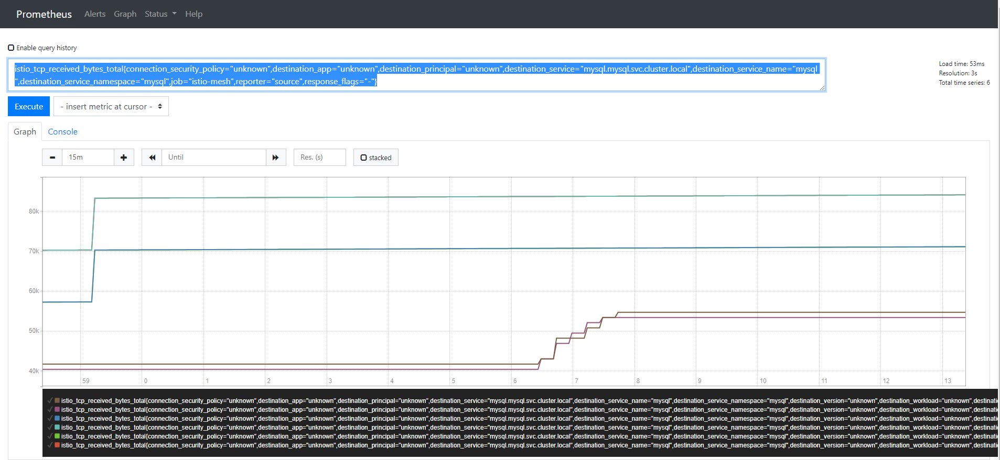
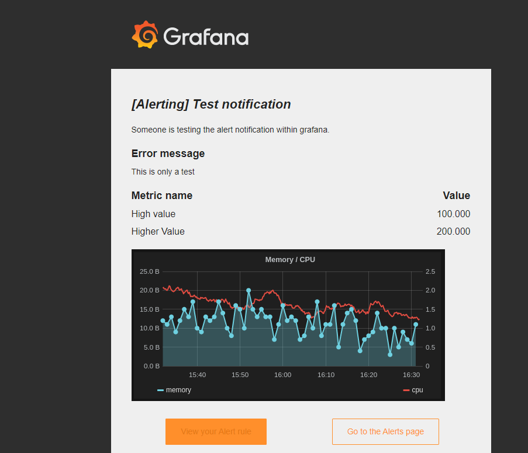
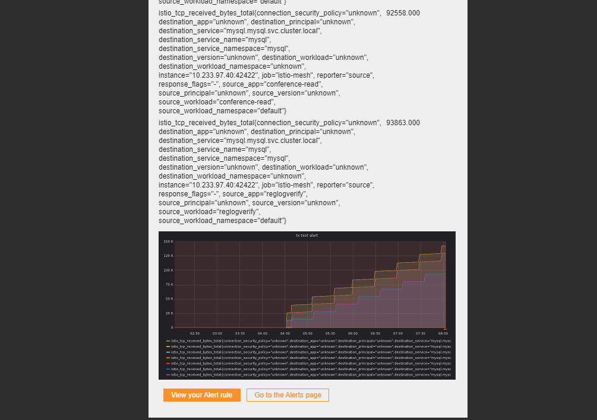

# 使用Istio 内置Promethues & Grafana进行集群监控

## Istio监控的原理与配置

Istio的监控主要是基于sidecar注入来进行，从这个角度来看，即sidecar能够直接监控到Pod层级的性能和流量，而不是通过Pod中的服务进行主动暴露和注册来进行资源的监控，只要是经过istio的流量或者被istio管控的Pod，都是有相应data source进入到Promethues和Grafana中的。

为了在集群中进行监控，Istio的配置文件中需要开启Promethues和Grafana

```yaml
#
# addon grafana configuration
#
grafana:
  enabled: true

#
# addon prometheus configuration
#
prometheus:
  enabled: true

```

### Promethues & Grafana

通过Promethues能够非常轻易的看到相关的统计数据



我们可以在Promethues中进行相应的调试之后，将最终的统计方式在Grafana中更好的展示，其语法是相通的。

grafana中首先要设置好相应smtp和server的url，这相对比较重要，由于在Istio的相关配置中未见到相应的暴露的方法来修改grafana的配置文件，因此我们决定自己打包一个image进行操作，主要是修改了配置文件：

```ini
#################################### Server ##############################
[server]
# Protocol (http, https, socket)
protocol = http

# The ip address to bind to, empty will bind to all interfaces
http_addr =

# The http port to use
http_port = 3000

# The public facing domain name used to access grafana from a browser
domain = grafana.casecloud.com.cn

# Redirect to correct domain if host header does not match domain
# Prevents DNS rebinding attacks
enforce_domain = false

# The full public facing url
root_url = http://grafana.casecloud.com.cn/

# Log web requests
router_logging = false

# the path relative working path
static_root_path = public

# enable gzip
enable_gzip = false

# https certs & key file
cert_file =
cert_key =

# Unix socket path
socket = /tmp/grafana.sock
#################################### SMTP / Emailing #####################
[smtp]
enabled = true
host = smtp.qq.com:465
user = 1115433638@qq.com
# If the password contains # or ; you have to wrap it with triple quotes. Ex """#password;"""
password = xginrskzcftjbaah
cert_file =
key_file =
skip_verify = false
from_address = 1115433638@qq.com
from_name = Grafana
ehlo_identity =
```

smtp部分主要是host、user、password、以及from_address需要进行相关的配置，server部分其实主要是root_url，这个部分事关在邮件中的相关按钮的url是否正确（否则会是localhost:3000），smtp的开启可以自行百度qq邮箱smtp

之后在Grafana的页面中进行Alert的channel配置并且sent for notification，在邮箱中会收到如下的邮件。



Alert可以认为是基于一个view的，我们可以新建一个view，之后在里面使用Promethues的语法进行统计， 并组织撰写相应的Rule，最后等待相应的邮件即可：



简单流程测试如上