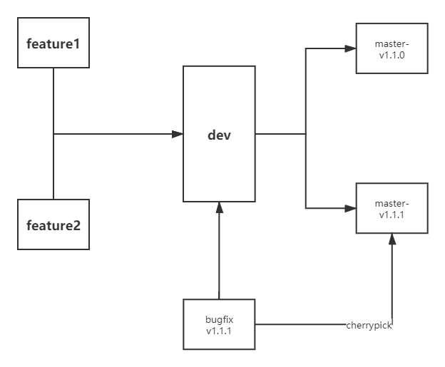

# casecloud backend demo

一个springboot的底板，针对之前的一些情况有了如下的修改：

1. 因为彻底的分库分表，且完全使用mongodb，则不需要使用submodule
2. 为方便测试，在drone的流程中加入一个mongodb service作为辅助
3. 由于现在所有的服务都不涉及鉴权（除去auth本来就有登录逻辑），则不需要在测试时进行JWT的生成，则也不提供jwt的相关内容

相关后端的标准

1. controller中进入相关内容必须使用DTO，service看不见具体的数据库模型，只能看见相关DTO，即出DAO就只能是DTO。进来的数据最好是以Request结尾，return的数据最好是以Response结尾
2. 关于版本号，格式为<主版本号>.<子版本号>.<阶段版本号>，如果是bug fix，建议只增加阶段版本号，并在阶段版本号简单两个词描述一下相关问题，如果设计到接口的增加，使用子版本号，如果涉及到接口除去增加的其他修改，请使用主版本号。版本号的修改都是单独在master进行修改，PR不会触发master的相关CI操作。
3. 有关于git workflow，以下图为基准，dev分支仍旧只有一个，master分支的命名方式为master-v{}.{}.{}，具体的工作分支按照jira的相关要求进行命名（似乎是CAS-describe），善用cherry pick

1. utils里面放相关工具类，以及枚举类，比如用户类型
2. Controller prefix与controller的名称相同，小写，最好不要带下划线，不要prefix /api
3. Exception统一使用ExceptionHnadlers进行统一的处理，具体的类包具体处理。
4. 路由一律使用小驼峰，自行思考使用slash的情况，id不隐藏在内容中，出现在路由中。
5. 正确使用REST FUL API，每次加接口都要检查
6. 坚持使用HTTPStatus，不要用数字，不要把状态码写在ResponseBody里面。