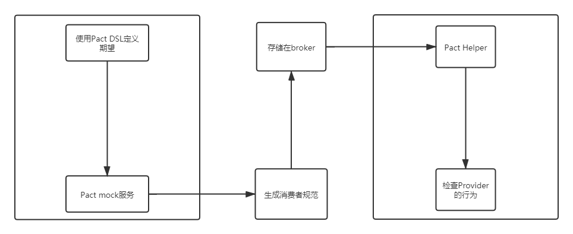

# pact理念和实践

pact这个测试框架最开始看见是在《微服务设计》中见到CDC(Consumer-Driven Contract)，确保部署新的服务到生产环境后，变更不会破坏新服务的消费者。我们希望能够在进入生产环境之前，就能发现到破坏性变化。因此，CDC应该是配合限界上下文中的比较合适的一种测试方式。

我们能够利用一份合约来约束一对consumer和provider。具体使用的框架就是Pact。

Pact给项目带来的好处有如下几点：

1. 提供简单快速使用的mock server
2. 促进consumer和provider的程序员进行交流，并且迅速的反馈（如果是一个第三方的接口，CDC基本是不适用的）
3. 接口规范化

