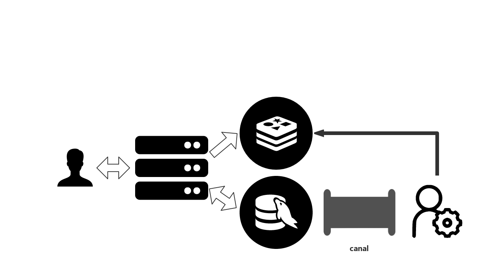

# Redis in Kubernetes

本文档的主要撰写目的是为完成SE419课程最终project，提供相应的redis集群的支持，在学习中进行记录。主要包含如何在kubernetes集群中快速高效的启动和管理redis，并进行redis持久化的相关学习。
## redis memory & disk
我们使用redis的一个重要的原因，就是在于redis作为在内存中使用的数据库，读写的性能都会非常好，但是这对于memory的要求是非常高的，因此，我们在集群中所要能提供的内存资源要丰富。
另外一点是在于memory和disk之间的trade off。内存虽然读写非常的块，但是我们没有办法同时在内存中存放如此大的一张表，我们总有一些数据是需要存入到硬盘中去的。
因此这里会提到相应的redis的汰换策略，但是我发现这些汰换策略都不是从没存汰换到文件，而是直接进行删除。

内存汰换策略

> 1.noeviction ：默认淘汰策略，不淘汰，如果内存已满，添加数据是报错。//eviction逐出
>
> 2.allkeys-lru:在所有键中，选取最近最少使用的数据抛弃。
>
> 3.volatile-lru:在设置了过期时间的所有键中，选取最近最少使用的数据抛弃。//Least Recently Used
>
> 4.allkeys-random: 在所有键中，随机抛弃。
>
> 5.volatile-random: 在设置了过期时间的所有键，随机抛弃。//volatile不稳定，易变的
>
> 6.volatile-ttl:在设置了过期时间的所有键，抛弃存活时间最短的数据。//time  to live 生存时间

持久化策略

> RDB快照，是一次全量备份，快照是内存数据的二进制序列化形式，存储上非常紧凑；
>
> 2. AOF日志，是连续的增量备份，AOF日志记录的是内存数据修改的指令记录文本，当数据库重启时要加载AOF日志进行指令重放，所以需要定期进行AOF重写，对日志进行瘦身。

与此同时，我们也考察了相关的vm机制，似乎是与我们的愿景非常相似，就是在内存不够的情况下使用disk作为虚拟内存，和linux的虚拟内存的机制非常相似。

我们最终的考虑为，建立redis cluster，通过redis自带的redis cluster进行sharding，最终能够解决redis的性能被限制在单机的memory大小上这一问题，同时，redis cluster采用了一致性hash的进一步优化的算法——虚拟槽分区。


我们会使用helm进行相应的部署。

## Deployment

k3s helmchart

```yaml
apiVersion: helm.cattle.io/v1
kind: HelmChart
metadata:
  name: redis-cluster
  namespace: redis-cluster
spec:
  chart: redis-cluster
  repo: https://inspur-iop.github.io/charts
  targetNamespace: redis-cluster
  set:
    persistentVolume.storageClass: "local-path"
```

最终在集群上首先成功的部署了redis cluster

```bash
redis-cluster   helm-install-redis-cluster-x75hz          1/1     Running     0          70s
redis-cluster   redis-cluster-post-install-mh549          1/1     Running     0          46s
redis-cluster   redis-cluster-shard2-0                    1/1     Running     0          47s
redis-cluster   redis-cluster-shard1-0                    1/1     Running     0          46s
redis-cluster   redis-cluster-shard0-0                    1/1     Running     0          46s
redis-cluster   redis-cluster-shard2-1                    1/1     Running     0          24s
redis-cluster   redis-cluster-shard1-1                    1/1     Running     0          23s
redis-cluster   redis-cluster-shard0-1                    1/1     Running     0          22s
redis-cluster   redis-cluster-post-install-mh549          0/1     Completed   0          51s
redis-cluster   redis-cluster-post-install-mh549          0/1     Terminating   0          51s
redis-cluster   redis-cluster-post-install-mh549          0/1     Terminating   0          51s
redis-cluster   helm-install-redis-cluster-x75hz          0/1     Completed     0          75s

```

## redis-cluster & mysql consistency

我们在此主要探讨redis cluster作为cache如何与mysql进行同步这样的一个问题，在我们的workload中，业务逻辑涉及的主要为create & read，不涉及update & delete。
较多教程中提到的更新cache主要是依靠我们的业务逻辑backend，这样会给该backend带来不属于业务逻辑的额外负担，并且需要处理一些并发race的情况，比如两个thread都读取到了mysql的数据，他们都想要去更新redis的cache，则必有一个会失败，消耗时间且达不到效果。
因此我们希望出现一个mysql的下游内容，其主要的工作就是进行mysql更新数据的提取和加工。加工对于我们而言就是写入到redis cluster中。
我们目前选择的是alibaba的开源项目[canal](https://github.com/alibaba/canal)



canal server将自己伪装成为mysql中一个slave，从binlog中获取到相应的数据，而后自定义化的canal client会进行加工和处理，当然其下游也可以是一个MQ(kafaka, rabbitMQ, etc.)。我们简易化的处理就直接写client即可。

后来我们发现这样结构对于淘汰机制是相当不友好的，我们考虑如下情况：

当我么你的redis内存使用耗尽时，redis针对其汰换机制，进行相应的操作：

1. insert abort，则会出现cache 无法进入到redis中，且因此该cache如若不更新，则不会再出现在canal中，从而不可能进入到cache中，也考虑到是否要放入到kafka中，发现redis abort，使用一些hard code让该消息重新回到消息队列中，但是这样也会导致消息队列中一个可能会abort的消息一直存在，相当的浪费资源。
2. LRU汰换，不会出现异常，但是如果出现该情况，则汰换过的相应entry在不会发生mysql update的时候是不会进入到cache中，比如在我们短链接的业务逻辑中，暂时就不存在更新的情况，则对于该条url的读取，就只能是从mysql里面读出数据。

另外，如此进行cache的更新，实质上只能完成cache的初始化。我们确实能够保证大部分的数据都被cache，但是一旦出现汰换的情况，我们没有办法做动态的调整。

### 有关于redis-cluster auto resharding的问题

By default this chart install 3 shards and one replica for each shard:

- In this chart, one statefulset means one shard (include master and replicas), the statefulset would be dynamic created when shard number changes.
- The shard number must be equal or greater than 3, or the cluter will create failed.
- By now, the chart support scale-out (add shards), but the data in cluster won't resharding automatically. You must reshard the data manually.
- If you want to scale-in the cluster, you must reshard the data and remove the node from cluster carefully first, then run `helm upgrade` command to decrease the shard number.

对于我们的使用场景，他存在如下的问题：

1. scale-out存在需要使用到helm进行相应的扩容，换种说法，我们无法在kubernetes层面上来进行相应scale-out的操作，或者这是一个需要手动触发的工作，能够与想到的一个解决方案是写一个operator部署在集群内，operator来代替helm进行相关StatefulSet的的部署和修改，同时该operator进行相关的redis数据的监控，从而redis在集群内能够自成一体。
2. 在scale-out的情况下，我们需要手动的使用redis-cluster 的相关cli去进行虚拟槽的resharding，这确实已经比直接对数据进行操作好了很多，但是仍旧需要进行一个手动的操作，应该是触发产生一个job，这个也应该是有一个operator进行操作。

下面我们简单的记录下现在的情况下，进行redis-cluster resharding的基本操作，我们这里使用的主要是redis-cli，将其作为一个job存在于kubernetes中。

在rebalance完成之后，我们会看到redis-cluster的状态如下。

```bash
ubuntu@cy-kubespray-1:~/redis-cluster$ kubectl logs -n redis-cluster redis-rebalance-k455j -c fix
10.43.155.10:6379 (da9c55b0...) -> 1 keys | 4096 slots | 1 slaves.
10.43.107.6:6379 (ad69d7e9...) -> 0 keys | 4096 slots | 1 slaves.
10.43.230.209:6379 (e944def1...) -> 0 keys | 4096 slots | 1 slaves.
10.43.83.90:6379 (d7d7e61f...) -> 0 keys | 4096 slots | 1 slaves.
[OK] 1 keys in 4 masters.
0.00 keys per slot on average.
>>> Performing Cluster Check (using node redis-cluster.redis-cluster:6379)
S: c853d6aa831aee8cf19196006e7c938dcbeaa20c redis-cluster.redis-cluster:6379
   slots: (0 slots) slave
   replicates d7d7e61f847cce799248f0cfe0f672990ffb4a41
M: da9c55b0ae43ef8fcc22bdcdb6b25ad2d312dffa 10.43.155.10:6379
   slots:[0-1364],[5461-6826],[10923-12287] (4096 slots) master
   1 additional replica(s)
M: ad69d7e978a51f08cb1a3f7c3fd2991e23e72496 10.43.107.6:6379
   slots:[12288-16383] (4096 slots) master
   1 additional replica(s)
M: e944def1c2a007a4b5b5906f80477c332ddd08d3 10.43.230.209:6379
   slots:[6827-10922] (4096 slots) master
   1 additional replica(s)
S: 7abc48bc707422a5c7dc04f1ca7cee7addbf9d86 10.43.118.151:6379
   slots: (0 slots) slave
   replicates e944def1c2a007a4b5b5906f80477c332ddd08d3
M: d7d7e61f847cce799248f0cfe0f672990ffb4a41 10.43.83.90:6379
   slots:[1365-5460] (4096 slots) master
   1 additional replica(s)
S: 18b65d4ac15a045ac0a2112eb9c821e675121bea 10.43.147.235:6379
   slots: (0 slots) slave
   replicates da9c55b0ae43ef8fcc22bdcdb6b25ad2d312dffa
S: 0d4c8d9f4c32a001d22c90c4beae30c9237f2c0d 10.43.203.163:6379
   slots: (0 slots) slave
   replicates ad69d7e978a51f08cb1a3f7c3fd2991e23e72496
[OK] All nodes agree about slots configuration.
>>> Check for open slots...
>>> Check slots coverage...
[OK] All 16384 slots covered.
ubuntu@cy-kubespray-1:~/redis-cluster$ kubectl logs -n redis-cluster redis-rebalance-k455j -c rebalance
>>> Performing Cluster Check (using node redis-cluster.redis-cluster:6379)
[OK] All nodes agree about slots configuration.
>>> Check for open slots...
>>> Check slots coverage...
[OK] All 16384 slots covered.
*** No rebalancing needed! All nodes are within the 2.00% threshold.
```

我们会发现每一个master上都有了相应的负载，我们想要达到的目的达成。

有关redis cluster的几种架构，可见[这里](https://blog.csdn.net/gu_wen_jie/article/details/91873889)