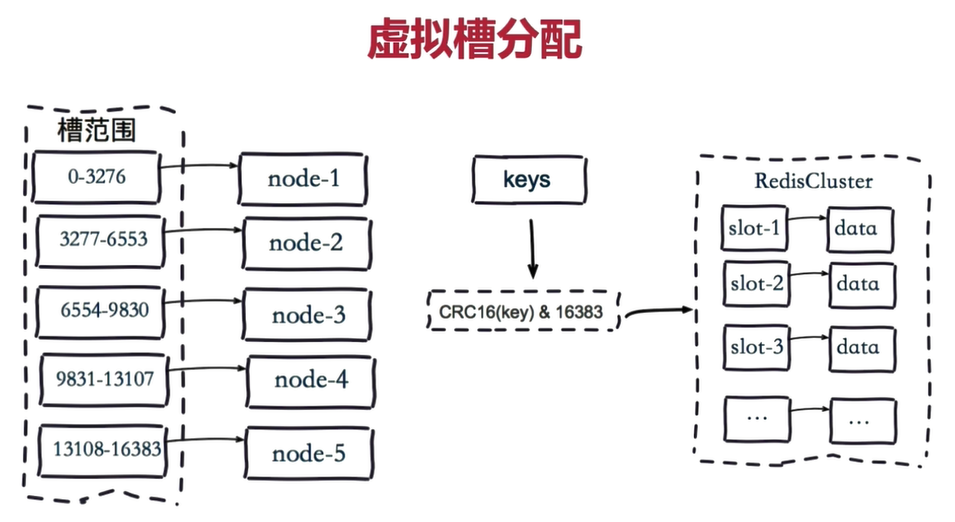

# Redis in Kubernetes

本文档的主要撰写目的是为完成SE419课程最终project，提供相应的redis集群的支持，在学习中进行记录。主要包含如何在kubernetes集群中快速高效的启动和管理redis，并进行redis持久化的相关学习。
## redis memory & disk
我们使用redis的一个重要的原因，就是在于redis作为在内存中使用的数据库，读写的性能都会非常好，但是这对于memory的要求是非常高的，因此，我们在集群中所要能提供的内存资源要丰富。
另外一点是在于memory和disk之间的trade off。内存虽然读写非常的块，但是我们没有办法同时在内存中存放如此大的一张表，我们总有一些数据是需要存入到硬盘中去的。
因此这里会提到相应的redis的汰换策略，但是我发现这些汰换策略都不是从没存汰换到文件，而是直接进行删除。

内存汰换策略

> 1.noeviction ：默认淘汰策略，不淘汰，如果内存已满，添加数据是报错。//eviction逐出
>
> 2.allkeys-lru:在所有键中，选取最近最少使用的数据抛弃。
>
> 3.volatile-lru:在设置了过期时间的所有键中，选取最近最少使用的数据抛弃。//Least Recently Used
>
> 4.allkeys-random: 在所有键中，随机抛弃。
>
> 5.volatile-random: 在设置了过期时间的所有键，随机抛弃。//volatile不稳定，易变的
>
> 6.volatile-ttl:在设置了过期时间的所有键，抛弃存活时间最短的数据。//time  to live 生存时间

持久化策略

> RDB快照，是一次全量备份，快照是内存数据的二进制序列化形式，存储上非常紧凑；
>
> 2. AOF日志，是连续的增量备份，AOF日志记录的是内存数据修改的指令记录文本，当数据库重启时要加载AOF日志进行指令重放，所以需要定期进行AOF重写，对日志进行瘦身。

与此同时，我们也考察了相关的vm机制，似乎是与我们的愿景非常相似，就是在内存不够的情况下使用disk作为虚拟内存，和linux的虚拟内存的机制非常相似。

我们最终的考虑为，建立redis cluster，通过redis自带的redis cluster进行sharding，最终能够解决redis的性能被限制在单机的memory大小上这一问题，同时，redis cluster采用了一致性hash的进一步优化的算法——虚拟槽分区。



我们会使用helm进行相应的部署。

## Deployment

k3s helmchart

```yaml
apiVersion: helm.cattle.io/v1
kind: HelmChart
metadata:
  name: redis-cluster
  namespace: redis-cluster
spec:
  chart: redis-cluster
  repo: https://inspur-iop.github.io/charts
  targetNamespace: redis-cluster
  set:
    persistentVolume.storageClass: "local-path"
```

最终在集群上首先成功的部署了redis cluster

```bash
redis-cluster   helm-install-redis-cluster-x75hz          1/1     Running     0          70s
redis-cluster   redis-cluster-post-install-mh549          1/1     Running     0          46s
redis-cluster   redis-cluster-shard2-0                    1/1     Running     0          47s
redis-cluster   redis-cluster-shard1-0                    1/1     Running     0          46s
redis-cluster   redis-cluster-shard0-0                    1/1     Running     0          46s
redis-cluster   redis-cluster-shard2-1                    1/1     Running     0          24s
redis-cluster   redis-cluster-shard1-1                    1/1     Running     0          23s
redis-cluster   redis-cluster-shard0-1                    1/1     Running     0          22s
redis-cluster   redis-cluster-post-install-mh549          0/1     Completed   0          51s
redis-cluster   redis-cluster-post-install-mh549          0/1     Terminating   0          51s
redis-cluster   redis-cluster-post-install-mh549          0/1     Terminating   0          51s
redis-cluster   helm-install-redis-cluster-x75hz          0/1     Completed     0          75s

```

