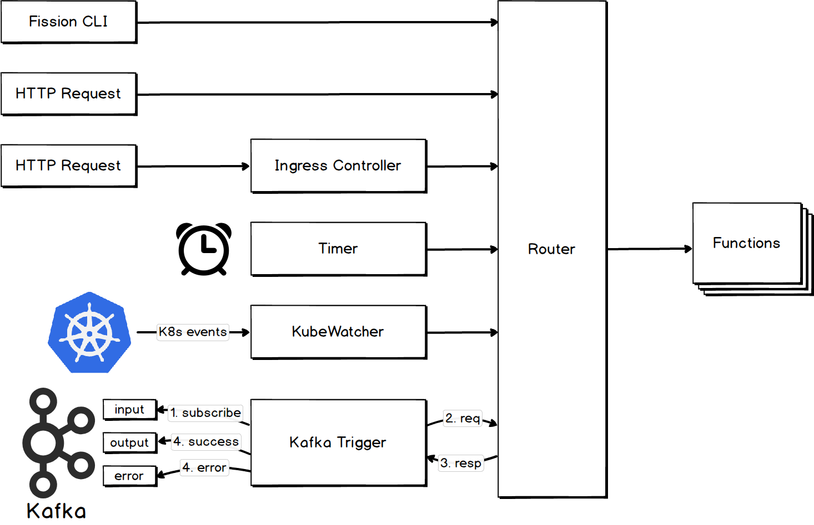

# Fission Deep Dive

本文主要是围绕Fission如何在k8s之上实现其“承诺的”业务水平，主要从按照其模块进行进一步的探索，与相对的操作的现象进行对比。

本文主要的内容以[该篇文章](https://www.alibabacloud.com/blog/fission-a-deep-dive-into-serverless-kubernetes-frameworks-2_594902)为纲，结合一些自己的fission实践进行相应的补充和源码的理解。

## 关于Fission的权限

Fission初始化之后会创建如下权限相关的角色

fission-admin(RoleBinding):

```yaml
Name:         fission-admin
Labels:       <none>
Annotations:  kubectl.kubernetes.io/last-applied-configuration:
                {"apiVersion":"rbac.authorization.k8s.io/v1","kind":"RoleBinding","metadata":{"annotations":{},"name":"fission-admin","namespace":"default...
Role:
  Kind:  ClusterRole
  Name:  admin
Subjects:
  Kind            Name         Namespace
  ----            ----         ---------
  ServiceAccount  fission-svc  default
```

fission-svc(ServiceAccount):

```yaml
Name:                fission-svc
Namespace:           default
Labels:              <none>
Annotations:         kubectl.kubernetes.io/last-applied-configuration:
                       {"apiVersion":"v1","kind":"ServiceAccount","metadata":{"annotations":{},"name":"fission-svc","namespace":"default"}}
Image pull secrets:  <none>
Mountable secrets:   fission-svc-token-vbbt9
Tokens:              fission-svc-token-vbbt9
Events:              <none>
```

admin(ClusterRole)

```
Name:         admin
Labels:       kubernetes.io/bootstrapping=rbac-defaults
Annotations:  rbac.authorization.kubernetes.io/autoupdate: true
PolicyRule:
  Resources                                       Non-Resource URLs  Resource Names  Verbs
  ---------                                       -----------------  --------------  -----
  rolebindings.rbac.authorization.k8s.io          []                 []              [create delete deletecollection get list patch update watch]
  roles.rbac.authorization.k8s.io                 []                 []              [create delete deletecollection get list patch update watch]
  configmaps                                      []                 []              [create delete deletecollection patch update get list watch]
  endpoints                                       []                 []              [create delete deletecollection patch update get list watch]
  persistentvolumeclaims                          []                 []              [create delete deletecollection patch update get list watch]
  pods                                            []                 []              [create delete deletecollection patch update get list watch]
  replicationcontrollers/scale                    []                 []              [create delete deletecollection patch update get list watch]
  replicationcontrollers                          []                 []              [create delete deletecollection patch update get list watch]
  services                                        []                 []              [create delete deletecollection patch update get list watch]
  daemonsets.apps                                 []                 []              [create delete deletecollection patch update get list watch]
  deployments.apps/scale                          []                 []              [create delete deletecollection patch update get list watch]
  deployments.apps                                []                 []              [create delete deletecollection patch update get list watch]
  replicasets.apps/scale                          []                 []              [create delete deletecollection patch update get list watch]
  replicasets.apps                                []                 []              [create delete deletecollection patch update get list watch]
  statefulsets.apps/scale                         []                 []              [create delete deletecollection patch update get list watch]
  statefulsets.apps                               []                 []              [create delete deletecollection patch update get list watch]
  horizontalpodautoscalers.autoscaling            []                 []              [create delete deletecollection patch update get list watch]
  cronjobs.batch                                  []                 []              [create delete deletecollection patch update get list watch]
  jobs.batch                                      []                 []              [create delete deletecollection patch update get list watch]
  daemonsets.extensions                           []                 []              [create delete deletecollection patch update get list watch]
  deployments.extensions/scale                    []                 []              [create delete deletecollection patch update get list watch]
  deployments.extensions                          []                 []              [create delete deletecollection patch update get list watch]
  ingresses.extensions                            []                 []              [create delete deletecollection patch update get list watch]
  networkpolicies.extensions                      []                 []              [create delete deletecollection patch update get list watch]
  replicasets.extensions/scale                    []                 []              [create delete deletecollection patch update get list watch]
  replicasets.extensions                          []                 []              [create delete deletecollection patch update get list watch]
  replicationcontrollers.extensions/scale         []                 []              [create delete deletecollection patch update get list watch]
  ingresses.networking.k8s.io                     []                 []              [create delete deletecollection patch update get list watch]
  networkpolicies.networking.k8s.io               []                 []              [create delete deletecollection patch update get list watch]
  poddisruptionbudgets.policy                     []                 []              [create delete deletecollection patch update get list watch]
  deployments.apps/rollback                       []                 []              [create delete deletecollection patch update]
  deployments.extensions/rollback                 []                 []              [create delete deletecollection patch update]
  localsubjectaccessreviews.authorization.k8s.io  []                 []              [create]
  pods/attach                                     []                 []              [get list watch create delete deletecollection patch update]
  pods/exec                                       []                 []              [get list watch create delete deletecollection patch update]
  pods/portforward                                []                 []              [get list watch create delete deletecollection patch update]
  pods/proxy                                      []                 []              [get list watch create delete deletecollection patch update]
  secrets                                         []                 []              [get list watch create delete deletecollection patch update]
  services/proxy                                  []                 []              [get list watch create delete deletecollection patch update]
  bindings                                        []                 []              [get list watch]
  events                                          []                 []              [get list watch]
  limitranges                                     []                 []              [get list watch]
  namespaces/status                               []                 []              [get list watch]
  namespaces                                      []                 []              [get list watch]
  pods/log                                        []                 []              [get list watch]
  pods/status                                     []                 []              [get list watch]
  replicationcontrollers/status                   []                 []              [get list watch]
  resourcequotas/status                           []                 []              [get list watch]
  resourcequotas                                  []                 []              [get list watch]
  controllerrevisions.apps                        []                 []              [get list watch]
  nodes.metrics.k8s.io                            []                 []              [get list watch]
  pods.metrics.k8s.io                             []                 []              [get list watch]
  serviceaccounts                                 []                 []              [impersonate create delete deletecollection patch update get list watch]
```

fission 对应的所有的deployment都是使用fission-svc。

## Executor

### Pool Manager

主要围绕其中比较重要的几点进行探索，如何创建一个pool，如何选择一个GenericPod和如何特化一个Generic Pod以及如何处理一个特化后无用的Generic Pod。

#### Pool Creator

```go
func (gpm *GenericPoolManager) eagerPoolCreator() {
	pollSleep := time.Duration(2 * time.Second)
	for {
		// get list of envs from controller
		envs, err := gpm.fissionClient.Environments(metav1.NamespaceAll).List(metav1.ListOptions{})
		if err != nil {
			if fission.IsNetworkError(err) {
				log.Printf("Encountered network error, retrying: %v", err)
				time.Sleep(5 * time.Second)
				continue
			}
			log.Fatalf("Failed to get environment list: %v", err)
		}

		// Create pools for all envs.  TODO: we should make this a bit less eager, only
		// creating pools for envs that are actually used by functions.  Also we might want
		// to keep these eagerly created pools smaller than the ones created when there are
		// actual function calls.
		for i := range envs.Items {
			env := envs.Items[i]
			// Create pool only if poolsize greater than zero
			if gpm.getEnvPoolsize(&env) > 0 {
				_, err := gpm.GetPool(&envs.Items[i])
				if err != nil {
					log.Printf("eager-create pool failed: %v", err)
				}
			}
		}

		// Clean up pools whose env was deleted
		gpm.CleanupPools(envs.Items)
		time.Sleep(pollSleep)
	}
}

// service
case GET_POOL:
			// just because they are missing in the cache, we end up creating another duplicate pool.
			var err error
			pool, ok := gpm.pools[crd.CacheKey(&req.env.Metadata)]
			if !ok {
				poolsize := gpm.getEnvPoolsize(req.env)
				switch req.env.Spec.AllowedFunctionsPerContainer {
				case fission.AllowedFunctionsPerContainerInfinite:
					poolsize = 1
				}

				// To support backward compatibility, if envs are created in default ns, we go ahead
				// and create pools in fission-function ns as earlier.
				ns := gpm.namespace
				if req.env.Metadata.Namespace != metav1.NamespaceDefault {
					ns = req.env.Metadata.Namespace
				}

				pool, err = MakeGenericPool(
					gpm.fissionClient, gpm.kubernetesClient, req.env, poolsize,
					ns, gpm.namespace, gpm.fsCache, gpm.instanceId, gpm.enableIstio)
				if err != nil {
					req.responseChannel <- &response{error: err}
					continue
				}
				gpm.pools[crd.CacheKey(&req.env.Metadata)] = pool
			}
			req.responseChannel <- &response{pool: pool}
```

该函数本身会作为一个routine存在，首先拿到所有的env的列表，之后遍历所有的env，去向service（主routine）查找相关的pool列表，service中存在cache，如果cache没法读到，会去向k8s api server询问，直接创建相关个数的Pod，Pool的本质就是一个Deployment，我们代码中在`MakeGenericPool`函数中调用`createPool`，里面的主要任务就是创建一个Deployment

#### Generic Pod Create

> K8s automatically creates a new pod after it detects that the actual number of pods managed by the deployment object is smaller than the number of target replicas.

这一条的具体体现如下：


新产生的Pod是我们pool里面的pod，上面的Pod是已经特化过的Pod，已经不受Deployment的管辖。

关于Pod的选择，首先通过label找到所有的Pod，之后进行筛选Ready的Pod如果没有，则进行等待，即调用`waitForReadyPod`——主要负责去deployment里面寻找到available，如果没有就继续等待。这个地方的实现存在两重超时，一种是`waitForReayPod`内部的超时处理，一种是`_choosePod`层级的超时处理。我们在此是会想如果有两个人同时调用`_choosePod`会出现race的情况，但是其上游的调用只会是在管道信号传递过来是管道化的。在readyPods里面随机选择一个Pod，之后对该Pod进行relabel。

```go
// choosePod picks a ready pod from the pool and relabels it, waiting if necessary.
// returns the pod API object.
func (gp *GenericPool) choosePod(newLabels map[string]string) (*apiv1.Pod, error) {
	req := &choosePodRequest{
		newLabels:       newLabels,
		responseChannel: make(chan *choosePodResponse),
	}
	gp.requestChannel <- req
	resp := <-req.responseChannel
	return resp.pod, resp.error
}


func (gp *GenericPool) _choosePod(newLabels map[string]string) (*apiv1.Pod, error) {
	startTime := time.Now()
	for {
		// Retries took too long, error out.
		if time.Since(startTime) > gp.podReadyTimeout {
			log.Printf("[%v] Erroring out, timed out", newLabels)
			return nil, errors.New("timeout: waited too long to get a ready pod")
		}

		// Get pods; filter the ones that are ready
		podList, err := gp.kubernetesClient.CoreV1().Pods(gp.namespace).List(
			metav1.ListOptions{
				LabelSelector: labels.Set(
					gp.deployment.Spec.Selector.MatchLabels).AsSelector().String(),
			})
		if err != nil {
			return nil, err
		}
		readyPods := make([]*apiv1.Pod, 0, len(podList.Items))
		for i := range podList.Items {
			pod := podList.Items[i]

			// Ignore not ready pod here
			if !fission.IsReadyPod(&pod) {
				continue
			}

			// add it to the list of ready pods
			readyPods = append(readyPods, &pod)
		}
		log.Printf("[%v] found %v ready pods of %v total", newLabels, len(readyPods), len(podList.Items))

		// If there are no ready pods, wait and retry.
		if len(readyPods) == 0 {
			err = gp.waitForReadyPod()
			if err != nil {
				return nil, err
			}
			continue
		}

		// Pick a ready pod.  For now just choose randomly;
		// ideally we'd care about which node it's running on,
		// and make a good scheduling decision.
		chosenPod := readyPods[rand.Intn(len(readyPods))]

		if gp.env.Spec.AllowedFunctionsPerContainer != fission.AllowedFunctionsPerContainerInfinite {
			// Relabel.  If the pod already got picked and
			// modified, this should fail; in that case just
			// retry.
			chosenPod.ObjectMeta.Labels = newLabels
			log.Printf("relabeling pod: [%v]", chosenPod.ObjectMeta.Name)
			_, err = gp.kubernetesClient.CoreV1().Pods(gp.namespace).Update(chosenPod)
			if err != nil {
				log.Printf("failed to relabel pod [%v]: %v", chosenPod.ObjectMeta.Name, err)
				continue
			}
		}
		log.Printf("Chosen pod: %v (in %v)", chosenPod.ObjectMeta.Name, time.Since(startTime))
		return chosenPod, nil
	}
}

func (gp *GenericPool) waitForReadyPod() error {
	startTime := time.Now()
	for {
		// TODO: for now we just poll; use a watch instead
		depl, err := gp.kubernetesClient.ExtensionsV1beta1().Deployments(gp.namespace).Get(
			gp.deployment.ObjectMeta.Name, metav1.GetOptions{})
		if err != nil {
			err = errors.Wrap(err, fmt.Sprintf(
				"Error waiting for ready pod of deployment %v in namespace %v",
				gp.deployment.ObjectMeta.Name, gp.namespace))
			log.Print(err)
			return err
		}

		gp.deployment = depl
		if gp.deployment.Status.AvailableReplicas > 0 {
			return nil
		}

		if time.Since(startTime) > gp.podReadyTimeout {
			return errors.Errorf(
				"Timeout: waited too long for pod of deployment %v in namespace %v to be ready",
				gp.deployment.ObjectMeta.Name, gp.namespace)
		}
		time.Sleep(1000 * time.Millisecond)
	}
}
```

#### Specialize Pod

这个问题主要由两个子问题，一个是Fetch，一个是Specialize。

Fetch主要是要知道如何获取到用户的Function。

用户的函数被定义在自定义的crd——Package中，我们可以通过package的selfLink下载函数的相关信息。

```go
// Fetch takes FetchRequest and makes the fetch call
// It returns the HTTP code and error if any
func (fetcher *Fetcher) Fetch(ctx context.Context, pkg *fv1.Package, req types.FunctionFetchRequest) (int, error) {
	// check that the requested filename is not an empty string and error out if so
	if len(req.Filename) == 0 {
		e := "fetch request received for an empty file name"
		fetcher.logger.Error(e, zap.Any("request", req))
		return http.StatusBadRequest, errors.New(fmt.Sprintf("%s, request: %v", e, req))
	}

	// verify first if the file already exists.
	if _, err := os.Stat(filepath.Join(fetcher.sharedVolumePath, req.Filename)); err == nil {
		fetcher.logger.Info("requested file already exists at shared volume - skipping fetch",
			zap.String("requested_file", req.Filename),
			zap.String("shared_volume_path", fetcher.sharedVolumePath))
		return http.StatusOK, nil
	}

	tmpFile := req.Filename + ".tmp"
	tmpPath := filepath.Join(fetcher.sharedVolumePath, tmpFile)

	if req.FetchType == types.FETCH_URL {
		// fetch the file and save it to the tmp path
		err := downloadUrl(ctx, fetcher.httpClient, req.Url, tmpPath)
		if err != nil {
			e := "failed to download url"
			fetcher.logger.Error(e, zap.Error(err), zap.String("url", req.Url))
			return http.StatusBadRequest, errors.Wrapf(err, "%s: %s", e, req.Url)
		}
	} else {
		var archive *fv1.Archive
		if req.FetchType == types.FETCH_SOURCE {
			archive = &pkg.Spec.Source
		} else if req.FetchType == types.FETCH_DEPLOYMENT {
			// sometimes, the user may invoke the function even before the source code is built into a deploy pkg.
			// this results in executor sending a fetch request of type FETCH_DEPLOYMENT and since pkg.Spec.Deployment.Url will be empty,
			// we hit this "Get : unsupported protocol scheme "" error.
			// it may be useful to the user if we can send a more meaningful error in such a scenario.
			if pkg.Status.BuildStatus != types.BuildStatusSucceeded && pkg.Status.BuildStatus != types.BuildStatusNone {
				e := fmt.Sprintf("cannot fetch deployment: package build status was not %q", types.BuildStatusSucceeded)
				fetcher.logger.Error(e,
					zap.String("package_name", pkg.Metadata.Name),
					zap.String("package_namespace", pkg.Metadata.Namespace),
					zap.Any("package_build_status", pkg.Status.BuildStatus))
				return http.StatusInternalServerError, errors.New(fmt.Sprintf("%s: pkg %s.%s has a status of %s", e, pkg.Metadata.Name, pkg.Metadata.Namespace, pkg.Status.BuildStatus))
			}
			archive = &pkg.Spec.Deployment
		} else {
			return http.StatusBadRequest, fmt.Errorf("unkonwn fetch type: %v", req.FetchType)
		}

		// get package data as literal or by url
		if len(archive.Literal) > 0 {
			// write pkg.Literal into tmpPath
			err := ioutil.WriteFile(tmpPath, archive.Literal, 0600)
			if err != nil {
				e := "failed to write file"
				fetcher.logger.Error(e, zap.Error(err), zap.String("location", tmpPath))
				return http.StatusInternalServerError, errors.Wrapf(err, "%s %s", e, tmpPath)
			}
		} else {
			// download and verify
			err := downloadUrl(ctx, fetcher.httpClient, archive.URL, tmpPath)
			if err != nil {
				e := "failed to download url"
				fetcher.logger.Error(e, zap.Error(err), zap.String("url", req.Url))
				return http.StatusBadRequest, errors.Wrapf(err, "%s %s", e, req.Url)
			}

			// check file integrity only if checksum is not empty.
			if len(archive.Checksum.Sum) > 0 {
				checksum, err := utils.GetFileChecksum(tmpPath)
				if err != nil {
					e := "failed to get checksum"
					fetcher.logger.Error(e, zap.Error(err))
					return http.StatusBadRequest, errors.Wrap(err, e)
				}
				err = verifyChecksum(checksum, &archive.Checksum)
				if err != nil {
					e := "failed to verify checksum"
					fetcher.logger.Error(e, zap.Error(err))
					return http.StatusBadRequest, errors.Wrap(err, e)
				}
			}
		}
	}

	if archiver.Zip.Match(tmpPath) && !req.KeepArchive {
		// unarchive tmp file to a tmp unarchive path
		tmpUnarchivePath := filepath.Join(fetcher.sharedVolumePath, uuid.NewV4().String())
		err := fetcher.unarchive(tmpPath, tmpUnarchivePath)
		if err != nil {
			fetcher.logger.Error("error unarchiving",
				zap.Error(err),
				zap.String("archive_location", tmpPath),
				zap.String("target_location", tmpUnarchivePath))
			return http.StatusInternalServerError, err
		}

		tmpPath = tmpUnarchivePath
	}

	// move tmp file to requested filename
	renamePath := filepath.Join(fetcher.sharedVolumePath, req.Filename)
	err := fetcher.rename(tmpPath, renamePath)
	if err != nil {
		fetcher.logger.Error("error renaming file",
			zap.Error(err),
			zap.String("original_path", tmpPath),
			zap.String("rename_path", renamePath))
		return http.StatusInternalServerError, err
	}

	fetcher.logger.Info("successfully placed", zap.String("location", renamePath))
	return http.StatusOK, nil
}
```

Fetch里面分为几种方式来进行获取function或对应的可执行文件。

FETCH_URL：

FETCH_DEPLOYMENT：

deployment对应的package在k8s中的显示如下：

```yaml
Name:         txsb-js-yoo7
Namespace:    default
Labels:       <none>
Annotations:  <none>
API Version:  fission.io/v1
Kind:         Package
Metadata:
  Creation Timestamp:  2019-11-04T12:38:37Z
  Generation:          1
  Resource Version:    482287
  Self Link:           /apis/fission.io/v1/namespaces/default/packages/txsb-js-yoo7
  UID:                 54b6bbf3-2b5f-49bb-a3f2-453f8a7ad800
Spec:
  Deployment:
    Checksum:
    Literal:  Cm1vZHVsZS5leHBvcnRzID0gYXN5bmMgZnVuY3Rpb24oY29udGV4dCkgewogICAgcmV0dXJuIHsKICAgICAgICBzdGF0dXM6IDIwMCwKICAgICAgICBib2R5OiAidGFueGlhbyBzYiFcbiIKICAgIH07Cn0K
    Type:     literal
  Environment:
    Name:       nodejs
    Namespace:  default
  Source:
    Checksum:
Status:
  Buildstatus:  succeeded
Events:         <none>
```

这种情况是Literal里面存在记录的情况，将Literal中的信息进行base64解码后即为相应的代码，但这仅仅限于代码非常少且代码组织形式很简单，没有多文件的组织形式。

另一种方式是给予相关的文件的url，直接从url download下内容。

Specialize部分：

主要是调用端口在8888上/specialize接口，会调用fetcher中的specializePod的接口

```go
func (fetcher *Fetcher) SpecializePod(ctx context.Context, fetchReq types.FunctionFetchRequest, loadReq types.FunctionLoadRequest) error {
	startTime := time.Now()
	defer func() {
		elapsed := time.Since(startTime)
		fetcher.logger.Info("specialize request done", zap.Duration("elapsed_time", elapsed))
	}()

	pkg, err := fetcher.getPkgInformation(fetchReq)
	if err != nil {
		return errors.Wrap(err, "error getting package information")
	}

	_, err = fetcher.Fetch(ctx, pkg, fetchReq)
	if err != nil {
		return errors.Wrap(err, "error fetching deploy package")
	}

	_, err = fetcher.FetchSecretsAndCfgMaps(fetchReq.Secrets, fetchReq.ConfigMaps)
	if err != nil {
		return errors.Wrap(err, "error fetching secrets/configs")
	}

	// Specialize the pod

	maxRetries := 30
	var contentType string
	var specializeURL string
	var reader *bytes.Reader

	loadPayload, err := json.Marshal(loadReq)
	if err != nil {
		return errors.Wrap(err, "error encoding load request")
	}

	// Instead of using "localhost", here we use "127.0.0.1" for
	// inter-pod communication to prevent wrongly record returned from DNS.

	if loadReq.EnvVersion >= 2 {
		contentType = "application/json"
		specializeURL = "http://127.0.0.1:8888/v2/specialize"
		reader = bytes.NewReader(loadPayload)
		fetcher.logger.Info("calling environment v2 specialization endpoint")
	} else {
		contentType = "text/plain"
		specializeURL = "http://127.0.0.1:8888/specialize"
		reader = bytes.NewReader([]byte{})
		fetcher.logger.Info("calling environment v1 specialization endpoint")
	}

	for i := 0; i < maxRetries; i++ {
		resp, err := http.Post(specializeURL, contentType, reader)
		if err == nil && resp.StatusCode < 300 {
			// Success
			resp.Body.Close()
			return nil
		}

		netErr := network.Adapter(err)
		// Only retry for the specific case of a connection error.
		if netErr != nil && (netErr.IsConnRefusedError() || netErr.IsDialError()) {
			if i < maxRetries-1 {
				time.Sleep(500 * time.Duration(2*i) * time.Millisecond)
				fetcher.logger.Error("error connecting to function environment pod for specialization request, retrying", zap.Error(netErr))
				continue
			}
		}

		// for 4xx, 5xx
		if err == nil {
			err = ferror.MakeErrorFromHTTP(resp)
		}

		return errors.Wrap(err, "error specializing function pod")
	}

	return errors.Wrapf(err, "error specializing function pod after %v times", maxRetries)
}
```

`/specialize`的具体实现是跟环境有关的，我们在fission的具体repo里面可以看到语言相关的实现，即，fission里面的env启动的时候的指令其实是运行了一个server，比如nodejs环境的[代码](https://github.com/fission/fission/blob/ef8289ff73fa3503466f76e0902e11aa7b5792c7/environments/nodejs/server.js)

### Trigger




fission的trigger机制如上，主要是四种，最终都是通过forward到router来统一进行与worker pod的交互。上述的四种工作方式是在[serverless白皮书](https://github.com/cncf/wg-serverless/tree/master/whitepapers/serverless-overview)上提到的四种方式。我们对每一种方式都在fission上进行下讨论。

#### Synchronous Req/Rep

主要针对的是网络相关的服务，这个地方比较常用的部分应该是短网址服务，加密服务等，是最直接的trigger router的方式。

HTTP trigger的主要实现是依靠`mux`来进行实现的，`mux`的功能就是一个注册路由，我们会对每一个trigger来生成一个对应的路由注册在`mux`中

```go

/pkg/router/httpTriggers.go
for _, function := range ts.functions {
		m := function.Metadata

		var recorderName string
		recorder, err := ts.recorderSet.functionRecorderMap.lookup(m.Name)
		if err == nil && recorder != nil {
			recorderName = recorder.Spec.Name
		}

		fh := &functionHandler{
			logger:                 ts.logger.Named(m.Name),
			fmap:                   ts.functionServiceMap,
			frmap:                  ts.recorderSet.functionRecorderMap,
			trmap:                  ts.recorderSet.triggerRecorderMap,
			function:               &m,
			executor:               ts.executor,
			tsRoundTripperParams:   ts.tsRoundTripperParams,
			recorderName:           recorderName,
			isDebugEnv:             ts.isDebugEnv,
			svcAddrUpdateThrottler: ts.svcAddrUpdateThrottler,
		}
		muxRouter.HandleFunc(utils.UrlForFunction(function.Metadata.Name, function.Metadata.Namespace), fh.handler)
	}

	// Healthz endpoint for the router.
	muxRouter.HandleFunc("/router-healthz", routerHealthHandler).Methods("GET")

	return muxRouter
// pkg/router/functionHandler.go
func (fh functionHandler) handler(responseWriter http.ResponseWriter, request *http.Request) {
	if fh.httpTrigger != nil && fh.httpTrigger.Spec.FunctionReference.Type == types.FunctionReferenceTypeFunctionWeights {
		// canary deployment. need to determine the function to send request to now
		fnMetadata := getCanaryBackend(fh.functionMetadataMap, fh.fnWeightDistributionList)
		if fnMetadata == nil {
			fh.logger.Error("could not get canary backend",
				zap.Any("metadataMap", fh.functionMetadataMap),
				zap.Any("distributionList", fh.fnWeightDistributionList))
			// TODO : write error to responseWrite and return response
			return
		}
		fh.function = fnMetadata
		fh.logger.Debug("chosen function backend's metadata", zap.Any("metadata", fh.function))
	}

	// url path
	setPathInfoToHeader(request)

	// system params
	setFunctionMetadataToHeader(fh.function, request)

	director := func(req *http.Request) {
		if _, ok := req.Header["User-Agent"]; !ok {
			// explicitly disable User-Agent so it's not set to default value
			req.Header.Set("User-Agent", "")
		}
	}

	var timeout int = fv1.DEFAULT_FUNCTION_TIMEOUT
	if fh.functionTimeoutMap != nil {
		timeout = fh.functionTimeoutMap[fh.function.GetUID()]
	}

	proxy := &httputil.ReverseProxy{
		Director: director,
		Transport: &RetryingRoundTripper{
			logger:      fh.logger.Named("roundtripper"),
			funcHandler: &fh,
			timeout:     timeout,
		},
		ErrorHandler: getProxyErrorHandler(fh.logger, fh.function),
	}

	proxy.ServeHTTP(responseWriter, request)
}
```

上述代码中的`httputil.ReverseProxy`实质上是给具体的function instance进行一个反向代理，里面比较重要的是RetryingRoundTripper的实例化，其中需要override多个函数比较重要的是`RoundTrip`。

```go
// RoundTrip is a custom transport with retries for http requests that forwards the request to the right serviceUrl, obtained
// from router's cache or from executor if router entry is stale.
//
// It first checks if the service address for this function came from router's cache.
// If it didn't, it makes a request to executor to get a new service for function. If that succeeds, it adds the address
// to it's cache and makes a request to that address with transport.RoundTrip call.
// Initial requests to new k8s services sometimes seem to fail, but retries work. So, it retries with an exponential
// back-off for maxRetries times.
//
// Else if it came from the cache, it makes a transport.RoundTrip with that cached address. If the response received is
// a network dial error (which means that the pod doesn't exist anymore), it removes the cache entry and makes a request
// to executor to get a new service for function. It then retries transport.RoundTrip with the new address.
//
// At any point in time, if the response received from transport.RoundTrip is other than dial network error, it is
// relayed as-is to the user, without any retries.
//
// While this RoundTripper handles the case where a previously cached address of the function pod isn't valid anymore
// (probably because the pod got deleted somehow), by making a request to executor to get a new service for this function,
// it doesn't handle a case where a newly specialized pod gets deleted just after the GetServiceForFunction succeeds.
// In such a case, the RoundTripper will retry requests against the new address and give up after maxRetries.
// However, the subsequent http call for this function will ensure the cache is invalidated.
//
// If GetServiceForFunction returns an error or if RoundTripper exits with an error, it get's translated into 502
// inside ServeHttp function of the reverseProxy.
// Earlier, GetServiceForFunction was called inside handler function and fission explicitly set http status code to 500
// if it returned an error.
func (roundTripper RetryingRoundTripper) RoundTrip(req *http.Request) (*http.Response, error) {
	// Set forwarded host header if not exists
	roundTripper.addForwardedHostHeader(req)

	fnMeta := roundTripper.funcHandler.function

	// Metrics stuff
	startTime := time.Now()
	funcMetricLabels := &functionLabels{
		namespace: fnMeta.Namespace,
		name:      fnMeta.Name,
	}
	httpMetricLabels := &httpLabels{
		method: req.Method,
	}
	if roundTripper.funcHandler.httpTrigger != nil {
		httpMetricLabels.host = roundTripper.funcHandler.httpTrigger.Spec.Host
		httpMetricLabels.path = roundTripper.funcHandler.httpTrigger.Spec.RelativeURL
	}

	// set the timeout for transport context
	transport := roundTripper.getDefaultTransport()
	ocRoundTripper := &ochttp.Transport{Base: transport}

	executingTimeout := roundTripper.funcHandler.tsRoundTripperParams.timeout

	// wrap the req.Body with another ReadCloser interface.
	if req.Body != nil {
		req.Body = &fakeCloseReadCloser{req.Body}
	}

	// close req body
	defer func() {
		if req.Body != nil {
			req.Body.(*fakeCloseReadCloser).RealClose()
		}
	}()

	// The reason for request failure may vary from case to case.
	// After some investigation, found most of the failure are due to
	// network timeout or target function is under heavy workload. In
	// such cases, if router keeps trying to get new function service
	// will increase executor burden and cause 502 error.
	//
	// The "retryCounter" was introduced to solve this problem by retrying
	// requests for "limited threshold". Once a request's retryCounter higher
	// than the predefined threshold, reset retryCounter and remove service
	// cache, then retry to get new svc record from executor again.
	var retryCounter int

	var serviceUrl *url.URL
	var serviceUrlFromCache bool
	var err error

	var resp *http.Response

	for i := 0; i < roundTripper.funcHandler.tsRoundTripperParams.maxRetries; i++ {
		// set service url of target service of request only when
		// trying to get new service url from cache/executor.
		if retryCounter == 0 {
			// get function service url from cache or executor
			serviceUrl, serviceUrlFromCache, err = roundTripper.funcHandler.getServiceEntry()
			if err != nil {
				// We might want a specific error code or header for fission failures as opposed to
				// user function bugs.
				statusCode, errMsg := ferror.GetHTTPError(err)
				if roundTripper.funcHandler.isDebugEnv {
					return &http.Response{
						StatusCode:    statusCode,
						Proto:         req.Proto,
						ProtoMajor:    req.ProtoMajor,
						ProtoMinor:    req.ProtoMinor,
						Body:          ioutil.NopCloser(bytes.NewBufferString(errMsg)),
						ContentLength: int64(len(errMsg)),
						Request:       req,
						Header:        make(http.Header),
					}, nil
				}
				return nil, ferror.MakeError(http.StatusInternalServerError, err.Error())
			}

			// service url maybe nil if router cannot find one in cache,
			// so here we retry to get service url again
			if serviceUrl == nil {
				time.Sleep(executingTimeout)
				executingTimeout = executingTimeout * time.Duration(roundTripper.funcHandler.tsRoundTripperParams.timeoutExponent)
				continue
			}

			// tapService before invoking roundTrip for the serviceUrl
			if serviceUrlFromCache {
				go roundTripper.funcHandler.tapService(serviceUrl)
			}

			// modify the request to reflect the service url
			// this service url may have come from the cache lookup or from executor response
			req.URL.Scheme = serviceUrl.Scheme
			req.URL.Host = serviceUrl.Host

			// To keep the function run container simple, it
			// doesn't do any routing.  In the future if we have
			// multiple functions per container, we could use the
			// function metadata here.
			// leave the query string intact (req.URL.RawQuery)
			req.URL.Path = "/"

			// Overwrite request host with internal host,
			// or request will be blocked in some situations
			// (e.g. istio-proxy)
			req.Host = serviceUrl.Host
		}

		// over-riding default settings.
		transport.DialContext = (&net.Dialer{
			Timeout:   executingTimeout,
			KeepAlive: roundTripper.funcHandler.tsRoundTripperParams.keepAliveTime,
		}).DialContext

		overhead := time.Since(startTime)

		roundTripper.logger.Debug("request headers", zap.Any("headers", req.Header))

		// Creating context for client
		if roundTripper.timeout <= 0 {
			roundTripper.timeout = fv1.DEFAULT_FUNCTION_TIMEOUT
		}

		roundTripper.logger.Debug("Creating context for request for ", zap.Any("time", roundTripper.timeout))
		// pass request context as parent context for the case
		// that user aborts connection before timeout. Otherwise,
		// the request won't be canceled until the deadline exceeded
		// which may be a potential security issue.
		ctx, closeCtx := context.WithTimeout(req.Context(), time.Duration(roundTripper.timeout)*time.Second)

		// forward the request to the function service
		resp, err = ocRoundTripper.RoundTrip(req.WithContext(ctx))
		closeCtx()

		if err == nil {
			// Track metrics
			httpMetricLabels.code = resp.StatusCode
			funcMetricLabels.cached = serviceUrlFromCache

			functionCallCompleted(funcMetricLabels, httpMetricLabels,
				overhead, time.Since(startTime), resp.ContentLength)

			// return response back to user
			return resp, nil
		} else if i >= roundTripper.funcHandler.tsRoundTripperParams.maxRetries-1 {
			// return here if we are in the last round
			roundTripper.logger.Error("error getting response from function",
				zap.String("function_name", fnMeta.Name),
				zap.Error(err))
			return nil, err
		}

		// if transport.RoundTrip returns a non-network dial error, then relay it back to user
		netErr := network.Adapter(err)

		// dial timeout or dial network errors goes here
		var isNetDialErr, isNetTimeoutErr bool
		if netErr != nil {
			isNetDialErr = netErr.IsDialError()
			isNetTimeoutErr = netErr.IsTimeoutError()
		}

		// if transport.RoundTrip returns a non-network dial error (e.g. "context canceled"), then relay it back to user
		if !isNetDialErr {
			return resp, err
		}

		// Check whether an error is an timeout error ("dial tcp i/o timeout").
		// If it's not a timeout error or retryCounter exceeded pre-defined threshold,
		// we assume the entry in router cache is stale, invalidate it.
		if !isNetTimeoutErr || retryCounter >= roundTripper.funcHandler.tsRoundTripperParams.svcAddrRetryCount {
			if serviceUrlFromCache {
				// if transport.RoundTrip returns a network dial error and serviceUrl was from cache,
				// it means, the entry in router cache is stale, so invalidate it.
				roundTripper.logger.Debug("request errored out - removing function from router's cache and requesting a new service for function",
					zap.String("url", req.URL.Host),
					zap.String("function_name", fnMeta.Name),
					zap.Error(err))

				roundTripper.funcHandler.fmap.remove(fnMeta)
			}
			retryCounter = 0
		} else {
			roundTripper.logger.Debug("request errored out - backing off before retrying",
				zap.String("url", req.URL.Host),
				zap.String("function_name", fnMeta.Name),
				zap.Error(err))
			retryCounter++
		}

		roundTripper.logger.Debug("Backing off before retrying", zap.Any("backoff_time", executingTimeout), zap.Error(err))
		time.Sleep(executingTimeout)
		executingTimeout = executingTimeout * time.Duration(roundTripper.funcHandler.tsRoundTripperParams.timeoutExponent)

		// close response body before entering next loop
		if resp != nil {
			resp.Body.Close()
		}
	}

	e := errors.New("Unable to get service url for connection")
	roundTripper.logger.Error(e.Error(), zap.String("function_name", fnMeta.Name))
	return nil, e
}
```

相关的interface在[这里](https://gowalker.org/net/http#RoundTripper)，上述的代码中，大致是一个以retry次数为基准的循环体，主要是从cache或者executor中获取到相关entry，并对其进行反向代理，如果从cache中读取的entry能够成功返回，则说明cache仍旧生效，但是如果cache对应的url无效，则清除对应的cache，选用新的cache，无有效cache可用的情况下，改为从executor中请求一个新的url，并加入到cache中，这个时候会trigger executor对相应环境进行specialize

```go
// getServiceEntryFromExecutor returns service url entry returns from executor
func (fh *functionHandler) getServiceEntryFromExecutor(ctx context.Context) (*url.URL, error) {
	// send a request to executor to specialize a new pod
	service, err := fh.executor.GetServiceForFunction(ctx, fh.function)
	if err != nil {
		statusCode, errMsg := ferror.GetHTTPError(err)
		fh.logger.Error("error from GetServiceForFunction",
			zap.Error(err),
			zap.String("error_message", errMsg),
			zap.Any("function", fh.function),
			zap.Int("status_code", statusCode))
		return nil, err
	}

	// parse the address into url
	serviceUrl, err := url.Parse(fmt.Sprintf("http://%v", service))
	if err != nil {
		fh.logger.Error("error parsing service url",
			zap.Error(err),
			zap.String("service_url", serviceUrl.String()))
		return nil, err
	}

	return serviceUrl, nil
}


//pkg/executor/client/client.go
func (c *Client) GetServiceForFunction(ctx context.Context, metadata *metav1.ObjectMeta) (string, error) {
	executorUrl := c.executorUrl + "/v2/getServiceForFunction"

	body, err := json.Marshal(metadata)
	if err != nil {
		return "", errors.Wrap(err, "could not marshal request body for getting service for function")
	}

	resp, err := ctxhttp.Post(ctx, c.httpClient, executorUrl, "application/json", bytes.NewReader(body))
	if err != nil {
		return "", errors.Wrap(err, "error posting to getting service for function")
	}
	defer resp.Body.Close()

	if resp.StatusCode != 200 {
		return "", ferror.MakeErrorFromHTTP(resp)
	}

	svcName, err := ioutil.ReadAll(resp.Body)
	if err != nil {
		return "", errors.Wrap(err, "error reading response body from getting service for function")
	}

	return string(svcName), nil
}

```

之后回到specialize的过程之中。

#### Message Stream