# 文件存储两三事

本文基本以历史为顺序，对（分布式）存储方面进行简要的介绍，并结合相关的实际应用场景进行分析。

## 软件

### DAS  vs NAS vs SAN

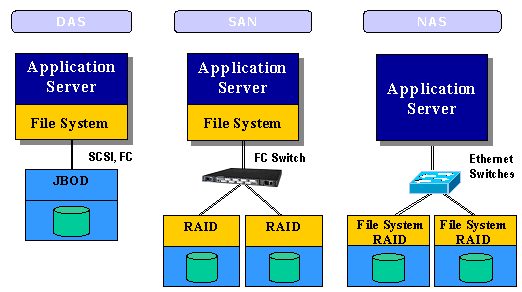

#### Direct Attached Storage

是最为常用的连接方式，使用SCSI (Small Computer System Interface)总线来从物理上连接应用服务器。SCSI总线通过菊花链结构可以支持的最大设备总数为15个。随着服务器CPU的处理能力越来越强，存储硬盘空间越来越大，对于个人PC和笔记本尚可，SCSI通道将会成为I/O瓶颈，并且DAS只能在一台服务器上进行使用

#### Network Attached Storage

NAS开始考虑定义一种特殊的服务器作为数据存储服务器，NAS支持多种协议（如NFS，CIFS，FTP，HTTP等，主要使用NFS和FTP），是**文件系统与文件系统层级**（所以存储的是文件）的映射，网络上只有协议，没有文件系统，文件系统都是在本地，并不通过计算机内部总线来传递文件读写指令的系统。

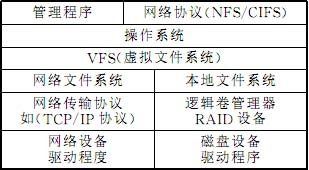

对于NAS较为简单的使用就是在数据存储服务器上架起NAS server之后，在我们的服务器上进行mount，我们使用sysbench比较过NAS和 内置磁盘的性能比较。

性能差距大概是在8-10倍左右，网络环境并非内网，在带宽上会有一定的差距。

相对于DAS，NAS可供多个服务器共享数据，但同时也出现了中心化的相关问题，例如数据备份，数据安全性，服务崩溃数据恢复等问题。

#### Storage Area Network

 SAN实际是一种专门为存储建立的独立于TCP/IP网络之外的专用网络（可以使用FC光纤通道技术进行专用网络的建立，更加安全和高效）。SAN中数据处理的单位是数据块，而并非是文件。以iSCSI为基础，能够进行快速的数据传输，注意这里我们的服务器是没有通过File System与存储设备进行交互，而是通过iSCSI（基于TCP/IP）与device driver进行交互。

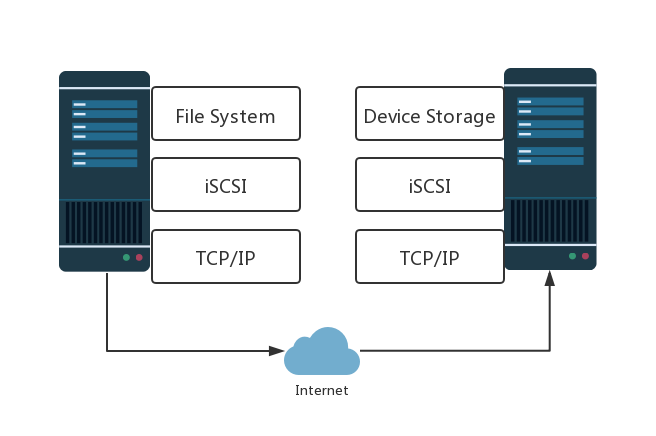

这样专用的性能并直接与Device进行交互，性能有大幅度的提升。

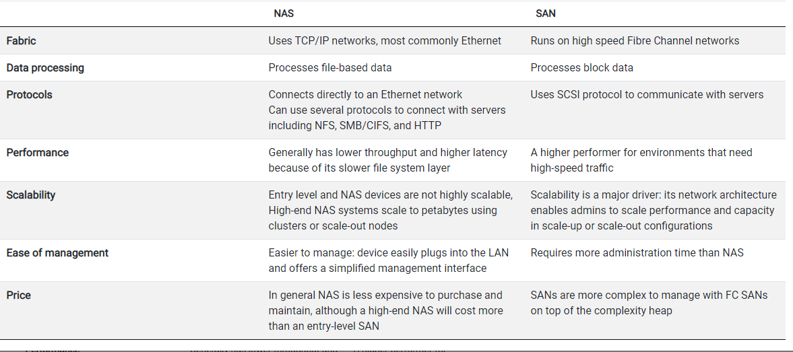

两者之间的比较可详见[这里](https://www.enterprisestorageforum.com/storage-networking/nas-vs.-san-differences-and-use-cases.html)。

NAS和SAN这两种存储的方式并不是互斥的。SAN可以负责关键应用的存储，比如数据库。NSA支持的是文件，以文件为单位的管控会更加的有效。

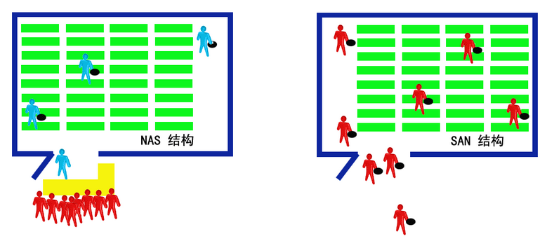

### Ceph vs GlusterFS

#### Ceph

Ceph提供对象存储、文件存储、块存储。对象存储是键值对存储，非常类似于OSS(Obejct Storage Service)，块存储即为SAN的使用模式。

Ceph集群的架构

Ceph集群的三个主要构件为：

- Ceph OSD Daemon: 主要负责存储具体的数据及其备份。
- Ceph Monitor 主要是使用Paxos保证一致性。
- Ceph Manager： 主要负责维护相关进程元数据和主机元数据

##### 数据存储

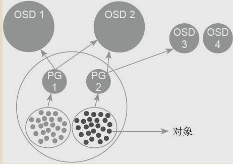

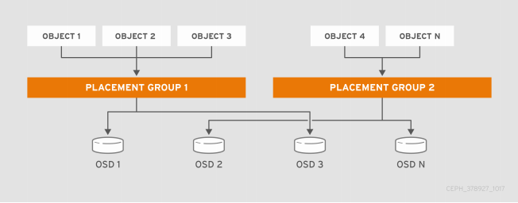

Pool是存储对象的逻辑分区

一个Pool中存在多个PG（placement group）

一个PG中存储有多个Object，他们都有相同的防止策略，数据均衡和恢复均是以PG为单位。

OSD上与PG是多对多的关系，一个OSD与具体的磁盘是一对一的关系。

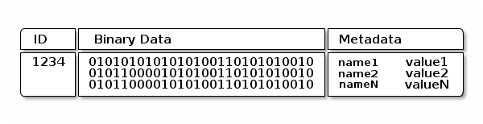

主义ID是全集群unique的，而不是filesystem唯一的。

Ceph存储数据的来源非常多，但是存储的方式都是以对象的方式存储的。

##### 可扩展和高可用

Ceph不存在中心化的gateway，Ceph OSD 会创建replicas使得整个集群的数据都是高可用的。为了保证高可用性。

##### crush map & CRUSH

crush map是一个高度层次化的树状结构，其叶子节点是OSD，中间节点可统称为bucket，我们可以在bucket中记录相应的权重。不同的层次是可以对应不同的物理意义的（货架、机架、电源、控制器和/或物理位置），与之对应的是你编写的placement rule，用于对这些层次的分配规则进行定义（用建模的方式来定义他们的物理关系）。

CRUSH的设计目的是在加权设备之间均匀分配数据，以保持存储和设备带宽资源的统计均衡利用。通过反映安装的底层物理组织，CRUSH可以建模并因此找到相关设备故障的潜在来源。典型的资源包括物理邻近性、共享电源和共享网络。通过将此信息编码到集群映射中，CRUSH放置策略可以跨不同的故障域分隔对象副本，同时仍然保持所需的分布。例如，解决并发的可能性失败时，最好确保数据副本位于不同的货架、机架、电源、控制器和/或物理位置的设备上。

Ceph使用了**CRUSH** 算法，配合在之前已经定义好的**crush map**，以及对应的**placement rule**，选出n个OSD，对数据进行分片存储。对于数据X进行hash运算后，得到的分区值并不直接与节点挂钩，分区与OSD形成多对多的关系。CRUSH算法要保证分区在OSD间均匀分布，分区的OSD要在不同的故障域，简单来讲，就是使数据（冗余）更加的分散，来提高一致性，算法详情可见[这里](https://www.cnblogs.com/shanno/p/3958298.html)以及[原论文](https://ieeexplore.ieee.org/stamp/stamp.jsp?tp=&arnumber=4090205)。

注意关于选取的replica rank，与我们使用的高可用实现的方式有关。

> In such situations, CRUSH can use the “first n” suitable targets by reselecting using r′ = r + f , where f is the number of failed placement attempts by the current select(n,t) (see Algorithm 1 line 16). With parity and erasure coding schemes, however, the rank or position of a storage device in the CRUSH output is critical because each target stores different bits of the data object. In particular, if a storage device fails, it should be replaced in CRUSH’s output list ~R in place, such that other devices in the list retain the same rank (i. e. position in ~R, see Figure 2). In such cases, CRUSH reselects using r′ = r + frn, where fr is the number of failed attempts on r, thus defining a sequence of candidates for each replica rank that are probabilistically independent of others’ failures.

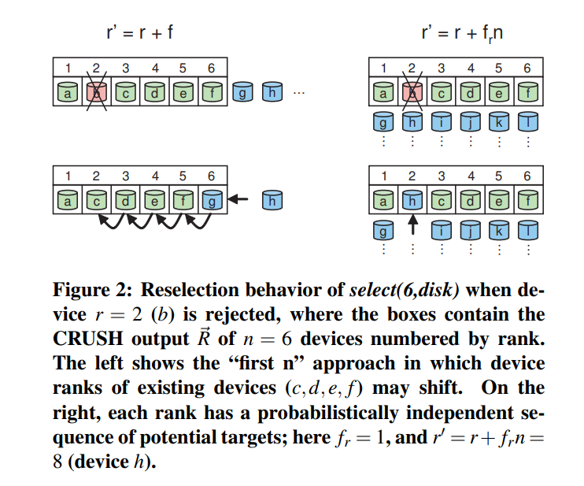

高可用的实现有两种方式一种是replication，在Ceph里面使用的是erasure code 和 n-way replication。

##### erasure code

erasure code的效果是将一份数据分为n份，在加上m份数据，只要拥有n+m份数据中的任意n份，就能进行还原。相比RAID5，其支持多个盘失效，相比于n-way replication，其成本更低。具体的原理解释可见[这里](https://blog.csdn.net/shelldon/article/details/54144730)，主要是利用编码矩阵，可以进一步针对编码矩阵进行优化。

##### n-way replication

基本是RAID10的实现，既进行数据的分片，又进行数据的冗余备份。

两者比较：

> We showed that the mean time to failure (MTTF) of
> an erasure encoded system can be shown to be many orders of magnitude higher than that of a replicated system with the same storage overhead and repair period. A novel result of our analysis showed that erasure-resilient codes use an order of magnitude less bandwidth and storage than replication for systems with similar MTTF. Finally, if care is taken to take advantage of temporal and spatial locality erasure encoded systems can use an order of magnitude less disk seeks than replicated systems.

使用erasure code更加复杂，但是各项性能上较实现更简单的都会有较大程度的提升，这也是为什么最开始Ceph采用的n-way replication而后推出了erasure code。

#### GlusterFS

关于GlusterFS的描述，主要的信息来源为该[tutorial](http://moo.nac.uci.edu/~hjm/fs/An_Introduction_To_Gluster_ArchitectureV7_110708.pdf)

##### gluster的目标

- elasticity，简单来说就是支持动态地、无伤地对存储进行修改。
- linear scaling，不仅仅是追求容量的增长，增加存储应当是整体的吞吐量等哥哥方面都是线性的增长，这就涉及到CPU、带宽等其他一些资源的使用，也需要作出相应的调整。
- 性能和容量能够持续的扩展，为此我们需要实现如下的技术
  - The elimination of metadata
  - Effective distribution of data to achieve scalability and reliability
  - The use of parallelism to maximizie performance via a fully distributed architecture
- software only，希望能够在软件层面就将存储的问题解决掉，或者另一种说法是对硬件的封装很好，能够跨平台使用不同硬件。
- data store innative formats，GlusterFS的本质仍旧是一个操作系统，文件最终都会使用native format（ext4/3， XFS），即便是不再使用GlusterFS，都能够正常的进行使用。
- no metadata with elastic hash algorithm，主要是与传统的中心化的存储metadata进行比较，传统方式存在性能瓶颈，而在GlusterFS中对文件名使用hash算法就能准确定位文件所在，当然去中心化后在另外一些方面也会存在一切其他问题。

##### centralized metadata systems vs. distributed metadata systems

**centralized metadata system**

优点：

- 遍历目录下文件耗时较短，因为元数据聚集在一起，遍历的速度会非常快。
- 删除目录的相关操作较快，理由同上。

缺点

- 由于metadata中心化导致的性能瓶颈问题，元数据的维护是非常消耗时间的（例如access time的维护），随着系统的长时间和不断扩容使用metadata会越来越多。
- 不高可用，如果centralized metadata server崩溃，将导致整个文件系统失效，最好的情况是会导致一次FSCK的操作，但是会消耗大量的时间，最坏的情况是所有数据均不可恢复。

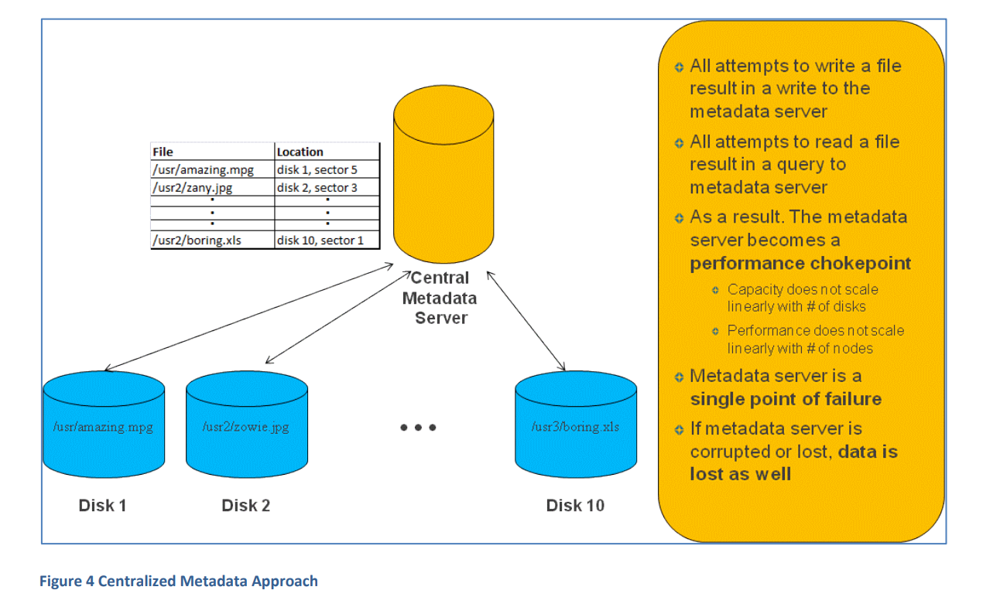

**distributed metadata systems**

优点：

- 由于没有中心化，即如果某存储服务器发生故障，不会影响到其他的存储服务器，相应的冗余有可能可以恢复故障服务器

缺点：

- 相当大的性能开销是作为各种分布式的引入的，系统试图通过使用各种锁定和同步机制与数据保持同步。因此，困扰集中式元数据系统的大多数性能扩展问题都困扰分布式系统。元数据系统也是如此。性能会随着文件、文件操作、存储系统、磁盘或I/O操作的随机性的增加而下降。性能也会随着平均文件大小的减小而降低。
- 分布式元数据系统还面临严重的潜在破坏问题。虽然一个分布式节点的丢失或损坏不会导致整个系统崩溃，但它可以损坏整个系统。当元数据存储在多个位置时，同步维护元数据的需求还意味着与以下情况相关的重大风险:元数据没有正确地保持同步，或者在实际损坏元数据的情况下。最糟糕的情况是，文件数据和元数据被成功地更新到不同的位置，而没有正确的元数据同步维护，从而导致多个实例之间不再完全一致。此外，损坏存储系统的几率随系统的数量呈指数增长。因此，元数据的并发性成为一个重大挑战。元数据系统也是如此。性能会随着文件、文件操作、存储系统、磁盘或I/O操作的随机性的增加而下降。性能也会随着平均文件大小的减小而降低。（metadata的Concurrency）

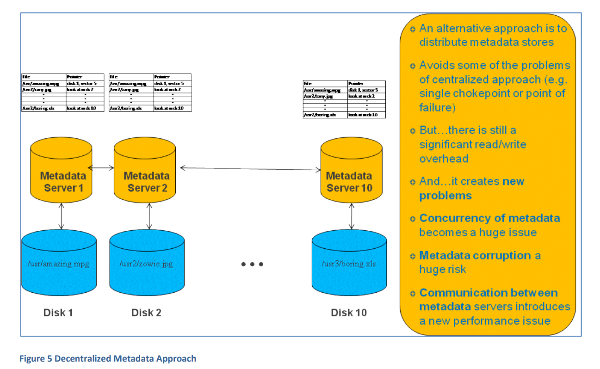

**algorithmic approach**

glusterFS 最终选择通过文件名和路径名使用Elastic Hashing Algorithm对文件进行定位。

优点：

- 采用无中心对称式架构，没有专用的metadata server，因而也就没有响应的性能瓶颈。
- 具有良好的可扩展性，Elastic Hashing Algorithm能够提供接近线性的高扩展性。
- 安全，因为所有的元数据不集中存放

缺点：

- 扩容缩容时的影响较大，虽然对用户而言扩容缩容是无感的，但是扩容和缩容期间都是需要hash重新计算，进行文件移动，会加重系统负载，影响到正常文件的访问操作。

#### 有关GlusterFS的实际应用相关业内人士见解

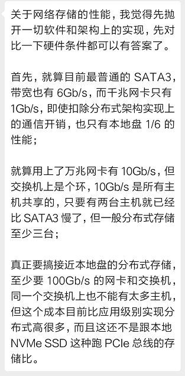

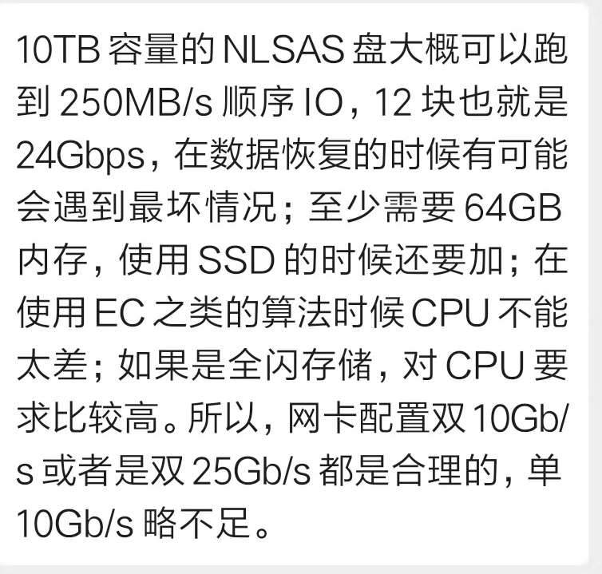

## ref

Weatherspoon H, Kubiatowicz J D. Erasure coding vs. replication: A quantitative comparison[C]//International Workshop on Peer-to-Peer Systems. Springer, Berlin, Heidelberg, 2002: 328-337.

Weil S A, Brandt S A, Miller E L, et al. CRUSH: Controlled, scalable, decentralized placement of replicated data[C]//SC'06: Proceedings of the 2006 ACM/IEEE Conference on Supercomputing. IEEE, 2006: 31-31.

[《glusterfs：优秀开源分布式存储系统》](https://zhuanlan.zhihu.com/p/45060910)